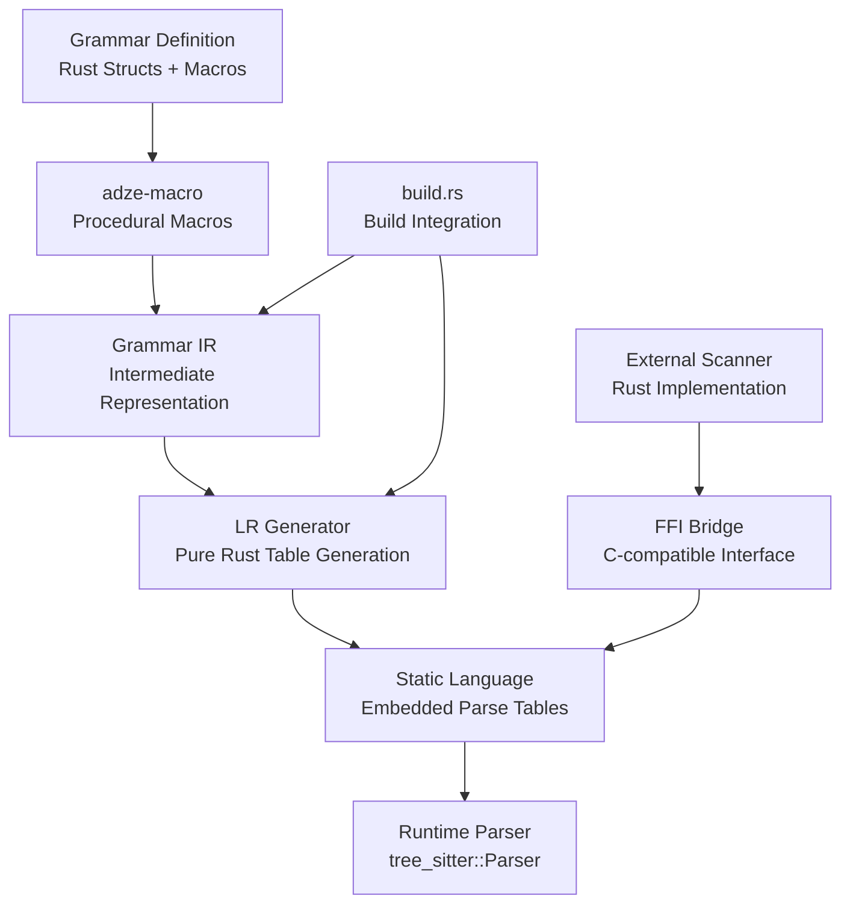

# Design Document

## Overview

This document outlines the design for evolving adze into a complete, pure-Rust Tree-sitter language generator ecosystem. The design eliminates all C dependencies while maintaining full compatibility with the existing Tree-sitter ecosystem, making adze the definitive solution for Tree-sitter integration.

The core innovation is implementing a pure-Rust GLR (Generalized LR) parser generator that produces static Language objects, replacing the current approach of shelling out to the C-based tree-sitter CLI. **Critical insight**: Tree-sitter's power comes from its GLR algorithm with compile-time conflict resolution, not simple LR(1) parsing. The system must support multiple actions per (state, lookahead) pair and implement fork/merge logic for handling ambiguous grammars.

## Architecture

### High-Level Architecture



### Crate Structure

The evolved adze will be organized as a Cargo workspace with clear separation of concerns:

```
adze/
├── macro/           # Procedural macros (existing, minimal changes)
├── runtime/         # Extract trait + runtime support (existing, minor updates)
├── ir/             # NEW: Grammar Intermediate Representation
├── lr-core/        # NEW: LR(1) table generation algorithms
├── tablegen/       # NEW: Static table generation and compression
├── tool/           # Build.rs integration (major refactor)
├── scanner-bridge/ # NEW: External scanner FFI utilities
└── examples/       # Updated examples using pure-Rust generation
```

## Components and Interfaces

### 1. Grammar IR (ir/ crate)

**Purpose**: Provide a comprehensive intermediate representation for all Tree-sitter grammar features.

**Key Types**:
```rust
#[derive(Debug, Clone, Serialize, Deserialize)]
pub struct Grammar {
    pub name: String,
    pub rules: IndexMap<SymbolId, Rule>,
    pub tokens: IndexMap<SymbolId, Token>,
    pub precedences: Vec<Precedence>,
    pub conflicts: Vec<ConflictDeclaration>,
    pub externals: Vec<ExternalToken>,
    pub fields: IndexMap<FieldId, String>, // Maintained in lexicographic order
    pub supertypes: Vec<SymbolId>,
    pub inline_rules: Vec<SymbolId>,
    pub alias_sequences: IndexMap<ProductionId, AliasSequence>,
    pub production_ids: IndexMap<RuleId, ProductionId>,
    pub max_alias_sequence_length: usize,
}

#[derive(Debug, Clone)]
pub struct Rule {
    pub lhs: SymbolId,
    pub rhs: Vec<Symbol>,
    pub precedence: Option<PrecedenceKind>,
    pub associativity: Option<Associativity>,
    pub fields: Vec<(FieldId, usize)>, // field -> position mapping
    pub production_id: ProductionId,
}

#[derive(Debug, Clone)]
pub enum PrecedenceKind {
    Static(i16),
    Dynamic(i16),
}

#[derive(Debug, Clone)]
pub struct Token {
    pub name: String,
    pub pattern: TokenPattern,
    pub fragile: bool, // TSFragile flag for lexical vs parse conflicts
}

#[derive(Debug, Clone)]
pub enum Symbol {
    Terminal(SymbolId),
    NonTerminal(SymbolId),
    External(SymbolId),
}

#[derive(Debug, Clone)]
pub struct AliasSequence {
    pub aliases: Vec<Option<String>>,
}
```

**Interface**:
- `Grammar::from_macro_output()` - Extract IR from procedural macro data
- `Grammar::validate()` - Ensure grammar consistency and detect issues
- `Grammar::optimize()` - Apply grammar transformations for better table generation

### 2. GLR Core (lr-core/ crate)

**Purpose**: Implement the core GLR parser generation algorithms in pure Rust, including support for multiple actions per (state, lookahead) pair and fork/merge logic.

**Key Components**:

#### FIRST/FOLLOW Computation
```rust
pub struct FirstFollowSets {
    first: IndexMap<SymbolId, FixedBitSet>,
    follow: IndexMap<SymbolId, FixedBitSet>,
    nullable: FixedBitSet,
}

impl FirstFollowSets {
    pub fn compute(grammar: &Grammar) -> Self;
    pub fn first_of_sequence(&self, symbols: &[Symbol]) -> FixedBitSet;
}
```

#### LR(1) Item Sets
```rust
#[derive(Debug, Clone, Hash, PartialEq, Eq)]
pub struct LRItem {
    pub rule_id: RuleId,
    pub position: usize,
    pub lookahead: SymbolId,
}

pub struct ItemSetCollection {
    pub sets: Vec<ItemSet>,
    pub goto_table: IndexMap<(StateId, SymbolId), StateId>,
}

impl ItemSetCollection {
    pub fn build_canonical_collection(grammar: &Grammar, first_follow: &FirstFollowSets) -> Self;
}
```

#### Parse Table Generation
```rust
pub struct ParseTable {
    pub action_table: Vec<Vec<Action>>,
    pub goto_table: Vec<Vec<StateId>>,
    pub symbol_metadata: Vec<SymbolMetadata>,
}

#[derive(Debug, Clone)]
pub enum Action {
    Shift(StateId),
    Reduce(RuleId),
    Accept,
    Error,
}
```

**Performance Optimizations**:
- Use `FixedBitSet` for efficient set operations
- Implement parallel table generation with `rayon` (behind feature flag)
- Cache intermediate results to enable incremental rebuilds

### 3. Table Generation (tablegen/ crate)

**Purpose**: Convert LR(1) parse tables into static Rust code and optimize for size/performance.

**Key Features**:

#### Static Code Generation
```rust
pub struct StaticLanguageGenerator {
    pub grammar: Grammar,
    pub parse_table: ParseTable,
}

impl StaticLanguageGenerator {
    pub fn generate_language_code(&self) -> TokenStream {
        // Generate static arrays and Language constructor
    }
    
    pub fn generate_node_types(&self) -> String {
        // Generate NODE_TYPES JSON string
    }
}
```

#### Table Compression
```rust
pub struct TableCompressor;

impl TableCompressor {
    pub fn compress_action_table(table: &[Vec<Action>]) -> CompressedTable;
    pub fn compress_goto_table(table: &[Vec<StateId>]) -> CompressedTable;
}

pub struct CompressedTable {
    pub data: &'static [u16],
    pub row_offsets: &'static [u16],
    pub default_actions: &'static [Action],
}
```

**Compression Strategies**:
- Row-based compression with default actions
- Run-length encoding for sparse tables
- Separate small/large table optimization (following Tree-sitter's approach)

### 4. Scanner Bridge (scanner-bridge/ crate)

**Purpose**: Provide seamless integration between Rust external scanners and the Tree-sitter FFI interface.

**Key Components**:

#### Scanner Trait
```rust
pub trait ExternalScanner: Send + Sync {
    type State: Serialize + for<'de> Deserialize<'de>;
    
    fn scan(&mut self, lexer: &mut Lexer, valid_symbols: &[bool]) -> Option<TokenType>;
    fn serialize(&self) -> Vec<u8>;
    fn deserialize(data: &[u8]) -> Self;
}
```

#### FFI Bridge Generation
```rust
pub fn generate_scanner_bridge<S: ExternalScanner>() -> TokenStream {
    // Generate extern "C" functions that bridge to the Rust scanner
    quote! {
        #[no_mangle]
        pub unsafe extern "C" fn tree_sitter_external_scanner_create() -> *mut c_void {
            // Implementation
        }
        
        #[no_mangle]
        pub unsafe extern "C" fn tree_sitter_external_scanner_scan(
            payload: *mut c_void,
            lexer: *mut TSLexer,
            valid_symbols: *const bool,
        ) -> bool {
            // Implementation
        }
        
        // ... other FFI functions
    }
}
```

### 5. Build Integration (tool/ crate)

**Purpose**: Provide seamless integration with Cargo's build system.

**Refactored Architecture**:
```rust
pub struct BuildConfig {
    pub grammar_paths: Vec<PathBuf>,
    pub output_dir: PathBuf,
    pub features: BuildFeatures,
}

pub struct BuildFeatures {
    pub table_compression: bool,
    pub parallel_generation: bool,
    pub incremental_cache: bool,
    pub debug_output: bool,
}

pub fn generate_parser(config: BuildConfig) -> Result<(), BuildError> {
    // 1. Extract grammar IR from source files
    // 2. Generate LR(1) tables
    // 3. Compress tables if enabled
    // 4. Generate static Rust code
    // 5. Write output files
}
```

**Incremental Build Support**:
- Hash-based caching of grammar rules
- Selective regeneration of changed components
- Build script integration with proper `rerun-if-changed` directives

## Data Models

### Symbol Management

```rust
#[derive(Debug, Clone, Copy, PartialEq, Eq, Hash)]
pub struct SymbolId(u16);

#[derive(Debug, Clone, Copy, PartialEq, Eq, Hash)]
pub struct RuleId(u16);

#[derive(Debug, Clone, Copy, PartialEq, Eq, Hash)]
pub struct StateId(u16);

#[derive(Debug, Clone, Copy, PartialEq, Eq, Hash)]
pub struct FieldId(u16);

pub struct SymbolTable {
    symbols: IndexVec<SymbolId, SymbolInfo>,
    name_to_id: IndexMap<String, SymbolId>,
}

#[derive(Debug, Clone)]
pub struct SymbolInfo {
    pub name: String,
    pub symbol_type: SymbolType,
    pub visible: bool,
    pub named: bool,
    pub supertype: bool,
}

#[derive(Debug, Clone, PartialEq, Eq)]
pub enum SymbolType {
    Terminal,
    NonTerminal,
    External,
    Auxiliary,
}
```

### Parse State Representation

```rust
#[derive(Debug, Clone)]
pub struct ParseState {
    pub id: StateId,
    pub items: Vec<LRItem>,
    pub actions: IndexMap<SymbolId, Action>,
    pub gotos: IndexMap<SymbolId, StateId>,
}

#[derive(Debug, Clone)]
pub struct ParseTableRow {
    pub actions: Vec<Action>,
    pub default_action: Action,
    pub gotos: Vec<StateId>,
}
```

## Error Handling

### Comprehensive Error Types

```rust
#[derive(Debug, thiserror::Error)]
pub enum GeneratorError {
    #[error("Grammar validation failed: {0}")]
    GrammarValidation(String),
    
    #[error("LR(1) conflict detected: {conflict}")]
    LRConflict { conflict: ConflictDescription },
    
    #[error("Table generation failed: {0}")]
    TableGeneration(String),
    
    #[error("Code generation failed: {0}")]
    CodeGeneration(String),
    
    #[error("IO error: {0}")]
    Io(#[from] std::io::Error),
}

#[derive(Debug, Clone)]
pub struct ConflictDescription {
    pub conflict_type: ConflictType,
    pub state: StateId,
    pub symbol: SymbolId,
    pub actions: Vec<Action>,
    pub source_location: Option<SourceSpan>,
}

#[derive(Debug, Clone)]
pub enum ConflictType {
    ShiftReduce,
    ReduceReduce,
}
```

### Error Recovery and Diagnostics

```rust
pub struct DiagnosticReporter {
    pub source_map: SourceMap,
}

impl DiagnosticReporter {
    pub fn report_conflict(&self, conflict: &ConflictDescription) -> Diagnostic {
        // Generate user-friendly error messages with source locations
        // Use ariadne for colorized output
    }
    
    pub fn suggest_resolution(&self, conflict: &ConflictDescription) -> Vec<String> {
        // Provide actionable suggestions for resolving conflicts
    }
}
```

## Testing Strategy

### Unit Testing

1. **Algorithm Correctness**:
   - FIRST/FOLLOW set computation with known grammars
   - LR(1) item set generation and closure operations
   - Conflict detection and resolution

2. **Table Generation**:
   - Parse table correctness for simple grammars
   - Compression/decompression round-trip tests
   - Static code generation validation

3. **Scanner Integration**:
   - FFI bridge functionality
   - State serialization/deserialization
   - Error handling in scanner code

### Integration Testing

1. **Grammar Compatibility**:
   - Test suite using existing Tree-sitter grammars
   - Parse tree comparison between C and Rust implementations
   - Query compatibility verification

2. **Performance Testing**:
   - Parsing speed benchmarks
   - Memory usage profiling
   - Build time measurement

3. **Cross-Platform Testing**:
   - Linux, macOS, Windows compatibility
   - WebAssembly build verification
   - Different Rust toolchain versions

### Corpus Testing

```rust
#[test]
fn test_grammar_corpus() {
    let test_cases = load_corpus_files();
    let rust_parser = create_rust_parser();
    let c_parser = create_c_parser();
    
    for test_case in test_cases {
        let rust_tree = rust_parser.parse(&test_case.source);
        let c_tree = c_parser.parse(&test_case.source);
        
        assert_trees_equivalent(&rust_tree, &c_tree);
    }
}
```

### Fuzzing Strategy

```rust
// cargo-fuzz integration
#[cfg(fuzzing)]
pub fn fuzz_parser(data: &[u8]) {
    if let Ok(source) = std::str::from_utf8(data) {
        let parser = create_parser();
        let _ = parser.parse(source); // Should not panic
    }
}
```

## Performance Considerations

### Build-Time Performance

1. **Parallel Table Generation**:
   - Use `rayon` for parallel FIRST/FOLLOW computation
   - Parallelize LR(1) item set construction where possible
   - Feature-gated to avoid unnecessary dependencies

2. **Incremental Compilation**:
   - Hash-based caching of grammar components
   - Selective regeneration of changed rules
   - Persistent cache storage between builds

3. **Memory Efficiency**:
   - Use `FixedBitSet` for set operations
   - Arena allocation for temporary data structures
   - Streaming code generation to avoid large in-memory representations

### Runtime Performance

1. **Table Optimization**:
   - Compressed table representation
   - Cache-friendly memory layout
   - Minimal indirection in hot paths

2. **Scanner Performance**:
   - Zero-copy string operations where possible
   - Efficient state serialization
   - Optimized lookahead operations

### Memory Usage

1. **Static Data**:
   - Compressed parse tables
   - Shared string constants
   - Minimal runtime overhead

2. **Dynamic Allocation**:
   - Reuse parse stacks
   - Efficient node allocation
   - Configurable memory limits

## Security Considerations

### Memory Safety

1. **Unsafe Code Boundaries**:
   - Limit unsafe code to FFI boundaries only
   - Comprehensive safety documentation
   - Regular audit of unsafe blocks

2. **Input Validation**:
   - Robust handling of malformed input
   - Bounds checking in all array accesses
   - Graceful degradation on resource exhaustion

### Build Security

1. **Dependency Management**:
   - Minimal dependency tree
   - Regular security audits
   - Pinned dependency versions

2. **Code Generation**:
   - Sanitize generated code
   - Prevent code injection through grammar definitions
   - Validate all user-provided input

## Migration Strategy

### Backward Compatibility

1. **API Stability**:
   - Maintain existing public interfaces
   - Feature flags for new functionality
   - Deprecation warnings for removed features

2. **Gradual Migration**:
   - Default to C backend initially
   - Opt-in pure-Rust generation
   - Side-by-side compatibility testing

### Feature Flags

```rust
[features]
default = ["c-backend"]
pure-rust = ["lr-core", "tablegen"]
c-backend = ["tree-sitter-generate", "cc"]
table-compression = ["pure-rust"]
parallel-generation = ["pure-rust", "rayon"]
debug-output = []
```

### Documentation and Tooling

1. **Migration Guide**:
   - Step-by-step upgrade instructions
   - Common issues and solutions
   - Performance comparison data

2. **Development Tools**:
   - Grammar visualization utilities
   - Conflict analysis tools
   - Performance profiling helpers

This design provides a comprehensive foundation for implementing a pure-Rust Tree-sitter ecosystem while maintaining compatibility and providing superior performance and developer experience.