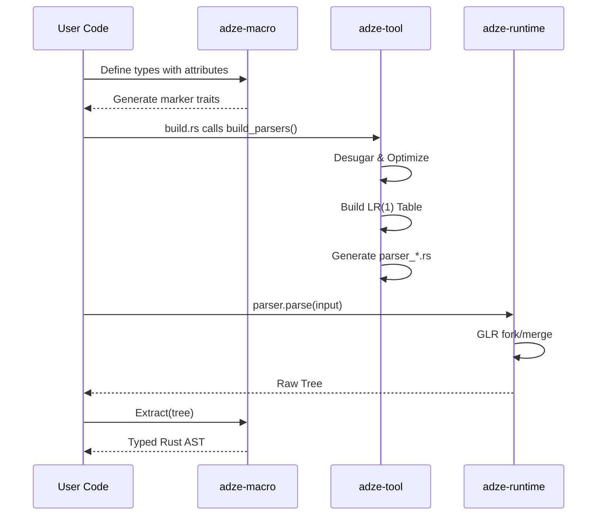

# Adze Architecture Overview

Adze (formerly `rust-sitter`) is a modern, high-performance GLR parser generator for Rust. It enables defining grammars using Rust types and generates robust, typed parsers that can handle ambiguous languages with ease.

---

## System Architecture

Adze is structured as a "Governance-as-Code" system, where policies and contracts drive the parser generation pipeline.

```mermaid
graph TD
    subgraph "Your Project"
        UserTypes["Rust Types (#[adze::grammar])"]
        BuildScript["build.rs"]
        RuntimeUsage["parser.parse()"]
    end

    subgraph "Adze Governance Layer"
        PolicyCore["feature-policy-core<br/>(Backend Selection)"]
        BddGrid["bdd-grid-core<br/>(Contract Tracking)"]
    end

    subgraph "Parser Generation Pipeline"
        Macro["adze-macro<br/>(Expansion)"]
        Tool["adze-tool<br/>(Build-time Gen)"]
        IR["adze-ir<br/>(Grammar IR)"]
        GLR["adze-glr-core<br/>(Automaton)"]
        Tablegen["adze-tablegen<br/>(Compression)"]
    end

    subgraph "Runtime"
        Runtime["adze<br/>(Runtime API)"]
    end

    UserTypes --> Macro
    BuildScript --> Tool
    Tool --> PolicyCore
    PolicyCore --> BddGrid
    Tool --> IR
    IR --> GLR
    GLR --> Tablegen
    Tablegen --> Runtime
    RuntimeUsage --> Runtime
    Runtime --> UserTypes
```

---

## Core Components

### 1. The Governance Layer (`crates/governance-*`)
Unlike traditional parser generators, Adze uses a governance layer to enforce architectural integrity:
- **Feature Policies**: Automatically selects between Pure-Rust LR, GLR, or Tree-sitter backends based on grammar complexity (e.g., detecting conflicts).
- **BDD Grid**: Tracks implementation status against a ledger of behavioral requirements (Behavior Driven Development).
- **Contract Enforcement**: Ensures that generated parsers meet performance and safety invariants before they are compiled.

### 2. The Macro Phase (`adze-macro`)
Processes Rust `enum` and `struct` definitions decorated with `#[adze::grammar]`.
- **Extraction**: Generates marker traits that allow the build-tool to "see" the grammar structure.
- **Typed AST**: Generates the `Extract` trait implementation used to convert raw parse trees back into your typed Rust values.

### 3. The Build-Time Pipeline (`adze-tool`)
The heavy lifting happens in `build.rs` via `adze_tool::build_parsers()`:
1. **Desugaring**: Pattern wrappers (e.g., regex literals) are converted into unit productions to ensure LR(1) lookahead stability.
2. **IR Conversion**: The grammar is lowered into a hardware-friendly Intermediate Representation.
3. **Automaton Construction**: `adze-glr-core` builds a full LR(1) automaton, identifying shift/reduce and reduce/reduce conflicts.
4. **Table Compression**: `adze-tablegen` uses the Tree-sitter table format to compress action/goto tables (often >10:1 ratio).
5. **Codegen**: Produces a optimized `.rs` file in `OUT_DIR` which is pulled into your project via `include!`.

### 4. The Runtime (`adze`)
A lightweight, zero-dependency (in `pure-rust` mode) runtime that executes the GLR algorithm:
- **Fork/Merge**: Handles ambiguities by forking the stack and merging identical states (SPPF).
- **Typed Recovery**: Provides structured error reporting and partial tree extraction.

---

## Data Flow: From Source to AST



---

## Crate Organization

| Crate | Purpose |
|-------|---------|
| `adze-macro` | Procedural macros for grammar definition |
| `adze-runtime` | Core parsing engine and tree APIs |
| `adze-tool` | Build-time orchestrator for parser generation |
| `adze-ir` | Intermediate representation of grammars |
| `adze-glr-core` | Automaton construction and conflict analysis |
| `adze-tablegen` | Table compression and Rust code generation |
| `crates/feature-policy-core` | Logic for backend selection and policy enforcement |
| `crates/bdd-grid-core` | Ledger of BDD scenarios and progress tracking |

---

## Debugging and Artifacts

To inspect what Adze is doing under the hood, use the following environment variables:

- `ADZE_EMIT_ARTIFACTS=true`: Writes `grammar.ir.json` and `NODE_TYPES.json` to the output directory.
- `RUST_LOG=adze=debug`: Enables detailed logging during the build and runtime phases.

### Inspecting Tables
If you suspect a grammar conflict is being handled incorrectly, check the generated `adze_debug_{grammar}.log` in your system's temp directory. It contains the full LR(1) state transitions and action tables.

---

## Next Steps

- **Quick Start**: See [QUICK_START.md](./QUICK_START.md)
- **Examples**: Explore the [example/](./example/) directory
- **Friction Log**: Report issues in [docs/status/FRICTION_LOG.md](./docs/status/FRICTION_LOG.md)
