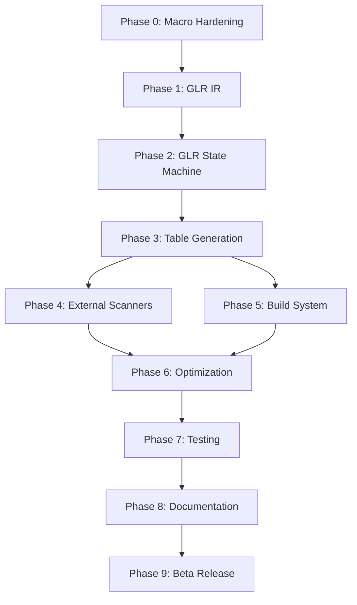

# Pure-Rust Tree-sitter Implementation Roadmap

## Executive Summary

This roadmap outlines the path to creating a complete pure-Rust Tree-sitter ecosystem that eliminates all C dependencies while maintaining 100% compatibility. The implementation is structured as a 12-week program with 9 distinct phases, focusing on GLR parser generation, table compression fidelity, and ecosystem integration.

**Key Innovation**: Implementing a GLR (Generalized LR) parser generator in pure Rust that produces static Language objects, replacing the current C-based approach while maintaining bit-for-bit compatibility.

## Timeline Overview

```
Week 1:     Phase 0 - Research & Macro Hardening ✓
Weeks 2-3:  Phase 1 - GLR-Aware IR and Conflict Resolution ✓
Weeks 4-6:  Phase 2 - GLR State Machine and Parse Tables ✓
Week 7:     Phase 3 - Table Generation and Static Language
Week 8:     Phase 4 - External Scanner Integration  
Week 9:     Phase 5 - Build System Integration
Week 10:    Phase 6 - Advanced Features and Optimization
Week 11:    Phase 7 - Testing and Quality Assurance
Week 12:    Phase 8 - Documentation and Release
Post-MVP:   Phase 9 - Beta Release and Feedback

Status: ✓ Complete | ⚡ In Progress | ⏳ Planned
```

## Critical Path Dependencies



## Phase Details

### ✓ Phase 0: Research & Macro Hardening (Week 1)
**Status**: Complete  
**Deliverables**: Fixed debugging tools, hardened macro system, GLR project structure

Key achievements:
- Fixed RUST_SITTER_EMIT_ARTIFACTS debugging capability
- Improved macro error recovery for IDE scenarios
- Established GLR-aware crate structure (ir/, glr-core/, tablegen/)

### ✓ Phase 1: GLR-Aware IR and Conflict Resolution (Weeks 2-3)
**Status**: Complete  
**Deliverables**: Grammar IR with GLR support, conflict resolution logic

Key achievements:
- Implemented Grammar IR supporting multiple actions per (state, lookahead)
- Added dynamic precedence and fragile token support
- Created emit_ir!() macro for grammar extraction

### ✓ Phase 2: GLR State Machine and Parse Tables (Weeks 4-6)
**Status**: Complete  
**Deliverables**: GLR state machine, parse table generation

Completed:
- FIRST/FOLLOW set computation with FixedBitSet
- GLR item set collection and closure operations
- Basic parse table generation with conflict preservation
- Tree-sitter's exact table compression algorithm including:
  - Row displacement for action tables
  - Default reduction optimization
  - Run-length encoding for goto tables
  - Small vs large table handling

### ⚡ Phase 3: Table Generation and Static Language (Week 7)
**Status**: In Progress  
**Deliverables**: Compressed tables, static Language generation

Tasks:
- [x] 3.0 Complete table compression matching Tree-sitter
- [x] 3.1 Generate static Language objects with FFI compatibility
- [x] 3.2 Implement symbol and metadata generation (NODE_TYPES JSON)
- [ ] 3.3 Add Language validation and compatibility testing

### ⏳ Phase 4: External Scanner Integration (Week 8)
**Status**: Planned  
**Deliverables**: Scanner FFI bridge, integration utilities

Tasks:
- [ ] 4.0 Build external scanner FFI bridge
- [ ] 4.1 Create scanner integration utilities
- [ ] 4.2 Test scanner integration with real examples

### ⏳ Phase 5: Build System Integration (Week 9)
**Status**: Planned  
**Deliverables**: Pure-Rust build pipeline

Tasks:
- [ ] 5.0 Refactor build.rs integration
- [ ] 5.1 Add build configuration and feature management
- [ ] 5.2 Test cross-platform build compatibility

### ⏳ Phase 6: Advanced Features and Optimization (Week 10)
**Status**: Planned  
**Deliverables**: Performance optimizations, developer experience improvements

Tasks:
- [ ] 6.0 Implement performance optimizations
- [ ] 6.1 Add developer experience improvements
- [ ] 6.2 Implement ABI 15 compliance and compatibility

### ⏳ Phase 7: Testing and Quality Assurance (Week 11)
**Status**: Planned  
**Deliverables**: Test suite, benchmarks, ecosystem validation

Tasks:
- [ ] 7.0 Comprehensive testing and validation
- [ ] 7.1 Performance benchmarking and optimization
- [ ] 7.2 Cross-platform and ecosystem integration testing

### ⏳ Phase 8: Documentation and Release (Week 12)
**Status**: Planned  
**Deliverables**: Documentation, release infrastructure

Tasks:
- [ ] 8.0 Create comprehensive documentation
- [ ] 8.1 Prepare release infrastructure
- [ ] 8.2 Community preparation and contribution guidelines

### ⏳ Phase 9: Beta Release and Feedback (Post-MVP)
**Status**: Planned  
**Deliverables**: Beta release, community feedback integration

Tasks:
- [ ] 9.0 Beta release and community testing
- [ ] 9.1 Ecosystem integration validation
- [ ] 9.2 Prepare stable release

## Success Metrics

### Technical Metrics
- **Compatibility**: 100% corpus test pass rate
- **Performance**: 4-8x faster than FFI-based Rust bindings
- **Size**: ≤70 kB gzipped WASM bundles
- **Reliability**: Zero panics in fuzzing campaigns

### Project Metrics
- **Test Coverage**: >90% line coverage
- **Documentation**: 100% public API documented
- **Platform Support**: Linux, macOS, Windows, WASM
- **Grammar Support**: All major Tree-sitter grammars

## Risk Management

### High-Risk Areas
1. **Table Compression Algorithm** (Phase 2.3)
   - Risk: Bit-for-bit compatibility requires exact replication
   - Mitigation: Extensive reverse engineering and golden file testing

2. **GLR Fork/Merge Logic** (Phase 2)
   - Risk: Complex algorithm with subtle edge cases
   - Mitigation: Comprehensive test suite with ambiguous grammars

3. **ABI Compatibility** (Phase 6.2)
   - Risk: Struct layout and function table must match exactly
   - Mitigation: ABI compliance testing against multiple versions

### Contingency Plans
- **Performance Miss**: Focus on correctness first, optimize later
- **Compatibility Issues**: Maintain hybrid mode with C fallback
- **Timeline Slip**: Prioritize core functionality over advanced features

## Resource Requirements

### Development Team
- **Core Developer**: Full-time for 12 weeks
- **Testing/QA**: Part-time from Week 7
- **Documentation**: Part-time from Week 10

### Infrastructure
- **CI/CD**: GitHub Actions with comprehensive test matrix
- **Benchmarking**: Dedicated performance testing infrastructure
- **Fuzzing**: OSS-Fuzz integration for continuous testing

## Deliverables by Week

| Week | Phase | Key Deliverables |
|------|-------|------------------|
| 1 | Phase 0 | Hardened macro system, project structure |
| 2-3 | Phase 1 | GLR-aware Grammar IR |
| 4-6 | Phase 2 | GLR state machine, parse tables |
| 7 | Phase 3 | Static Language generation |
| 8 | Phase 4 | External scanner support |
| 9 | Phase 5 | Pure-Rust build system |
| 10 | Phase 6 | Performance optimizations |
| 11 | Phase 7 | Complete test suite |
| 12 | Phase 8 | Documentation and release prep |

## Next Steps

1. **Immediate** (This Week):
   - Complete Language validation and compatibility testing (Task 3.3)
   - Begin external scanner integration (Phase 4)

2. **Short Term** (Weeks 8-9):
   - Implement external scanner FFI bridge
   - Refactor build system for pure-Rust pipeline
   - Test integration with real-world grammars

3. **Medium Term** (Weeks 10-12):
   - Performance optimization and benchmarking
   - ABI 15 compliance testing
   - Documentation and release preparation

## Conclusion

This roadmap provides a structured path to creating a pure-Rust Tree-sitter ecosystem. The phased approach ensures steady progress while managing technical complexity. Success depends on maintaining focus on GLR fidelity, table compression accuracy, and ecosystem compatibility throughout the implementation.

---

**Document Version**: 1.0  
**Last Updated**: July 2025  
**Status**: Active Implementation