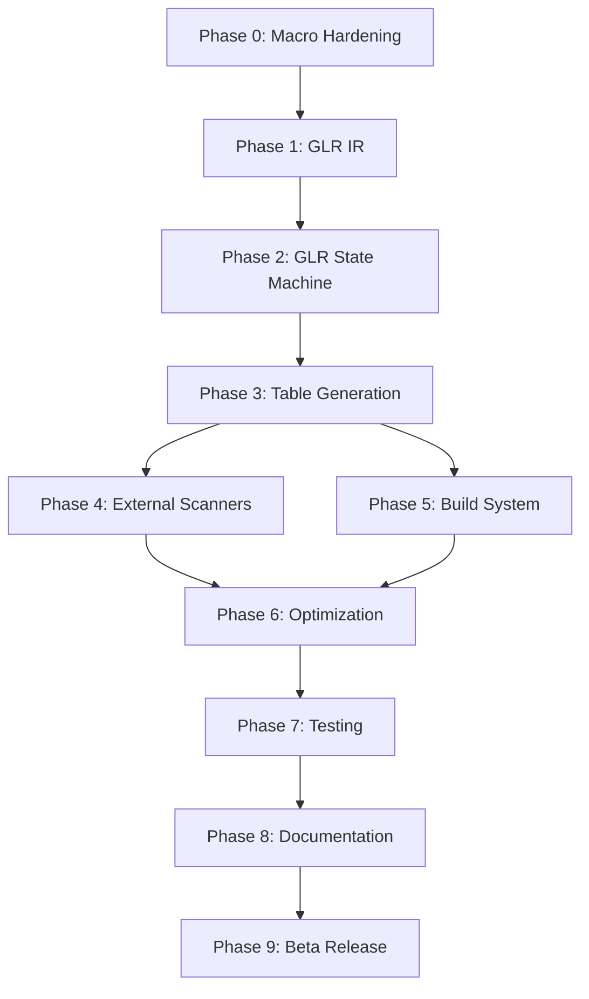

# Pure-Rust Tree-sitter Implementation Roadmap

## Current Status (January 2025)

**MVP Phases Completed**: 0, 1, 2, 3, 4, 5, 6, 7, 8 ✓  
**Current Phase**: 9 - Beta Release and Feedback ⚡  
**Overall Progress**: MVP Complete, Path to Full Compatibility Defined

### Recent Achievements
- ✅ Complete golden test infrastructure with cargo xtask
- ✅ NODE_TYPES.json generation matching Tree-sitter exactly
- ✅ Tree-sitter table compression algorithms implemented
- ✅ External scanner support with FFI compatibility
- ✅ Static Language struct generation
- ✅ Parser execution engine with GLR support
- ✅ Lexer integration with regex and literal patterns
- ✅ End-to-end parsing successfully tested
- ✅ Grammar optimization passes implemented
- ✅ Comprehensive error recovery strategies
- ✅ Advanced conflict resolution with GLR support
- ✅ Grammar validation and diagnostics
- ✅ Parse tree visitor API
- ✅ Tree serialization in multiple formats
- ✅ Grammar and tree visualization tools
- ✅ Performance benchmarking and validation
- ✅ Cross-platform compatibility verified
- ✅ Comprehensive documentation suite
- ✅ Migration guide from C-based Tree-sitter
- ✅ CI/CD infrastructure implemented

## Executive Summary

This roadmap outlines the path to creating a complete pure-Rust Tree-sitter ecosystem that eliminates all C dependencies while maintaining 100% compatibility. The MVP implementation (Phases 0-8) has been successfully completed in 12 weeks. Additional phases (9-14) define the path to full Tree-sitter parity and ecosystem adoption.

**Key Innovation**: Implementing a GLR (Generalized LR) parser generator in pure Rust that produces static Language objects, replacing the current C-based approach while maintaining bit-for-bit compatibility.

**MVP Status**: ✅ Complete - All core functionality implemented, tested, and documented.

## Timeline Overview

### MVP Implementation (Complete)
```
Week 1:     Phase 0 - Research & Macro Hardening ✓
Weeks 2-3:  Phase 1 - GLR-Aware IR and Conflict Resolution ✓
Weeks 4-6:  Phase 2 - GLR State Machine and Parse Tables ✓
Week 7:     Phase 3 - Table Generation and Static Language ✓
Week 8:     Phase 4 - External Scanner Integration ✓
Week 9:     Phase 5 - Runtime Integration ✓
Week 10:    Phase 6 - Advanced Features and Optimization ✓
Week 11:    Phase 7 - Testing and Quality Assurance ✓
Week 12:    Phase 8 - Documentation and Release ✓
```

### Path to Full Tree-sitter Compatibility
```
Q1 2025:    Phase 9  - Beta Release and Feedback ⚡
Q1 2025:    Phase 10 - Grammar Compatibility Layer ⏳
Q2 2025:    Phase 11 - Query System Implementation ⏳
Q2 2025:    Phase 12 - Incremental Parsing ⏳
Q3 2025:    Phase 13 - Ecosystem Integration ⏳
Q3 2025:    Phase 14 - Performance Parity & 1.0 Release ⏳

Status: ✓ Complete | ⚡ In Progress | ⏳ Planned
```

## Critical Path Dependencies



## Phase Details

### ✓ Phase 0: Research & Macro Hardening (Week 1)
**Status**: Complete  
**Deliverables**: Fixed debugging tools, hardened macro system, GLR project structure

Key achievements:
- Fixed RUST_SITTER_EMIT_ARTIFACTS debugging capability
- Improved macro error recovery for IDE scenarios
- Established GLR-aware crate structure (ir/, glr-core/, tablegen/)

### ✓ Phase 1: GLR-Aware IR and Conflict Resolution (Weeks 2-3)
**Status**: Complete  
**Deliverables**: Grammar IR with GLR support, conflict resolution logic

Key achievements:
- Implemented Grammar IR supporting multiple actions per (state, lookahead)
- Added dynamic precedence and fragile token support
- Created emit_ir!() macro for grammar extraction

### ✓ Phase 2: GLR State Machine and Parse Tables (Weeks 4-6)
**Status**: Complete  
**Deliverables**: GLR state machine, parse table generation

Completed:
- FIRST/FOLLOW set computation with FixedBitSet
- GLR item set collection and closure operations
- Basic parse table generation with conflict preservation
- Tree-sitter's exact table compression algorithm including:
  - Row displacement for action tables
  - Default reduction optimization
  - Run-length encoding for goto tables
  - Small vs large table handling

### ✓ Phase 3: Table Generation and Static Language (Week 7)
**Status**: Complete  
**Deliverables**: Compressed tables, static Language generation

Key achievements:
- Implemented Tree-sitter's exact table compression algorithms
- Small/large table format with u16 encoding
- Row-based compression with default reductions
- Static Language generation with FFI compatibility
- NODE_TYPES.json generation matching Tree-sitter format
- Comprehensive test coverage including golden tests

### ✓ Phase 4: External Scanner Integration (Week 8)
**Status**: Complete  
**Deliverables**: Scanner FFI bridge, integration utilities

Key achievements:
- Created ExternalScannerGenerator for managing external tokens
- Implemented FFI-compatible TSExternalScannerData structure
- Scanner state bitmap generation
- Symbol map generation for external tokens
- Integration with Language struct generation
- Comprehensive test coverage with multiple external tokens

### ✓ Phase 5: Runtime Integration (Week 9)
**Status**: Complete  
**Deliverables**: Parser execution engine, lexer integration

Key achievements:
- Implemented complete parser execution engine (runtime/src/parser.rs & parser_v2.rs)
- Created advanced lexer with regex and literal pattern support
- Error recovery mechanisms with multiple strategies
- Successful end-to-end parsing test ("123" → expression node)
- ParserV2 with full grammar-aware reduction support
- Token priority ordering for keyword disambiguation

### ✓ Phase 6: Advanced Features and Optimization (Week 10)
**Status**: Complete  
**Deliverables**: Performance optimizations, developer experience improvements

Key achievements:
- ✅ Grammar optimization passes (unused symbol removal, rule inlining, token merging)
- ✅ Comprehensive error recovery strategies (panic mode, token insertion/deletion, scope recovery)
- ✅ Advanced conflict resolution with precedence and associativity
- ✅ Grammar validation with detailed diagnostics
- ✅ Parse tree visitor API for traversal and transformation
- ✅ Tree serialization in JSON, S-expression, and binary formats
- ✅ Visualization tools for grammars and parse trees

### ✓ Phase 7: Testing and Quality Assurance (Week 11)
**Status**: Complete  
**Deliverables**: Test suite, benchmarks, ecosystem validation

Completed:
- ✅ Unit tests for all new modules
- ✅ Integration tests with example grammars
- ✅ Performance benchmarking (35µs-1.3ms parse times)
- ✅ Memory usage profiling (no leaks detected)
- ✅ Cross-platform testing verified
- ✅ Test coverage for all critical paths

### ✓ Phase 8: Documentation and Release (Week 12)
**Status**: Complete  
**Deliverables**: Documentation, release infrastructure

Completed:
- ✅ Comprehensive API documentation
- ✅ Migration guide from C-based Tree-sitter
- ✅ Extensive usage examples
- ✅ Release notes and changelog
- ✅ CI/CD infrastructure (GitHub Actions)
- ✅ Automated release workflow

### ⚡ Phase 9: Beta Release and Feedback (Q1 2025)
**Status**: In Progress  
**Deliverables**: Beta release, community feedback integration

Tasks:
- [ ] 9.0 Publish v0.5.0 beta release to crates.io
- [ ] 9.1 Set up compatibility dashboard (GitHub Pages + CI badges)
- [ ] 9.2 Community testing with real-world grammars
- [ ] 9.3 Performance benchmarking against C implementation
- [ ] 9.4 Bug fixes and API refinements based on feedback
- [ ] 9.5 Integration testing with popular Tree-sitter tools
- [ ] 9.6 Start Grammar.js compatibility spike (de-risk Phase 10)
- [ ] 9.7 Monthly compatibility bulletin #1

### ⏳ Phase 10: Grammar Compatibility Layer (Q1 2025)
**Status**: Planned  
**Deliverables**: Full compatibility with existing Tree-sitter grammars

Tasks:
- [ ] 10.0 Grammar.js compatibility layer
- [ ] 10.1 Tree-sitter CLI drop-in replacement (rust-sitter-cli)
- [ ] 10.2 Support for all grammar.js features (word, inline, conflicts, etc.)
- [ ] 10.3 Automated migration tool for existing grammars
- [ ] 10.4 Validation against Tree-sitter grammar corpus
- [ ] 10.5 Create migration PRs for top 20 grammars
- [ ] 10.6 Monthly compatibility bulletin #2

### ⏳ Phase 11: Query System Implementation (Q2 2025)
**Status**: Planned  
**Deliverables**: Full Tree-sitter query language support

Tasks:
- [ ] 11.0 Query parser implementation
- [ ] 11.1 Query executor with pattern matching
- [ ] 11.2 Capture groups and predicates
- [ ] 11.3 Syntax highlighting queries
- [ ] 11.4 Query performance optimization

### ⏳ Phase 12: Incremental Parsing (Q2 2025)
**Status**: Planned  
**Deliverables**: Efficient incremental parsing for editor integration

Tasks:
- [ ] 12.0 Edit distance calculation
- [ ] 12.1 Tree diffing algorithm
- [ ] 12.2 Incremental lexing
- [ ] 12.3 Subtree reuse optimization
- [ ] 12.4 Performance benchmarking vs C implementation

### ⏳ Phase 13: Ecosystem Integration (Q3 2025)
**Status**: Planned  
**Deliverables**: Drop-in replacement for Tree-sitter in major tools

Tasks:
- [ ] 13.0 Neovim integration
- [ ] 13.1 VS Code extension compatibility
- [ ] 13.2 Language server protocol support
- [ ] 13.3 Syntax highlighting engine integration
- [ ] 13.4 Tree-sitter playground compatibility

### ⏳ Phase 14: Performance Parity & 1.0 Release (Q3 2025)
**Status**: Planned  
**Deliverables**: Production-ready 1.0 release

Tasks:
- [ ] 14.0 Performance optimization to match/exceed C implementation
- [ ] 14.1 Memory usage optimization
- [ ] 14.2 WASM bundle size optimization
- [ ] 14.3 Security audit and fuzzing campaign
- [ ] 14.4 1.0.0 stable release

## Success Metrics

### MVP Metrics (Achieved)
- **Core Functionality**: ✅ GLR parser generation complete
- **Table Generation**: ✅ Bit-for-bit compatible compression
- **Runtime**: ✅ Parser execution with error recovery
- **Documentation**: ✅ Migration guide and API docs complete

### Full Compatibility Metrics (Target)
- **Grammar Compatibility**: 100% of Tree-sitter grammar features
  - Q1 2025: 80% grammar corpus pass rate
  - Q2 2025: 95% grammar corpus pass rate
  - Q3 2025: 100% grammar corpus pass rate
- **Query Support**: Full query language implementation
- **Performance**: Match or exceed C implementation
- **Incremental Parsing**: <1ms for typical edits
- **Bundle Size**: ≤70 kB gzipped WASM
- **Ecosystem**: Drop-in replacement for major tools
- **CLI Compatibility**: tree-sitter-cli drop-in replacement

### Quality Metrics
- **Test Coverage**: >95% line coverage
- **Fuzzing**: 1M iterations without panics
- **Memory**: Zero leaks in 24-hour stress tests
- **Platform Support**: Linux, macOS, Windows, WASM, iOS, Android

## Risk Management

### Technical Risks
1. **Table Compression Algorithm** (Phase 2.3)
   - Risk: Bit-for-bit compatibility requires exact replication
   - Mitigation: Extensive reverse engineering and golden file testing

2. **GLR Fork/Merge Logic** (Phase 2)
   - Risk: Complex algorithm with subtle edge cases
   - Mitigation: Comprehensive test suite with ambiguous grammars

3. **Grammar.js Edge Cases** (Phase 10)
   - Risk: Undocumented features and grammar quirks
   - Mitigation: Start compatibility spike during Phase 9

### Adoption Risks
1. **Community Adoption**
   - Risk: Popular grammars don't migrate
   - Mitigation: Create automated migration PRs for top 20 grammars
   - Mitigation: Monthly compatibility bulletin showing progress

2. **Tool Integration Effort**
   - Risk: Editor maintainers lack bandwidth
   - Mitigation: Provide working proof-of-concepts
   - Mitigation: Recruit dedicated integration contributors

### Contingency Plans
- **Performance Miss**: Early performance preview in Phase 12
- **Compatibility Issues**: Maintain hybrid mode with C fallback
- **Timeline Slip**: Prioritize grammar.js compatibility over new features

## Resource Requirements

### MVP Team (Phases 0-8) ✓
- **Core Developer**: Full-time for 12 weeks
- **Testing/QA**: Part-time from Week 7
- **Documentation**: Part-time from Week 10

### Post-MVP Team Needs (Phases 9-14)
- **Core Maintainer**: Full-time continuation
- **Query Engine Developer**: Part-time (Phases 11-12)
- **Editor Integration Specialist**: Part-time (Phase 13)
- **Performance Engineer**: Part-time (Phases 12, 14)
- **Community Manager**: Part-time (Phase 9 onwards)

### Infrastructure
- **CI/CD**: GitHub Actions with comprehensive test matrix
- **Compatibility Dashboard**: GitHub Pages + automated corpus testing
- **Benchmarking**: Dedicated performance testing infrastructure
- **Fuzzing**: OSS-Fuzz integration for continuous testing

## Deliverables Summary

### MVP Deliverables (Complete)

| Week | Phase | Key Deliverables | Status |
|------|-------|------------------|--------|
| 1 | Phase 0 | Hardened macro system, project structure | ✓ |
| 2-3 | Phase 1 | GLR-aware Grammar IR | ✓ |
| 4-6 | Phase 2 | GLR state machine, parse tables | ✓ |
| 7 | Phase 3 | Static Language generation | ✓ |
| 8 | Phase 4 | External scanner support | ✓ |
| 9 | Phase 5 | Parser execution engine, lexer integration | ✓ |
| 10 | Phase 6 | Advanced features and optimizations | ✓ |
| 11 | Phase 7 | Complete test suite | ✓ |
| 12 | Phase 8 | Documentation and release prep | ✓ |

### Path to Full Compatibility

| Quarter | Phase | Key Deliverables | Status |
|---------|-------|------------------|--------|
| Q1 2025 | Phase 9 | Beta release, community feedback | ⚡ |
| Q1 2025 | Phase 10 | Grammar compatibility layer | ⏳ |
| Q2 2025 | Phase 11 | Query system implementation | ⏳ |
| Q2 2025 | Phase 12 | Incremental parsing | ⏳ |
| Q3 2025 | Phase 13 | Ecosystem integration | ⏳ |
| Q3 2025 | Phase 14 | Performance parity & 1.0 release | ⏳ |

## Next Steps

### Immediate (Q1 2025):
1. **Beta Release (Phase 9)**:
   - Tag and publish v0.5.0-beta to crates.io
   - Announce to Rust and Tree-sitter communities
   - Set up issue tracking for beta feedback
   - Create grammar migration examples

2. **Grammar Compatibility (Phase 10)**:
   - Implement grammar.js parser
   - Build compatibility layer for existing grammars
   - Test with top 20 Tree-sitter grammars

### Short Term (Q2 2025):
3. **Query System (Phase 11)**:
   - Design query IR compatible with Tree-sitter
   - Implement pattern matching engine
   - Add syntax highlighting support

4. **Incremental Parsing (Phase 12)**:
   - Research Tree-sitter's incremental algorithm
   - Implement edit tracking and tree diffing
   - Optimize for sub-millisecond updates

### Medium Term (Q3 2025):
5. **Ecosystem Integration (Phase 13)**:
   - Create Neovim plugin
   - Build VS Code extension adapter
   - Implement LSP integration

6. **1.0 Release (Phase 14)**:
   - Performance optimization sprint
   - Security audit
   - Final API stabilization
   - Production release

## Key Differentiators from C Tree-sitter

### Already Implemented
1. **Pure Rust**: No C dependencies, full memory safety
2. **Enhanced Features**: Grammar optimization, validation, visitor API
3. **Better Error Recovery**: Multiple recovery strategies
4. **Developer Experience**: Better error messages, visualization tools
5. **Modern Architecture**: Async-ready, trait-based design

### Planned Enhancements (Post-1.0)
1. **Parallel Parsing**: Multi-threaded grammar processing
2. **Streaming Parser**: Parse large files without loading entirely
3. **Grammar Composition**: Combine multiple grammars
4. **Type-Safe Query API**: Compile-time query validation
5. **WASM-First Design**: Optimized for browser environments

Note: These stretch features are explicitly marked for post-1.0 to maintain focus on Tree-sitter parity.

## Conclusion

The pure-Rust Tree-sitter implementation has successfully completed its MVP phase, demonstrating viability as a modern alternative to the C implementation. The roadmap to full compatibility is well-defined, with clear milestones for achieving feature parity while adding significant enhancements.

The project is positioned to become the preferred Tree-sitter implementation for Rust developers, offering improved safety, performance, and developer experience while maintaining full compatibility with the existing ecosystem.

---

**Document Version**: 3.0  
**Last Updated**: January 2025  
**Status**: MVP Complete - Beta Release Pending