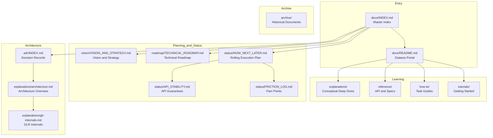

# Adze Documentation Index

**Last updated:** 2026-03-13  
**Version:** 0.8.0-dev (RC Quality)

Master index for all Adze documentation. Use this page to navigate the documentation structure and find what you need.

---

## Quick Navigation by Persona

| I am a... | I want to... | Start here |
|-----------|--------------|------------|
| **New User** | Learn to build parsers | [Getting Started](./tutorials/getting-started.md) → [GLR Quickstart](./tutorials/glr-quickstart.md) |
| **Contributor** | Help improve Adze | [Contributing Guide](../CONTRIBUTING.md) → [Now/Next/Later](./status/NOW_NEXT_LATER.md) |
| **Maintainer** | Understand architecture | [Architecture Overview](./explanations/architecture.md) → [ADRs](./adr/INDEX.md) |
| **Integrator** | Embed Adze in my tool | [API Reference](./reference/api.md) → [Tree-sitter Compatibility](./reference/tree-sitter-compatibility.md) |

---

## Documentation Structure

---

## 1. Strategic Documentation

High-level planning, vision, and status documents.

| Document | Purpose | Audience |
|----------|---------|----------|
| [**Vision and Strategy**](./vision/VISION_AND_STRATEGY.md) | 3-5 year vision, market positioning, sustainability | All stakeholders |
| [**Technical Roadmap**](./roadmap/TECHNICAL_ROADMAP.md) | Technology evolution, feature timelines, performance targets | Contributors, integrators |
| [**Now / Next / Later**](./status/NOW_NEXT_LATER.md) | Rolling execution plan, current wave status | Contributors, maintainers |
| [**Friction Log**](./status/FRICTION_LOG.md) | Current developer pain points being addressed | Contributors |
| [**API Stability**](./status/API_STABILITY.md) | API guarantees per crate | Integrators |
| [**Known Red**](./status/KNOWN_RED.md) | Intentional CI exclusions | Maintainers |

---

## 2. Architecture Decision Records

Formal records of significant architectural decisions.

| ADR | Title | Status |
|-----|-------|--------|
| [INDEX](./adr/INDEX.md) | ADR Index and Guidelines | - |
| [000](./adr/000-template.md) | ADR Template | - |
| [001](./adr/001-pure-rust-glr-implementation.md) | Pure-Rust GLR Implementation | Accepted |
| [002](./adr/002-workspace-structure.md) | Workspace Structure | Accepted |
| [003](./adr/003-dual-runtime-strategy.md) | Dual Runtime Strategy | Accepted |
| [004](./adr/004-grammar-definition-via-macros.md) | Grammar Definition via Macros | Accepted |
| [005](./adr/005-incremental-parsing-architecture.md) | Incremental Parsing Architecture | Accepted |
| [006](./adr/006-tree-sitter-compatibility-layer.md) | Tree-sitter Compatibility Layer | Accepted |
| [007](./adr/007-bdd-framework-for-parser-testing.md) | BDD Framework for Parser Testing | Accepted |
| [008](./adr/008-governance-microcrates-architecture.md) | Governance Microcrates Architecture | Accepted |
| [009](./adr/009-symbol-registry-unification.md) | Symbol Registry Unification | Accepted |
| [010](./adr/010-external-scanner-architecture.md) | External Scanner Architecture | Accepted |
| [011](./adr/011-parse-table-binary-format.md) | Parse Table Binary Format (Postcard) | Accepted |
| [012](./adr/012-performance-baseline-management.md) | Performance Baseline Management | Accepted |
| [013](./adr/013-gss-implementation-strategy.md) | GSS Implementation Strategy | Accepted |
| [014](./adr/014-parse-table-compression-strategy.md) | Parse Table Compression Strategy | Accepted |
| [015](./adr/015-disambiguation-strategy.md) | Disambiguation Strategy for Ambiguous Parses | Accepted |
| [016](./adr/016-error-handling-strategy.md) | Error Handling Strategy | Accepted |
| [017](./adr/017-memory-management-strategy.md) | Memory Management and Allocation Strategy | Accepted |
| [018](./adr/018-grammar-optimization-pipeline.md) | Grammar Optimization Pipeline | Accepted |
| [0001](./adr/0001-arena-allocator-for-parse-trees.md) | Arena Allocator for Parse Trees | Accepted |
| [0003](./adr/0003-enum-variant-inlining-for-glr.md) | Enum Variant Inlining for GLR | Accepted |
| [0007](./adr/ADR-0007-RUNTIME2-GLR-INTEGRATION.md) | Runtime2 GLR Integration | Accepted |

---

## 3. Tutorials

Learning-oriented guides for getting started.

| Tutorial | Description |
|----------|-------------|
| [Getting Started](./tutorials/getting-started.md) | Build a working calculator parser in 5 minutes |
| [GLR Quickstart](./tutorials/glr-quickstart.md) | Understanding and building ambiguous grammars |

---

## 4. How-to Guides

Task-oriented step-by-step guides.

| Guide | Description |
|-------|-------------|
| [Handling Precedence](./how-to/handle-precedence.md) | Resolve operator ambiguity and associativity |
| [External Scanners](./how-to/external-scanners.md) | Integrate custom Rust/C logic for complex tokens |
| [Testing Grammars](./how-to/test-grammars.md) | Unit tests, snapshots, and golden tests |
| [Incremental Parsing](./how-to/incremental-parsing.md) | Reparsing partial text changes for IDE performance |
| [Optimizing Performance](./how-to/optimize-performance.md) | SIMD, GLR tuning, and profiling |
| [LSP Generation](./how-to/generate-lsp.md) | Generate a Language Server for your grammar |
| [Using the Playground](./how-to/use-playground.md) | Develop grammars interactively in the browser |
| [Visualizing GLR](./how-to/visualize-glr.md) | Debug forks and stacks with visual tools |
| [Querying with Metadata](./how-to/query-with-metadata.md) | Use symbol metadata in Tree-sitter queries |
| [C++ Templates Cookbook](./how-to/cookbook-cpp-templates.md) | Best practices for parsing complex C++ constructs |

---

## 5. Reference Documentation

Technical specifications and API documentation.

| Reference | Description |
|-----------|-------------|
| [API Reference](./reference/api.md) | Detailed docs for the `adze` crate and macro attributes |
| [Grammar Examples](./reference/grammar-examples.md) | Patterns for common constructs |
| [Usage Examples](./reference/usage-examples.md) | Practical code snippets for common tasks |
| [Language Support](./reference/language-support.md) | Status of built-in grammars |
| [Known Limitations](./reference/known-limitations.md) | Current status of experimental features |
| [Tree-sitter Compatibility](./reference/tree-sitter-compatibility.md) | Adze's Tree-sitter table format implementation |
| [Empty Rules Reference](./reference/empty-rules-reference.md) | Quick reference for ε-productions |

---

## 6. Explanations

Conceptual background and deep dives.

| Explanation | Description |
|-------------|-------------|
| [Architecture Overview](./explanations/architecture.md) | How Macro, Tool, and Runtime fit together |
| [GLR Internals](./explanations/glr-internals.md) | Deep dive into the Generalized LR engine |
| [Incremental Theory](./explanations/incremental-parsing-theory.md) | Direct Forest Splicing algorithm |
| [Test Strategy](./explanations/test-strategy.md) | Why and how we test Adze |
| [Arena Allocation](./explanations/arena-allocator.md) | Efficient memory management for parse trees |
| [Symbol Normalization](./explanations/symbol-normalization.md) | How Adze simplifies complex grammar rules |
| [Query Predicates](./explanations/query-predicates.md) | How #eq?, #match?, etc. are evaluated |
| [Empty Rules Theory](./explanations/empty-rules.md) | Challenges of nullable productions in LR(1) |
| [GOTO Indexing](./explanations/goto-indexing.md) | Mathematical invariants of table compression |
| [Direct Forest Splicing](./explanations/direct-forest-splicing.md) | Incremental GLR architecture |
| [GLR Incremental Architecture](./explanations/glr-incremental-architecture.md) | Detailed incremental parsing design |
| [Governance](./explanations/governance.md) | Project governance model |

---

## 7. Guides

Comprehensive guides on specific topics.

| Guide | Description |
|-------|-------------|
| [Arena Allocator Guide](./guides/ARENA_ALLOCATOR_GUIDE.md) | Complete guide to arena allocation |
| [Performance Benchmarking](./guides/PERFORMANCE_BENCHMARKING.md) | How to benchmark Adze parsers |
| [Testing Guide](./testing/TESTING_GUIDE.md) | Comprehensive testing strategies for Adze |
| [Contributor Guide](./contributing/CONTRIBUTOR_GUIDE.md) | Complete guide for project contributors |

---

## 8. Archive

Historical documents preserved for reference.

| Directory | Contents |
|-----------|----------|
| [archive/implementation/](./archive/implementation/) | Implementation summaries and roadmaps |
| [archive/releases/](./archive/releases/) | Release notes and checklists |
| [archive/specs/](./archive/specs/) | Technical specifications |
| [archive/status/](./archive/status/) | Historical status documents |
| [archive/plans/](./archive/plans/) | Planning documents |
| [archive/sessions/](./archive/sessions/) | Session summaries |

---

## Suggested Reading Paths

### Path 1: New User Onboarding
1. [Getting Started](./tutorials/getting-started.md) - Build your first parser
2. [API Reference](./reference/api.md) - Understand the API
3. [Grammar Examples](./reference/grammar-examples.md) - See patterns
4. [How-to Guides](./how-to/) - Solve specific problems

### Path 2: Contributor Onboarding
1. [Contributor Guide](./contributing/CONTRIBUTOR_GUIDE.md) - Complete contributor guide
2. [AGENTS.md](../AGENTS.md) - Project conventions
3. [Now / Next / Later](./status/NOW_NEXT_LATER.md) - Current priorities
4. [Architecture Overview](./explanations/architecture.md) - Understand the system
5. [ADR Index](./adr/INDEX.md) - Learn the decisions

### Path 3: Architecture Deep Dive
1. [Architecture Overview](./explanations/architecture.md) - System structure
2. [GLR Internals](./explanations/glr-internals.md) - Parser engine
3. [ADR Index](./adr/INDEX.md) - Decision history
4. [Technical Roadmap](./roadmap/TECHNICAL_ROADMAP.md) - Future direction

### Path 4: Strategic Planning
1. [Vision and Strategy](./vision/VISION_AND_STRATEGY.md) - Long-term vision
2. [Technical Roadmap](./roadmap/TECHNICAL_ROADMAP.md) - Technology plan
3. [Now / Next / Later](./status/NOW_NEXT_LATER.md) - Current execution
4. [API Stability](./status/API_STABILITY.md) - Compatibility guarantees

### Path 5: Testing Mastery
1. [Testing Guide](./testing/TESTING_GUIDE.md) - Comprehensive testing strategies
2. [Test Strategy](./explanations/test-strategy.md) - Why and how we test
3. [Testing Grammars](./how-to/test-grammars.md) - Practical testing guide

---

## Related Files

- [AGENTS.md](../AGENTS.md) - AI agent instructions and project conventions
- [FAQ.md](../FAQ.md) - Frequently asked questions
- [CONTRIBUTING.md](../CONTRIBUTING.md) - Contribution guidelines
- [ROADMAP.md](../ROADMAP.md) - Public roadmap summary

---

## Quick Links

| What | Link |
|------|------|
| Build your first parser | [Getting Started](./tutorials/getting-started.md) |
| See current priorities | [Now / Next / Later](./status/NOW_NEXT_LATER.md) |
| Understand architecture | [Architecture Overview](./explanations/architecture.md) |
| Read the vision | [Vision and Strategy](./vision/VISION_AND_STRATEGY.md) |
| Check API stability | [API Stability](./status/API_STABILITY.md) |
| Browse decision records | [ADR Index](./adr/INDEX.md) |
| View technical roadmap | [Technical Roadmap](./roadmap/TECHNICAL_ROADMAP.md) |
| Learn testing strategies | [Testing Guide](./testing/TESTING_GUIDE.md) |
| Start contributing | [Contributor Guide](./contributing/CONTRIBUTOR_GUIDE.md) |
