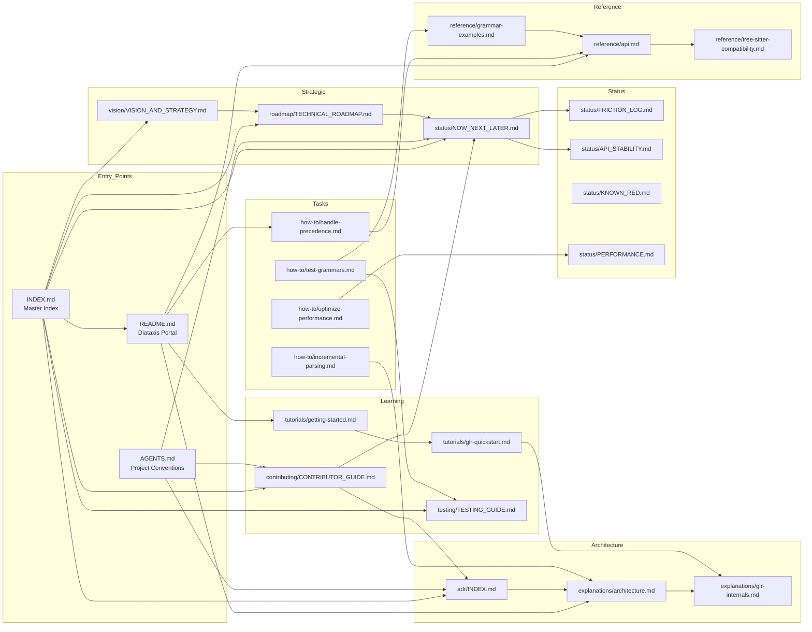
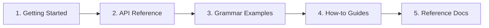
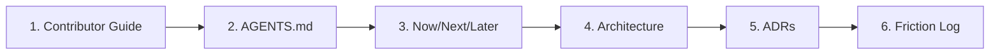
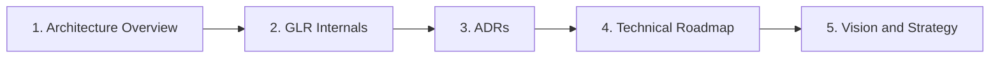
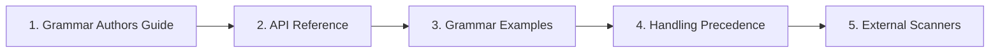
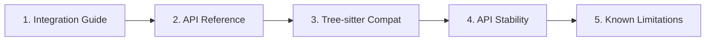

# Adze Documentation Navigation

**Last updated:** 2026-03-13  
**Version:** 0.8.0-dev (RC Quality)

This document provides cross-references between documents and suggested reading paths for different use cases.

---

## Document Relationship Map

---

## I Want To...

### Get Started with Adze

| Goal | Start Here | Next Steps |
|------|------------|------------|
| Build my first parser | [Getting Started](./tutorials/getting-started.md) | [API Reference](./reference/api.md) → [Grammar Examples](./reference/grammar-examples.md) |
| Define a new grammar | [Grammar Author's Guide](./guides/GRAMMAR_AUTHORS_GUIDE.md) | [Grammar Examples](./reference/grammar-examples.md) → [Handle Precedence](./how-to/handle-precedence.md) |
| Understand GLR parsing | [GLR Quickstart](./tutorials/glr-quickstart.md) | [GLR Internals](./explanations/glr-internals.md) → [Handle Precedence](./how-to/handle-precedence.md) |
| See code examples | [Grammar Examples](./reference/grammar-examples.md) | [Usage Examples](./reference/usage-examples.md) |

### Solve a Specific Problem

| Goal | Start Here | Related Docs |
|------|------------|--------------|
| Fix operator precedence issues | [Handling Precedence](./how-to/handle-precedence.md) | [API Reference](./reference/api.md) |
| Add custom tokenization | [External Scanners](./how-to/external-scanners.md) | [Architecture](./explanations/architecture.md) |
| Test my grammar | [Testing Grammars](./how-to/test-grammars.md) | [Testing Guide](./testing/TESTING_GUIDE.md) |
| Master testing strategies | [Testing Guide](./testing/TESTING_GUIDE.md) | [Test Strategy](./explanations/test-strategy.md) |
| Optimize performance | [Optimizing Performance](./how-to/optimize-performance.md) | [Performance Status](./status/PERFORMANCE.md) |
| Add IDE support | [Incremental Parsing](./how-to/incremental-parsing.md) | [Incremental Theory](./explanations/incremental-parsing-theory.md) |
| Generate an LSP | [LSP Generation](./how-to/generate-lsp.md) | [Architecture](./explanations/architecture.md) |
| Debug GLR behavior | [Visualizing GLR](./how-to/visualize-glr.md) | [GLR Internals](./explanations/glr-internals.md) |
| Handle empty rules | [Empty Rules Reference](./reference/empty-rules-reference.md) | [Empty Rules Theory](./explanations/empty-rules.md) |

### Integrate Adze

| Goal | Start Here | Related Docs |
|------|------------|--------------|
| Embed Adze in my tool | [Integration Guide](./guides/INTEGRATION_GUIDE.md) | [API Reference](./reference/api.md) |
| Set up editor support | [Integration Guide: Editors](./guides/INTEGRATION_GUIDE.md#editor-integrations) | [Tree-sitter Compatibility](./reference/tree-sitter-compatibility.md) |
| Configure CI/CD | [Integration Guide: CI/CD](./guides/INTEGRATION_GUIDE.md#cicd-integration) | [Testing Guide](./testing/TESTING_GUIDE.md) |
| Build for WASM | [Integration Guide: WASM](./guides/INTEGRATION_GUIDE.md#wasm-integration) | [API Stability](./status/API_STABILITY.md) |
| Generate an LSP | [Integration Guide: LSP](./guides/INTEGRATION_GUIDE.md#lsp-server-generation) | [LSP Generation How-to](./how-to/generate-lsp.md) |

### Author Grammars

| Goal | Start Here | Related Docs |
|------|------------|--------------|
| Learn grammar definition | [Grammar Author's Guide](./guides/GRAMMAR_AUTHORS_GUIDE.md) | [API Reference](./reference/api.md) |
| Define tokens | [Grammar Author's Guide: Tokens](./guides/GRAMMAR_AUTHORS_GUIDE.md#defining-tokens) | [External Scanners](./how-to/external-scanners.md) |
| Handle precedence | [Grammar Author's Guide: Precedence](./guides/GRAMMAR_AUTHORS_GUIDE.md#handling-precedence) | [Handling Precedence](./how-to/handle-precedence.md) |
| Use common patterns | [Grammar Author's Guide: Patterns](./guides/GRAMMAR_AUTHORS_GUIDE.md#common-patterns) | [Grammar Examples](./reference/grammar-examples.md) |
| Debug grammar issues | [Grammar Author's Guide: Troubleshooting](./guides/GRAMMAR_AUTHORS_GUIDE.md#troubleshooting) | [Visualizing GLR](./how-to/visualize-glr.md) |

### Understand the Architecture

| Goal | Start Here | Deep Dives |
|------|------------|------------|
| Get system overview | [Architecture Overview](./explanations/architecture.md) | [GLR Internals](./explanations/glr-internals.md) |
| Learn design decisions | [ADR Index](./adr/INDEX.md) | Individual ADRs (001-018) |
| Understand memory model | [Arena Allocation](./explanations/arena-allocator.md) | [Arena Allocator Guide](./guides/ARENA_ALLOCATOR_GUIDE.md) |
| Learn incremental parsing | [Incremental Theory](./explanations/incremental-parsing-theory.md) | [Direct Forest Splicing](./explanations/direct-forest-splicing.md) |
| Understand table generation | [GOTO Indexing](./explanations/goto-indexing.md) | [Symbol Normalization](./explanations/symbol-normalization.md) |

### Contribute to Adze

| Goal | Start Here | Next Steps |
|------|------------|------------|
| Start contributing | [Contributor Guide](./contributing/CONTRIBUTOR_GUIDE.md) | [AGENTS.md](../AGENTS.md) |
| Find tasks | [Now/Next/Later](./status/NOW_NEXT_LATER.md) | [Friction Log](./status/FRICTION_LOG.md) |
| Understand conventions | [AGENTS.md](../AGENTS.md) | [PR Template](./PR_TEMPLATE.md) |
| Check CI exclusions | [Known Red](./status/KNOWN_RED.md) | - |

### Plan Strategic Work

| Goal | Start Here | Supporting Docs |
|------|------------|-----------------|
| Understand vision | [Vision and Strategy](./vision/VISION_AND_STRATEGY.md) | [Technical Roadmap](./roadmap/TECHNICAL_ROADMAP.md) |
| See technology plan | [Technical Roadmap](./roadmap/TECHNICAL_ROADMAP.md) | [Now/Next/Later](./status/NOW_NEXT_LATER.md) |
| Check API stability | [API Stability](./status/API_STABILITY.md) | [ADR Index](./adr/INDEX.md) |
| Review performance | [Performance Status](./status/PERFORMANCE.md) | [Benchmarking Guide](./guides/PERFORMANCE_BENCHMARKING.md) |

---

## Reading Paths by Role

### New User Path

1. **[Getting Started](./tutorials/getting-started.md)** - Build your first parser
2. **[API Reference](./reference/api.md)** - Understand the API surface
3. **[Grammar Examples](./reference/grammar-examples.md)** - See common patterns
4. **[How-to Guides](./how-to/)** - Solve specific problems
5. **[Reference Docs](./reference/)** - Deep technical reference

### Contributor Path

1. **[Contributor Guide](./contributing/CONTRIBUTOR_GUIDE.md)** - Complete contributor onboarding
2. **[AGENTS.md](../AGENTS.md)** - Project conventions and setup
3. **[Now/Next/Later](./status/NOW_NEXT_LATER.md)** - Current priorities
4. **[Architecture Overview](./explanations/architecture.md)** - System understanding
5. **[ADR Index](./adr/INDEX.md)** - Design decisions
6. **[Friction Log](./status/FRICTION_LOG.md)** - Pain points to address

### Architect Path

1. **[Architecture Overview](./explanations/architecture.md)** - System structure
2. **[GLR Internals](./explanations/glr-internals.md)** - Parser engine details
3. **[ADR Index](./adr/INDEX.md)** - Decision history
4. **[Technical Roadmap](./roadmap/TECHNICAL_ROADMAP.md)** - Future direction
5. **[Vision and Strategy](./vision/VISION_AND_STRATEGY.md)** - Strategic context

### Grammar Author Path

1. **[Grammar Author's Guide](./guides/GRAMMAR_AUTHORS_GUIDE.md)** - Complete grammar definition guide
2. **[API Reference](./reference/api.md)** - API surface for grammar annotations
3. **[Grammar Examples](./reference/grammar-examples.md)** - Common patterns
4. **[Handling Precedence](./how-to/handle-precedence.md)** - Resolve operator ambiguity
5. **[External Scanners](./how-to/external-scanners.md)** - Custom tokenization

### Integrator Path

1. **[Integration Guide](./guides/INTEGRATION_GUIDE.md)** - Complete integration guide
2. **[API Reference](./reference/api.md)** - API surface
3. **[Tree-sitter Compatibility](./reference/tree-sitter-compatibility.md)** - Interoperability
4. **[API Stability](./status/API_STABILITY.md)** - Compatibility guarantees
5. **[Known Limitations](./reference/known-limitations.md)** - Current constraints

---

## Document Cross-Reference Matrix

| From ↓ / To → | Vision | Roadmap | NNL | ADRs | Architecture | API Ref | Tutorials |
|----------------|--------|---------|-----|------|--------------|---------|-----------|
| **Vision** | - | ✓ | - | - | - | - | - |
| **Roadmap** | ✓ | - | ✓ | ✓ | ✓ | - | - |
| **NNL** | - | ✓ | - | - | - | ✓ | - |
| **ADRs** | - | - | - | ✓ | ✓ | - | - |
| **Architecture** | - | - | - | ✓ | - | - | ✓ |
| **API Ref** | - | - | - | - | ✓ | - | ✓ |
| **Tutorials** | - | - | - | - | ✓ | ✓ | ✓ |

### Key Cross-References

| Document | References | Referenced By |
|----------|------------|---------------|
| [Vision and Strategy](./vision/VISION_AND_STRATEGY.md) | Technical Roadmap | Roadmap, INDEX |
| [Technical Roadmap](./roadmap/TECHNICAL_ROADMAP.md) | Vision, NNL, ADRs, Architecture | Vision, INDEX |
| [Now/Next/Later](./status/NOW_NEXT_LATER.md) | Friction Log, API Stability, Known Red | Roadmap, AGENTS, INDEX |
| [ADR Index](./adr/INDEX.md) | All ADRs, AGENTS | Roadmap, Architecture, INDEX |
| [Architecture Overview](./explanations/architecture.md) | GLR Internals, ADRs | Tutorials, How-to, Roadmap |
| [API Reference](./reference/api.md) | Grammar Examples, Tree-sitter Compat | Tutorials, How-to, NNL |

---

## Quick Navigation Shortcuts

### By Category

- **Strategic**: [Vision](./vision/VISION_AND_STRATEGY.md) | [Roadmap](./roadmap/TECHNICAL_ROADMAP.md) | [Now/Next/Later](./status/NOW_NEXT_LATER.md)
- **Status**: [Friction Log](./status/FRICTION_LOG.md) | [API Stability](./status/API_STABILITY.md) | [Known Red](./status/KNOWN_RED.md) | [Performance](./status/PERFORMANCE.md)
- **Architecture**: [ADRs](./adr/INDEX.md) | [Overview](./explanations/architecture.md) | [GLR](./explanations/glr-internals.md)
- **Learning**: [Getting Started](./tutorials/getting-started.md) | [GLR Quickstart](./tutorials/glr-quickstart.md)
- **Reference**: [API](./reference/api.md) | [Examples](./reference/grammar-examples.md) | [Compatibility](./reference/tree-sitter-compatibility.md)
- **Guides**: [Grammar Author's Guide](./guides/GRAMMAR_AUTHORS_GUIDE.md) | [Integration Guide](./guides/INTEGRATION_GUIDE.md) | [Testing Guide](./testing/TESTING_GUIDE.md) | [Contributor Guide](./contributing/CONTRIBUTOR_GUIDE.md)

### By Task

- **Build**: [Getting Started](./tutorials/getting-started.md) → [API Reference](./reference/api.md)
- **Define Grammar**: [Grammar Author's Guide](./guides/GRAMMAR_AUTHORS_GUIDE.md) → [Grammar Examples](./reference/grammar-examples.md)
- **Integrate**: [Integration Guide](./guides/INTEGRATION_GUIDE.md) → [API Stability](./status/API_STABILITY.md)
- **Test**: [Testing Guide](./testing/TESTING_GUIDE.md) → [Test Grammars](./how-to/test-grammars.md)
- **Debug**: [Visualizing GLR](./how-to/visualize-glr.md) → [GLR Internals](./explanations/glr-internals.md)
- **Optimize**: [Performance Guide](./how-to/optimize-performance.md) → [Performance Status](./status/PERFORMANCE.md)
- **Contribute**: [Contributor Guide](./contributing/CONTRIBUTOR_GUIDE.md) → [Now/Next/Later](./status/NOW_NEXT_LATER.md)

---

## Related Resources

| Resource | Location | Purpose |
|----------|----------|---------|
| [Master Index](./INDEX.md) | docs/INDEX.md | Complete documentation index |
| [Diataxis Portal](./README.md) | docs/README.md | Learning-oriented entry point |
| [AGENTS.md](../AGENTS.md) | Root | AI agent and developer conventions |
| [FAQ](../FAQ.md) | Root | Frequently asked questions |
| [CONTRIBUTING](../CONTRIBUTING.md) | Root | Contribution guidelines |
