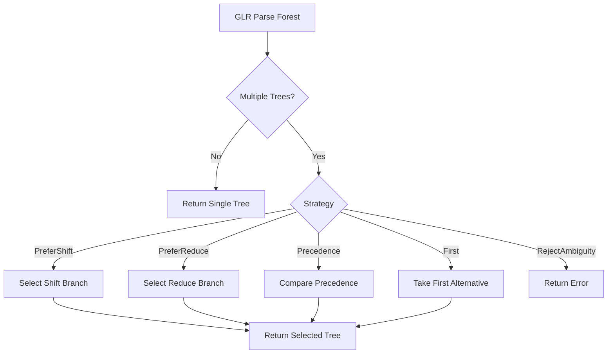

# ADR 015: Disambiguation Strategy for Ambiguous Parses

**Status**: Accepted
**Date**: 2025-03-13
**Authors**: adze maintainers
**Related**: ADR-001 (Pure-Rust GLR Implementation), ADR-003 (Dual Runtime Strategy)

## Context

GLR parsing naturally produces parse forests containing multiple valid parse trees when grammars are ambiguous. The forest-to-tree conversion process must select a single tree from these forests using a disambiguation strategy.

The [`ForestConverter`](../../runtime2/src/forest_converter.rs) handles this conversion, while [`conflict_resolution.rs`](../../glr-core/src/conflict_resolution.rs) provides runtime conflict resolution for specific patterns like vec-wrappers.

### Disambiguation Challenges

1. **Operator Associativity**: `a - b - c` can parse as `(a - b) - c` (left) or `a - (b - c)` (right)
2. **Dangling Else**: `if a then if b then c else d` - which `if` does `else` belong to?
3. **Empty Productions**: List rules like `items -> items item | ε` create shift/reduce conflicts
4. **Expression Precedence**: `a + b * c` requires precedence-aware selection

## Decision

We implement a **multi-level disambiguation hierarchy** with PreferShift as the default:

### Level 1: Static Disambiguation (Grammar Declaration)

Grammar authors declare precedence and associativity in the grammar:

```rust
// Example: Expression precedence declaration
builder.declare_infix("+", Associativity::Left, 10);
builder.declare_infix("*", Associativity::Left, 20);  // Higher precedence
```

### Level 2: Runtime Disambiguation Strategies

The [`DisambiguationStrategy`](../../runtime2/src/forest_converter.rs:21) enum defines available strategies:

```rust
pub enum DisambiguationStrategy {
    /// Prefer shift over reduce (Tree-sitter default)
    /// Creates right-associative trees
    PreferShift,

    /// Prefer reduce over shift
    /// Creates left-associative trees
    PreferReduce,

    /// Use precedence from grammar declarations
    Precedence,

    /// Take first alternative (fast but arbitrary)
    First,

    /// Reject ambiguity (return error)
    RejectAmbiguity,
}
```

### Default Strategy: PreferShift

**PreferShift** is the default for Tree-sitter compatibility:

```rust
impl ForestConverter {
    pub fn new(strategy: DisambiguationStrategy) -> Self {
        Self { strategy }
    }
}
```

**Rationale**:
- Matches Tree-sitter's behavior exactly
- Resolves dangling-else correctly (else binds to nearest if)
- Produces right-associative trees for binary operators

### Level 3: Specialized Runtime Resolvers

For specific conflict patterns, specialized resolvers implement [`RuntimeConflictResolver`](../../glr-core/src/conflict_resolution.rs:8):

```rust
pub trait RuntimeConflictResolver {
    fn resolve(&self, state: StateId, lookahead: SymbolId, actions: &[Action]) -> Option<Action>;
}
```

#### VecWrapperResolver

Handles optional list patterns where empty productions create conflicts:

```rust
pub struct VecWrapperResolver {
    wrapper_states: FxHashMap<StateId, Option<ProductionId>>,
    statement_starters: FixedBitSet,
}

impl VecWrapperResolver {
    /// Returns true if token is NOT a statement-starter
    pub fn should_reduce_empty(&self, token: SymbolId) -> bool {
        !self.statement_starters.contains(token.0 as usize)
    }
}
```

This resolver reduces empty list productions only when the lookahead token cannot start a list element.

### Conflict Resolution Flow



## Consequences

### Positive

- **Tree-sitter Compatibility**: PreferShift matches Tree-sitter's default behavior
- **Flexibility**: Multiple strategies available for different use cases
- **Explicit Ambiguity**: RejectAmbiguity forces grammar authors to resolve conflicts
- **Performance**: First strategy provides fast selection when correctness matters less

### Negative

- **Silent Selection**: PreferShift may silently select incorrect parse for left-associative operators
- **Grammar Complexity**: Precedence-based resolution requires explicit declarations
- **Debugging Difficulty**: Ambiguity resolution is not always obvious from the output tree
- **Incomplete Implementation**: Precedence strategy marked as Phase 3.3 (not fully implemented)

### Neutral

- The default strategy prioritizes compatibility over theoretical correctness
- Grammar authors should declare associativity to avoid silent misparses
- Future work may include ambiguity visualization tools

## Related

- Related ADRs: [ADR-001](001-pure-rust-glr-implementation.md), [ADR-003](003-dual-runtime-strategy.md)
- Evidence: [`runtime2/src/forest_converter.rs`](../../runtime2/src/forest_converter.rs), [`glr-core/src/conflict_resolution.rs`](../../glr-core/src/conflict_resolution.rs)
- Contract: [`docs/specs/FOREST_CONVERTER_CONTRACT.md`](../specs/FOREST_CONVERTER_CONTRACT.md)
