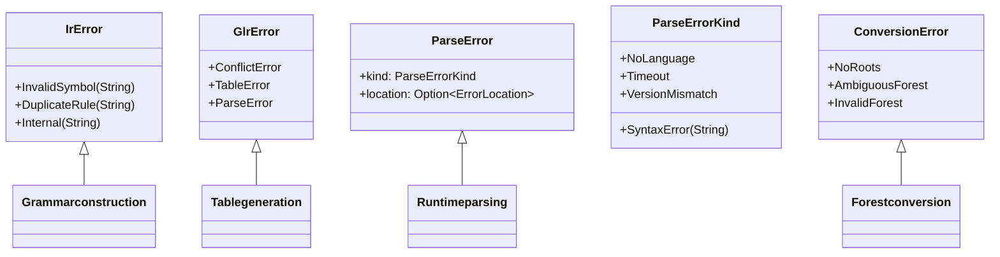

# ADR 016: Error Handling Strategy

**Status**: Accepted
**Date**: 2025-03-13
**Authors**: adze maintainers
**Related**: ADR-001 (Pure-Rust GLR Implementation), ADR-003 (Dual Runtime Strategy)

## Context

Error handling in a parser toolchain spans multiple layers:
1. **Grammar construction**: Errors in grammar definitions
2. **Parse table generation**: Conflicts and inconsistencies
3. **Runtime parsing**: Syntax errors in input
4. **Error recovery**: Continuing after errors

The project uses two error handling crates:
- **`thiserror`**: For library crates (structured, typed errors)
- **`anyhow`**: For application crates (flexible, chainable errors)

Evidence from [`runtime2/src/error.rs`](../../runtime2/src/error.rs), [`ir/src/error.rs`](../../ir/src/error.rs), and [`glr-core/src/lib.rs`](../../glr-core/src/lib.rs) informs this strategy.

## Decision

We adopt a **layered error handling strategy** with clear ownership boundaries:

### 1. Library Crates: Typed Errors with `thiserror`

All library crates use `thiserror` to define precise error types:

#### IR Layer ([`ir/src/error.rs`](../../ir/src/error.rs))

```rust
#[non_exhaustive]
#[derive(Debug, thiserror::Error)]
pub enum IrError {
    #[error("invalid symbol: {0}")]
    InvalidSymbol(String),

    #[error("duplicate rule: {0}")]
    DuplicateRule(String),

    #[error("internal error: {0}")]
    Internal(String),
}

pub type Result<T> = std::result::Result<T, IrError>;
```

#### Runtime Layer ([`runtime2/src/error.rs`](../../runtime2/src/error.rs))

```rust
#[derive(Debug, Error)]
#[error("{kind}")]
pub struct ParseError {
    pub kind: ParseErrorKind,
    pub location: Option<ErrorLocation>,
}

#[derive(Debug, Error)]
pub enum ParseErrorKind {
    #[error("no language set")]
    NoLanguage,

    #[error("parse timeout exceeded")]
    Timeout,

    #[error("syntax error at {0}")]
    SyntaxError(String),

    #[error("language version mismatch: expected {expected}, got {actual}")]
    VersionMismatch { expected: u32, actual: u32 },
    // ...
}
```

### 2. Application Crates: Flexible Errors with `anyhow`

CLI tools and applications use `anyhow` for:
- Error chain accumulation
- Context attachment
- Simplified error propagation

### 3. Error Recovery Invariants

The GLR core defines critical invariants for error recovery ([`glr-core/src/lib.rs`](../../glr-core/src/lib.rs:32)):

```rust
//! ### Error Recovery Invariants
//! - `has_error`: true if any error chunks exist in the parse forest
//! - `missing`: count of unique missing terminal symbols inserted
//! - `cost`: total error recovery cost (insertions + deletions)
//! - No double counting: each missing symbol counted exactly once
//! - Extras (whitespace/comments) are never inserted during recovery
```

### 4. Error Type Hierarchy



### 5. Error Conversion Rules

Errors flow upward through conversion implementations:

```rust
// Forest conversion errors → Parse errors
impl From<ConversionError> for ParseError {
    fn from(err: ConversionError) -> Self {
        ParseError::with_msg(&err.to_string())
    }
}

// GLR errors → Parse errors
impl From<adze_glr_core::driver::GlrError> for ParseError {
    fn from(e: adze_glr_core::driver::GlrError) -> Self {
        ParseError::with_msg(&e.to_string())
    }
}
```

### 6. Location Information

Parse errors include structured location data:

```rust
#[derive(Debug, Clone, PartialEq, Eq)]
pub struct ErrorLocation {
    pub byte_offset: usize,
    pub line: usize,      // 1-indexed
    pub column: usize,    // 1-indexed
}
```

## Consequences

### Positive

- **Type Safety**: Library errors are exhaustive and compiler-checked
- **API Stability**: `#[non_exhaustive]` allows adding error variants without breaking changes
- **Clear Boundaries**: Each layer owns its error domain
- **Rich Context**: Location information enables precise error reporting
- **Recovery Invariants**: Documented invariants ensure consistent error recovery behavior

### Negative

- **Boilerplate**: Error conversion implementations required between layers
- **Information Loss**: Some detail may be lost during conversion
- **Two Ecosystems**: Mixing `thiserror` and `anyhow` requires understanding both

### Neutral

- The `#[non_exhaustive]` attribute on error enums prevents exhaustive matching by downstream users
- Error recovery cost tracking enables sophisticated error tolerance strategies
- Future versions may consolidate error types across layers

## Related

- Related ADRs: [ADR-001](001-pure-rust-glr-implementation.md), [ADR-003](003-dual-runtime-strategy.md)
- Evidence: [`runtime2/src/error.rs`](../../runtime2/src/error.rs), [`ir/src/error.rs`](../../ir/src/error.rs), [`glr-core/src/lib.rs`](../../glr-core/src/lib.rs)
- AGENTS.md: Error type conventions for library vs application crates
