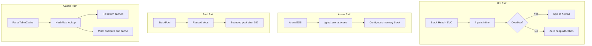

# ADR 017: Memory Management and Allocation Strategy

**Status**: Accepted
**Date**: 2025-03-13
**Authors**: adze maintainers
**Related**: ADR-001 (Pure-Rust GLR Implementation), ADR-003 (Dual Runtime Strategy), ADR-013 (GSS Implementation Strategy)

## Context

GLR parsing is memory-intensive due to:
1. **Multiple concurrent parse stacks** that fork and merge
2. **Parse forests** storing potentially exponential parse trees
3. **Frequent allocations** for stack nodes and tree nodes
4. **Large parse tables** that must remain memory-resident

The project employs several memory optimization strategies across different components:
- Small vector optimization in [`glr-core/src/stack.rs`](../../glr-core/src/stack.rs)
- Arena allocation in [`glr-core/src/gss_arena.rs`](../../glr-core/src/gss_arena.rs)
- Object pooling in [`glr-core/src/perf_optimizations.rs`](../../glr-core/src/perf_optimizations.rs)

## Decision

We adopt a **layered allocation strategy** with different strategies for different access patterns:

### 1. Small Vector Optimization (SVO)

For frequently-accessed, typically-small collections, we use stack-allocated storage that spills to heap only when necessary.

#### Persistent Stack Implementation

```rust
// From glr-core/src/stack.rs
const SMALL_VEC_PAIR_CAP: usize = 4;
const ENTRY_CAP: usize = SMALL_VEC_PAIR_CAP * 2;  // 8 entries

pub struct StackNode {
    pub state: u16,
    pub symbol: Option<u16>,
    pub head: Vec<u16>,  // Small vector: 4 pairs before spill
    pub tail: Option<Arc<StackNode>>,
}
```

**Benefits**:
- Avoids heap allocation for stacks ≤4 levels deep
- Common case (shallow stacks) is zero-allocation
- Automatic spilling when capacity exceeded

### 2. Arena Allocation

For bulk allocation of same-typed objects with identical lifetimes.

#### Arena-Based GSS

```rust
// From glr-core/src/gss_arena.rs
use typed_arena::Arena;

pub struct ArenaGSS<'a> {
    arena: &'a Arena<ArenaStackNode<'a>>,
    active_heads: Vec<&'a ArenaStackNode<'a>>,
    // ...
}
```

**Benefits**:
- Single allocation for all nodes
- Excellent cache locality
- Zero fragmentation
- Bulk deallocation

**Trade-offs**:
- Requires lifetime annotations
- Cannot free individual nodes
- All nodes share the same lifetime

### 3. Object Pooling

For frequently-allocated-and-freed objects of varying sizes.

#### Stack Pool

```rust
// From glr-core/src/perf_optimizations.rs
pub struct StackPool<T> {
    pool: Vec<Vec<T>>,
}

impl<T> StackPool<T> {
    pub fn acquire(&mut self) -> Vec<T> {
        self.pool.pop().unwrap_or_default()
    }

    pub fn release(&mut self, mut vec: Vec<T>) {
        vec.clear();
        if self.pool.len() < 100 {
            self.pool.push(vec);
        }
    }
}
```

**Benefits**:
- Reuses allocated vectors
- Reduces allocator pressure
- Bounded pool size prevents memory bloat

### 4. Parse Table Caching

For frequently-accessed parse table lookups.

```rust
// From glr-core/src/perf_optimizations.rs
pub struct ParseTableCache {
    cache: HashMap<(StateId, SymbolId), Action>,
    stats: PerfStats,
}

impl ParseTableCache {
    pub fn get_or_compute<F>(&mut self, state: StateId, symbol: SymbolId, compute: F) -> Action
    where F: FnOnce() -> Action
    {
        if let Some(action) = self.cache.get(&(state, symbol)) {
            self.stats.cache_hits += 1;
            action.clone()
        } else {
            self.stats.cache_misses += 1;
            let action = compute();
            self.cache.insert((state, symbol), action.clone());
            action
        }
    }
}
```

### 5. Stack Deduplication

For detecting and merging identical stack configurations.

```rust
// From glr-core/src/perf_optimizations.rs
pub struct StackDeduplicator {
    seen_states: HashMap<Vec<StateId>, usize>,
}

impl StackDeduplicator {
    pub fn is_duplicate(&mut self, states: &[StateId]) -> bool {
        if let Some(count) = self.seen_states.get_mut(states) {
            *count += 1;
            true
        } else {
            self.seen_states.insert(states.to_vec(), 1);
            false
        }
    }
}
```

### Strategy Selection Matrix

| Allocation Pattern | Strategy | Use Case |
|-------------------|----------|----------|
| Small, fixed-size collections | Small Vector | Stack heads, symbol sequences |
| Bulk same-type allocation | Arena | GSS nodes in batch parsing |
| Frequent alloc/free cycles | Object Pool | Vec reuse in parsing loops |
| Repeated lookups | Cache | Parse table access |
| Duplicate detection | Deduplication | Stack state comparison |

### Memory Hierarchy Diagram



## Consequences

### Positive

- **Reduced Allocation Overhead**: SVO eliminates heap allocation for common cases
- **Better Cache Locality**: Arena allocation provides contiguous memory access
- **Controlled Memory Growth**: Object pools prevent unbounded allocation
- **Performance Monitoring**: Built-in statistics track cache efficiency

### Negative

- **Implementation Complexity**: Multiple strategies increase code complexity
- **Lifetime Complexity**: Arena allocation requires careful lifetime management
- **Memory Overhead**: Caches and pools consume additional memory
- **Tuning Required**: Pool sizes and thresholds may need adjustment per workload

### Neutral

- The default configuration works well for typical parsing workloads
- Performance statistics enable data-driven tuning
- Future work may include adaptive strategy selection based on workload characteristics

## Related

- Related ADRs: [ADR-001](001-pure-rust-glr-implementation.md), [ADR-013](013-gss-implementation-strategy.md)
- Evidence: [`glr-core/src/perf_optimizations.rs`](../../glr-core/src/perf_optimizations.rs), [`glr-core/src/stack.rs`](../../glr-core/src/stack.rs), [`glr-core/src/gss_arena.rs`](../../glr-core/src/gss_arena.rs)
- See also: [`glr-core/src/telemetry.rs`](../../glr-core/src/telemetry.rs) for performance monitoring
