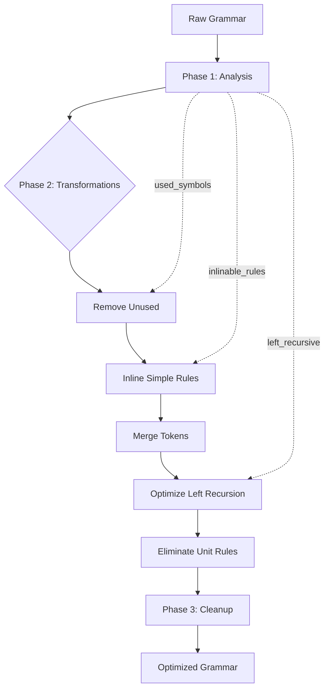

# ADR 018: Grammar Optimization Pipeline

**Status**: Accepted
**Date**: 2025-03-13
**Authors**: adze maintainers
**Related**: ADR-004 (Grammar Definition via Macros), ADR-001 (Pure-Rust GLR Implementation)

## Context

Grammar optimization transforms raw grammar definitions into efficient parse tables. The optimizer in [`ir/src/optimizer.rs`](../../ir/src/optimizer.rs) applies multiple passes that must be executed in a specific order due to dependencies between transformations.

### Optimization Challenges

1. **Unused Symbols**: Generated grammars may contain unreachable rules
2. **Rule Inlining**: Simple rules can be inlined to reduce parse states
3. **Token Merging**: Equivalent tokens should be unified
4. **Left Recursion**: Direct left recursion requires special handling
5. **Unit Rules**: Chain rules (A → B) add unnecessary states
6. **Symbol Renumbering**: Final compacting of symbol IDs

## Decision

We implement a **multi-phase optimization pipeline** with explicit ordering and dependencies:

### Phase Structure

```rust
// From ir/src/optimizer.rs
pub fn optimize(&mut self, grammar: &mut Grammar) -> OptimizationStats {
    let mut stats = OptimizationStats::default();

    // Phase 1: Analysis
    self.analyze_grammar(grammar);

    // Phase 2: Optimizations (order matters!)
    stats.removed_unused_symbols = self.remove_unused_symbols(grammar);
    stats.inlined_rules = self.inline_simple_rules(grammar);
    stats.merged_tokens = self.merge_equivalent_tokens(grammar);
    stats.optimized_left_recursion = self.optimize_left_recursion(grammar);
    stats.eliminated_unit_rules = self.eliminate_unit_rules(grammar);

    // Phase 3: Cleanup
    self.renumber_symbols(grammar);

    stats
}
```

### Phase 1: Analysis

The analysis phase collects information needed by subsequent optimizations:

```rust
fn analyze_grammar(&mut self, grammar: &Grammar) {
    // Mark start symbol as used
    if let Some(start_symbol) = grammar.start_symbol() {
        self.used_symbols.insert(start_symbol);
    }

    // Always mark source_file as used (Tree-sitter compatibility)
    if let Some(source_file_id) = grammar.find_symbol_by_name("source_file") {
        self.source_file_id = Some(source_file_id);
        self.used_symbols.insert(source_file_id);
    }

    // Identify inlinable rules (single production, non-recursive)
    // Identify left-recursive rules for special handling
}
```

**Outputs**:
- `used_symbols`: Set of reachable symbols
- `inlinable_rules`: Rules safe to inline
- `left_recursive_rules`: Rules requiring special handling

### Phase 2: Transformations

Each transformation depends on results from previous phases:

#### 2.1 Remove Unused Symbols

**Dependency**: Analysis phase must complete first

```rust
fn remove_unused_symbols(&mut self, grammar: &mut Grammar) -> usize {
    // Remove rules for unused symbols
    // Remove unused tokens
    // Return count of removed symbols
}
```

**Invariants**:
- `source_file` is never removed (Tree-sitter compatibility)
- Start symbol is never removed
- All symbols reachable from start remain

#### 2.2 Inline Simple Rules

**Dependency**: Unused symbols removed (prevents inlining dead code)

```rust
fn inline_simple_rules(&mut self, grammar: &mut Grammar) -> usize {
    // For each inlinable rule:
    //   Replace all references with rule's RHS
    //   Remove the rule
}
```

**Inlining Criteria**:
- Single production rule
- Non-recursive
- Not `source_file` (start symbol)

#### 2.3 Merge Equivalent Tokens

**Dependency**: Inlining complete (may expose equivalences)

```rust
fn merge_equivalent_tokens(&mut self, grammar: &mut Grammar) -> usize {
    // Find tokens with identical patterns
    // Consolidate to single token
    // Update all references
}
```

#### 2.4 Optimize Left Recursion

**Dependency**: Token merging complete (stable token IDs)

```rust
fn optimize_left_recursion(&mut self, grammar: &mut Grammar) -> usize {
    // Detect direct left recursion
    // Transform to iterative form if possible
    // Mark for GLR handling if not transformable
}
```

#### 2.5 Eliminate Unit Rules

**Dependency**: Left recursion handled (may create unit rules)

```rust
fn eliminate_unit_rules(&mut self, grammar: &mut Grammar) -> usize {
    // A -> B where B is single non-terminal
    // Replace with direct transitions
}
```

### Phase 3: Cleanup

Final renumbering ensures dense symbol IDs:

```rust
fn renumber_symbols(&mut self, grammar: &mut Grammar) {
    // Assign contiguous symbol IDs
    // Update all symbol references
    // Rebuild symbol name mappings
}
```

### Optimization Pipeline Diagram



### Statistics Tracking

```rust
#[derive(Debug, Default)]
pub struct OptimizationStats {
    pub removed_unused_symbols: usize,
    pub inlined_rules: usize,
    pub merged_tokens: usize,
    pub optimized_left_recursion: usize,
    pub eliminated_unit_rules: usize,
}
```

### Special Case: source_file Protection

The optimizer explicitly protects the `source_file` symbol throughout all phases:

```rust
// Always mark source_file as used if it exists (Tree-sitter compatibility)
if let Some(source_file_id) = grammar.find_symbol_by_name("source_file") {
    self.source_file_id = Some(source_file_id);
    self.used_symbols.insert(source_file_id);
}

// Never inline source_file as it's the start symbol
if rule.rhs.len() == 1
    && !self.is_recursive_rule(rule, grammar)
    && Some(rule.lhs) != self.source_file_id  // Guard clause
{
    // Mark as inlinable
}
```

## Consequences

### Positive

- **Deterministic Output**: Same input always produces same optimized output
- **Measurable Results**: Statistics track optimization effectiveness
- **Tree-sitter Compatibility**: `source_file` protection ensures compatibility
- **Separable Phases**: Each phase can be tested independently
- **Observable Progress**: Debug tracing shows transformation progress

### Negative

- **Fixed Order**: Phase order is hardcoded; cannot be easily customized
- **Single Pass**: No iterative optimization until fixed point
- **Limited Parallelism**: Phases must execute sequentially
- **Memory Overhead**: Analysis results kept for entire optimization

### Neutral

- Debug builds include trace output for optimization phases
- The `check_source_file` closure verifies invariants after each phase in debug mode
- Future versions may support configurable optimization levels

## Related

- Related ADRs: [ADR-004](004-grammar-definition-via-macros.md), [ADR-001](001-pure-rust-glr-implementation.md)
- Evidence: [`ir/src/optimizer.rs`](../../ir/src/optimizer.rs)
- See also: [`ir/src/normalization.rs`](../../ir/src/normalization.rs) for grammar normalization
