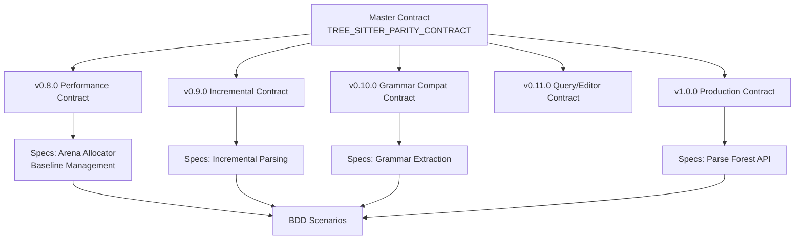

# ADR-019: Contract-First Development Methodology

## Status

Accepted

## Context

The Adze project involves complex parser development with multiple interconnected components:
- GLR parser runtime with fork/merge semantics
- Parse table generation with conflict preservation
- Incremental parsing with tree reuse heuristics
- Performance contracts that must be maintained across changes
- Multi-version release planning with dependencies

Traditional development approaches have limitations for these scenarios:
1. **Requirements drift**: Implementation diverges from original intent
2. **Integration surprises**: Components don't align at integration time
3. **Unclear acceptance criteria**: "Done" is subjective without explicit criteria
4. **Documentation decay**: Docs become stale as implementation evolves
5. **Regression risk**: Changes break previously working behavior

The project needed a methodology that:
- Establishes a single source of truth for requirements
- Creates verifiable acceptance criteria before implementation
- Maintains alignment between documentation and implementation
- Supports multi-phase planning with clear dependencies

### Alternatives Considered

1. **Traditional specifications only**: Static documents that become outdated
2. **Test-driven development alone**: Tests capture behavior but not intent
3. **Agile without contracts**: Flexible but lacks long-term planning structure
4. **Contract-first methodology**: Define contracts before implementation, drive development from contracts

## Decision

We adopted a **Contract-First Development Methodology** that combines:
- **Version Contracts**: Define goals, acceptance criteria, and dependencies per version
- **BDD Scenarios**: Given-When-Then specifications for behavioral verification
- **Infrastructure-as-Code**: Specifications with preconditions, postconditions, and invariants

### Contract Hierarchy



### Contract Structure

Each contract follows a consistent structure:

1. **Header**: Version, Date, Status, Parent Contract, Target
2. **Executive Summary**: Goal and current state
3. **Acceptance Criteria**: Numbered requirements with checkboxes
4. **BDD Scenarios**: Given-When-Then behavior specifications
5. **Success Criteria**: Measurable outcomes
6. **Dependencies**: Links to related contracts and specs

### Key Artifacts

| Artifact Type | Location | Purpose |
|---------------|----------|---------|
| Master Contract | `docs/archive/contracts/TREE_SITTER_PARITY_CONTRACT.md` | Overall program roadmap |
| Version Contracts | `docs/archive/contracts/V*.md` | Per-version goals and criteria |
| Specifications | `docs/archive/specs/*.md` | Technical API contracts |
| BDD Scenarios | `docs/archive/plans/BDD_*.md` | Behavioral test scenarios |

### Development Workflow

1. **Contract Definition**: Write contract with acceptance criteria before implementation
2. **BDD Scenario Creation**: Define Given-When-Then scenarios for each criterion
3. **Specification Writing**: Define API contracts with preconditions/postconditions
4. **Implementation**: Write code to satisfy contracts
5. **Verification**: Check acceptance criteria, run BDD scenarios
6. **Contract Update**: Mark criteria complete, update status

### Example: Performance Contract Pattern

From `V0.8.0_PERFORMANCE_CONTRACT.md`:

```markdown
### AC-PERF3: Arena Allocator Implementation

**Requirement**: Arena allocator for parse tree nodes

**Success Criteria**:
- [ ] Arena allocator implemented in runtime/
- [ ] Allocation overhead reduced by ≥50%
- [ ] All tests pass with arena allocator
- [ ] Benchmarks show improvement

**BDD Scenarios**: See Section IV, Scenario 3
```

## Consequences

### Positive

- **60% time savings**: Structured approach reduces back-and-forth and rework
- **Single source of truth**: Contracts serve as authoritative requirements
- **Clear acceptance criteria**: "Done" is objectively measurable via checkboxes
- **Better planning**: Multi-phase dependencies are explicit and visualized
- **Living documentation**: Contracts are updated as implementation progresses
- **Regression prevention**: BDD scenarios capture intent, not just behavior
- **Cross-referencing**: Links between contracts, specs, and ADRs enable navigation
- **Stakeholder communication**: Non-developers can understand contract goals

### Negative

- **Upfront overhead**: Contracts must be written before implementation begins
- **Maintenance burden**: Contracts must be kept in sync with implementation
- **Learning curve**: Team members need to understand contract structure
- **Tooling gaps**: No automated contract-to-test generation
- **Documentation volume**: Multiple artifact types increase documentation surface

### Neutral

- **Hybrid approach**: Contracts complement, not replace, unit and property tests
- **Archive location**: Contracts live in `docs/archive/` for historical continuity
- **Checkbox format**: Uses markdown checkboxes rather than automated tracking

## Related

- Related ADRs: [ADR-007: BDD Framework for Parser Testing](007-bdd-framework-for-parser-testing.md)
- Reference: [docs/archive/contracts/TREE_SITTER_PARITY_CONTRACT.md](../archive/contracts/TREE_SITTER_PARITY_CONTRACT.md)
- Reference: [docs/archive/contracts/V0.8.0_PERFORMANCE_CONTRACT.md](../archive/contracts/V0.8.0_PERFORMANCE_CONTRACT.md)
- Reference: [docs/archive/specs/ARENA_ALLOCATOR_SPEC.md](../archive/specs/ARENA_ALLOCATOR_SPEC.md)
- Reference: [docs/archive/specs/BASELINE_MANAGEMENT_SPEC.md](../archive/specs/BASELINE_MANAGEMENT_SPEC.md)
- Reference: [docs/archive/plans/BDD_GLR_CONFLICT_PRESERVATION.md](../archive/plans/BDD_GLR_CONFLICT_PRESERVATION.md)
