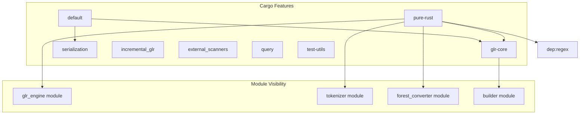
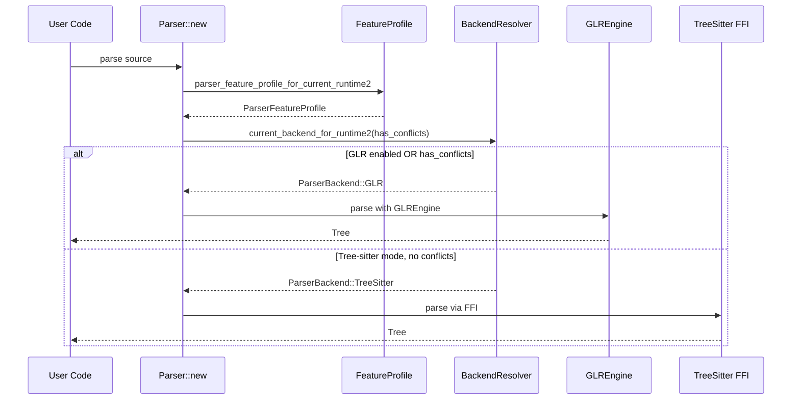

# ADR-021: Feature Flag and Backend Selection Strategy

## Status

Accepted

## Context

Adze supports multiple parser backends to address different use cases:

1. **Tree-sitter LR Mode** (`runtime/`) - Full TSLanguage ABI compatibility with mature ecosystem integration
2. **Pure-Rust GLR Mode** (`runtime2/`) - True GLR semantics for ambiguous grammars without C dependencies

This multi-backend architecture requires a coherent strategy for:

- **Compile-time selection**: Which backend is built and available
- **Runtime selection**: Which backend handles a given parse request
- **Feature gating**: Conditional compilation of optional capabilities
- **Conflict routing**: Directing grammars with conflicts to appropriate backends

### The Challenge

Without a systematic approach to feature flags and backend selection:

- Users may not understand which backend handles their grammar
- Compile times suffer when unnecessary backends are included
- Ambiguous grammars may silently fail or produce incorrect results
- Testing and governance become fragmented across configurations

### Related Decisions

- [ADR-003: Dual Runtime Strategy](003-dual-runtime-strategy.md) established the two-runtime architecture
- [ADR-001: Pure-Rust GLR Implementation](001-pure-rust-glr-implementation.md) defined the GLR backend
- [ADR-006: Tree-sitter Compatibility Layer](006-tree-sitter-compatibility-layer.md) defined API compatibility

## Decision

We implement a **layered feature flag architecture** with **profile-based backend resolution**.

### Feature Flag Hierarchy



### Feature Flag Definitions

The `runtime2/Cargo.toml` defines these feature flags:

| Feature | Dependencies | Purpose |
|---------|--------------|---------|
| `default` | `glr-core`, `serialization` | Standard GLR runtime with table loading |
| `glr-core` | `adze-glr-core`, `adze-ir` | Core GLR engine integration |
| `pure-rust` | `glr-core`, `regex` | Complete pure-Rust GLR pipeline |
| `pure-rust-glr` | `pure-rust` | Deprecated alias for backward compatibility |
| `serialization` | `adze-glr-core/serialization` | `.parsetable` file support |
| `arenas` | `bumpalo`, `typed-arena` | Arena allocators for performance |
| `incremental_glr` | - | Incremental parsing support |
| `incremental` | `incremental_glr` | Deprecated alias |
| `external_scanners` | - | External scanner integration |
| `external-scanners` | `external_scanners` | Deprecated alias |
| `query` | - | Query system - future |
| `queries` | `query` | Deprecated alias |
| `test-utils` | - | Test helper exposure |

### Parser Feature Profile

The `ParserFeatureProfile` struct captures compile-time configuration:

```rust
pub struct ParserFeatureProfile {
    pub pure_rust: bool,
    pub tree_sitter_standard: bool,
    pub tree_sitter_c2rust: bool,
    pub glr: bool,
}
```

Profile resolution functions:

```rust
// In governance-runtime-core
pub const fn parser_feature_profile_for_runtime() -> ParserFeatureProfile {
    ParserFeatureProfile::current()
}

pub const fn parser_feature_profile_for_runtime2(pure_rust_glr: bool) -> ParserFeatureProfile {
    ParserFeatureProfile {
        pure_rust: pure_rust_glr,
        tree_sitter_standard: false,
        tree_sitter_c2rust: false,
        glr: pure_rust_glr,
    }
}
```

### Backend Enumeration

The `ParserBackend` enum represents available backends:

```rust
pub enum ParserBackend {
    TreeSitter,  // Tree-sitter C ABI via FFI
    GLR,         // Pure-Rust GLR implementation
}
```

### Backend Resolution Logic

Backend selection follows this decision matrix:

```rust
impl ParserFeatureProfile {
    pub const fn resolve_backend(&self, has_conflicts: bool) -> ParserBackend {
        match (self.glr, has_conflicts) {
            (true, _) => ParserBackend::GLR,      // GLR enabled: always use GLR
            (false, true) => ParserBackend::GLR,  // Conflicts: require GLR
            (false, false) => ParserBackend::TreeSitter, // No conflicts: TS OK
        }
    }
}
```

**Resolution helpers in runtime2:**

```rust
// runtime2/src/lib.rs
pub const fn parser_feature_profile_for_current_runtime2() -> ParserFeatureProfile {
    parser_feature_profile_for_runtime2(cfg!(feature = "pure-rust"))
}

pub const fn current_backend_for_runtime2(has_conflicts: bool) -> ParserBackend {
    resolve_runtime2_backend(cfg!(feature = "pure-rust"), has_conflicts)
}
```

### Runtime Selection Flow



### Governance Integration

The feature profile integrates with BDD governance reporting:

```rust
// Build governance report for current profile
pub fn bdd_progress_report_for_current_profile(phase: BddPhase, phase_title: &str) -> String {
    bdd_progress_report_for_runtime2_profile(
        phase,
        phase_title,
        parser_feature_profile_for_current_runtime2(),
    )
}

// Status line for CI logging
pub fn bdd_progress_status_line_for_current_profile(phase: BddPhase) -> String {
    bdd_progress_status_line_for_runtime2_profile(
        phase,
        parser_feature_profile_for_current_runtime2(),
    )
}
```

### Module Visibility by Feature

```rust
// runtime2/src/lib.rs

#[cfg(feature = "glr-core")]
mod builder;

#[cfg(feature = "glr-core")]
mod engine;

#[cfg(feature = "pure-rust")]
pub mod forest_converter;

#[cfg(feature = "pure-rust")]
pub mod glr_engine;

#[cfg(feature = "pure-rust")]
pub mod tokenizer;

#[cfg(feature = "query")]
pub mod query { /* ... */ }

#[cfg(any(test, feature = "test-utils", all(debug_assertions, not(doc))))]
pub mod test_helpers;
```

## Consequences

### Positive

- **Clear Selection Logic**: Backend choice is deterministic based on feature flags and grammar characteristics
- **Compile-Time Optimization**: Unused backends are not compiled, reducing binary size and build time
- **Governance Visibility**: BDD reports show which profile is active and what scenarios are covered
- **Backward Compatibility**: Deprecated aliases (`pure-rust-glr`, `incremental`, `external-scanners`) preserve existing usage
- **Conflict Safety**: Grammars with conflicts are automatically routed to GLR backend
- **Test Infrastructure**: `test-utils` feature enables test helpers without affecting production builds

### Negative

- **Feature Flag Proliferation**: 12+ feature flags increase cognitive load for users
- **Deprecated Alias Maintenance**: Backward compatibility aliases add maintenance burden
- **Configuration Complexity**: Users must understand feature interactions to select appropriate backend
- **Testing Matrix**: Multiple feature combinations require comprehensive CI coverage
- **Documentation Burden**: Each feature flag requires clear documentation of its purpose and interactions

### Neutral

- **Governance Crate Chain**: Profile resolution spans multiple governance crates:
  - `governance-runtime-reporting` → `governance-runtime-core` → `governance-matrix-contract`
- **Const Evaluation**: Backend resolution uses `const fn` for compile-time determinability
- **cfg! Macro Usage**: Runtime detection of compile-time features via `cfg!(feature = "...")`

## Configuration Examples

### Default Configuration

```toml
[dependencies]
adze-runtime = "0.8"  # Gets glr-core + serialization
```

### Pure-Rust GLR

```toml
[dependencies]
adze-runtime = { version = "0.8", features = ["pure-rust"] }
```

### Minimal Build

```toml
[dependencies]
adze-runtime = { version = "0.8", default-features = false, features = ["glr-core"] }
```

### Full Featured

```toml
[dependencies]
adze-runtime = { version = "0.8", features = [
    "pure-rust",
    "incremental_glr",
    "external_scanners",
    "arenas",
] }
```

### Development/Testing

```toml
[dependencies]
adze-runtime = { version = "0.8", features = ["pure-rust", "test-utils"] }
```

## Related

- **Parent ADR**: [ADR-003: Dual Runtime Strategy](003-dual-runtime-strategy.md)
- **Related ADRs**:
  - [ADR-001: Pure-Rust GLR Implementation](001-pure-rust-glr-implementation.md)
  - [ADR-006: Tree-sitter Compatibility Layer](006-tree-sitter-compatibility-layer.md)
  - [ADR-007: BDD Framework for Parser Testing](007-bdd-framework-for-parser-testing.md)
  - [ADR-008: Governance Microcrates Architecture](008-governance-microcrates-architecture.md)
- **Reference**: [docs/archive/specs/RUNTIME_MODES.md](../archive/specs/RUNTIME_MODES.md) - Runtime mode specifications
- **Implementation**:
  - [`runtime2/src/lib.rs`](../../runtime2/src/lib.rs) - Feature-gated module exports
  - [`runtime2/Cargo.toml`](../../runtime2/Cargo.toml) - Feature definitions
  - [`crates/governance-runtime-core/src/lib.rs`](../../crates/governance-runtime-core/src/lib.rs) - Profile resolution
  - [`crates/runtime2-governance/src/lib.rs`](../../crates/runtime2-governance/src/lib.rs) - Runtime2 governance façade
