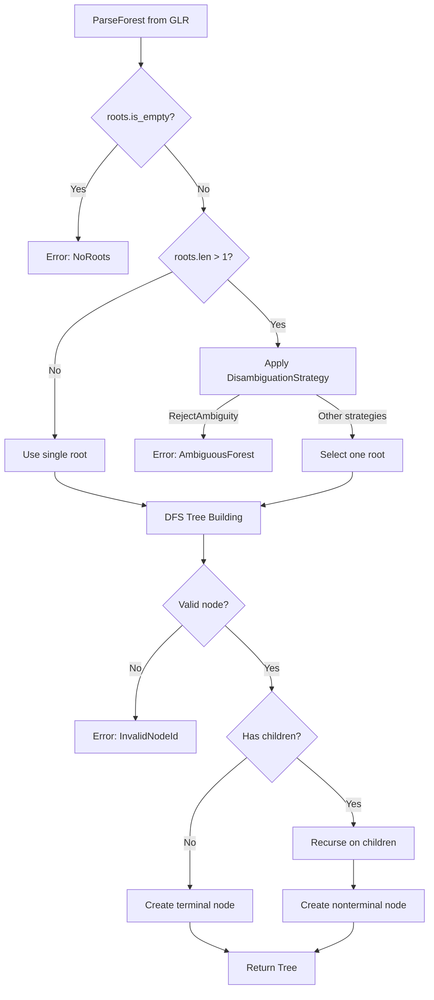

# ADR-023: Forest-to-Tree Conversion Strategy

**Status**: Accepted
**Date**: 2026-03-13
**Authors**: adze maintainers
**Related**: ADR-001 (Pure-Rust GLR Implementation), ADR-015 (Disambiguation Strategy)

## Context

GLR (Generalized LR) parsing naturally produces parse forests rather than single parse trees. When grammars contain ambiguities or conflicts, the GLR algorithm explores all possible parse paths simultaneously, resulting in a data structure that represents multiple valid parse trees compactly.

### Why GLR Produces Forests

Unlike deterministic LR parsers that must choose a single action at each conflict point, GLR parsers:

1. **Fork on Conflicts**: When shift/reduce or reduce/reduce conflicts occur, the parser forks execution to explore all alternatives
2. **Merge Common Paths**: Shared sub-parses are merged to avoid redundant computation
3. **Accumulate Alternatives**: Multiple successful parses result in multiple root nodes in the output forest

This is essential for:
- **Ambiguous Languages**: C++ declaration/expression ambiguity, JavaScript semicolon insertion
- **Grammar Development**: Exploring all parses helps identify and resolve ambiguities
- **Error Recovery**: Multiple partial parses can inform better error messages

### The Conversion Challenge

While forests are useful internally, most consumers expect a single tree:

- **Tree-sitter API Compatibility**: The `Tree` type represents a single parse tree
- **Editor Integration**: IDE features like syntax highlighting need deterministic output
- **Query System**: Tree queries operate on single tree structures

The [`ForestConverter`](../../runtime2/src/forest_converter.rs) bridges this gap by converting potentially ambiguous forests to single trees.

## Decision

We implement a **two-phase conversion algorithm** with configurable disambiguation:

### Phase1: Root Selection

```rust
pub fn to_tree(&self, forest: &ParseForest, input: &[u8]) -> Result<Tree, ConversionError> {
    // Phase 1: Select root
    if forest.roots.is_empty() {
        return Err(ConversionError::NoRoots);
    }

    let selected_root = if forest.roots.len() == 1 {
        forest.roots[0]
    } else {
        // Multiple roots - apply disambiguation
        self.disambiguate_roots(&forest.roots, forest)?
    };
    // ...
}
```

When multiple root nodes exist (indicating multiple valid parses), the converter applies the configured [`DisambiguationStrategy`](../../runtime2/src/forest_converter.rs:21):

| Strategy | Behavior | Use Case |
|----------|----------|----------|
| `PreferShift` | Select shift branch | Tree-sitter compatibility, right-associative |
| `PreferReduce` | Select reduce branch | Left-associative operators |
| `Precedence` | Use grammar precedence | Expression parsing |
| `First` | Take first alternative | Fast, unambiguous grammars |
| `RejectAmbiguity` | Return error | Grammar validation |

### Phase2: DFS Tree Building

```rust
fn build_node(
    &self,
    node_id: ForestNodeId,
    forest: &ParseForest,
    input: &[u8],
    visited: &mut HashSet<usize>,
) -> Result<TreeNode, ConversionError> {
    let forest_node = &forest.nodes[node_id.0];

    if forest_node.children.is_empty() {
        // Terminal node - create leaf
        Ok(TreeNode::new_with_children(
            forest_node.symbol.0 as u32,
            forest_node.range.start,
            forest_node.range.end,
            vec![],
        ))
    } else {
        // Nonterminal - recurse on children
        let mut child_nodes = Vec::new();
        for child_id in &forest_node.children {
            child_nodes.push(self.build_node(*child_id, forest, input, visited)?);
        }
        Ok(TreeNode::new_with_children(
            forest_node.symbol.0 as u32,
            forest_node.range.start,
            forest_node.range.end,
            child_nodes,
        ))
    }
}
```

The DFS traversal:
1. **Validates node references** - Returns `InvalidNodeId` error for out-of-bounds
2. **Tracks visited nodes** - Prevents infinite loops in malformed forests
3. **Preserves ranges** - Uses pre-calculated ranges from GLR engine
4. **Builds recursively** - Constructs tree bottom-up from terminals

### Ambiguity Detection

The converter provides explicit ambiguity detection:

```rust
pub fn detect_ambiguity(&self, forest: &ParseForest) -> Option<usize> {
    if forest.roots.len() > 1 {
        return Some(forest.roots.len());
    }
    None
}
```

This allows callers to:
- Warn users about ambiguous parses
- Log ambiguity metrics for grammar improvement
- Decide whether to accept or reject ambiguous input

### Error Handling

Conversion errors are structured for diagnostics:

```rust
pub enum ConversionError {
    /// Forest has no root nodes
    NoRoots,

    /// Ambiguous forest with multiple valid parses
    AmbiguousForest { count: usize },

    /// Invalid forest structure
    InvalidForest { reason: String },

    /// Invalid node reference
    InvalidNodeId { node_id: usize },

    /// Cycle detected in forest
    CycleDetected { node_id: usize },
}
```

### Conversion Flow



## Consequences

### Positive

- **Deterministic Output**: Always produces a single tree for downstream consumers
- **Configurable Behavior**: Disambiguation strategy can be chosen per use case
- **Tree-sitter Compatible**: Output integrates with existing Tree-sitter ecosystem
- **Performance**: O(n) time complexity with single DFS traversal
- **Space Efficient**: O(d) auxiliary space where d is tree depth
- **Explicit Errors**: Structured error types enable good diagnostics

### Negative

- **Information Loss**: Alternative parses are discarded after conversion
- **Silent Selection**: Default strategies may select unexpected parse without warning
- **Precedence Incomplete**: `Precedence` strategy requires metadata not yet implemented
- **No Cycle Handling**: Cycle detection commented out due to valid DAG false positives

### Neutral

- The two-phase approach separates concerns but requires full forest materialization
- Range preservation depends on correct GLR engine calculation
- Future Packed node support will add internal ambiguity handling

## Implementation Notes

### Current Limitations

1. **Struct-based ForestNode**: Current implementation uses a struct with children vector rather than the full enum with Terminal/Nonterminal/Packed variants
2. **Precedence Metadata**: `PreferShift` and `PreferReduce` strategies default to `First` until Phase3.3 adds shift/reduce metadata
3. **Packed Node Handling**: `disambiguate_alternatives()` exists but is not yet called in the main path

### Contract Reference

The full contract specification is in [`FOREST_CONVERTER_CONTRACT.md`](../archive/specs/FOREST_CONVERTER_CONTRACT.md).

## Related

- **ADR-001**: [Pure-Rust GLR Implementation](001-pure-rust-glr-implementation.md) - Why we use GLR parsing
- **ADR-015**: [Disambiguation Strategy](015-disambiguation-strategy.md) - Strategy selection details
- **ADR-020**: [Direct Forest Splicing Algorithm](020-direct-forest-splicing-algorithm.md) - Incremental parsing optimization
- **Implementation**: [`runtime2/src/forest_converter.rs`](../../runtime2/src/forest_converter.rs)
- **Contract**: [`docs/archive/specs/FOREST_CONVERTER_CONTRACT.md`](../archive/specs/FOREST_CONVERTER_CONTRACT.md)
