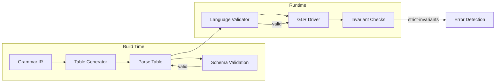

# ADR-025: Parse Table Validation Strategy

## Status

Accepted

## Context

Parse tables are the core data structures that drive the GLR parsing engine. Invalid or corrupted parse tables can lead to:

1. **Silent parsing failures** - Incorrect parse results without error indication
2. **Memory safety violations** - Out-of-bounds accesses in action tables
3. **ABI incompatibility** - Mismatches between table format and runtime expectations
4. **Non-deterministic behavior** - Action ordering affecting parse outcomes

The Adze toolchain generates parse tables at build time and loads them at runtime. This separation creates multiple points where validation must occur:



### Validation Layers

The codebase implements validation at three distinct layers:

1. **Schema Validation** ([`tablegen/src/schema.rs`](../../tablegen/src/schema.rs)) - Build-time structural validation
2. **Language Validator** ([`tablegen/src/validation.rs`](../../tablegen/src/validation.rs)) - ABI compliance checking
3. **Runtime Invariants** ([`glr-core/src/lib.rs`](../../glr-core/src/lib.rs)) - Feature-gated runtime checks

### Related Decisions

- [ADR-014: Parse Table Compression Strategy](014-parse-table-compression-strategy.md) defines the compressed format
- [ADR-021: Feature Flag and Backend Selection](021-feature-flag-and-backend-selection.md) defines feature gating
- [ADR-016: Error Handling Strategy](016-error-handling-strategy.md) defines error reporting patterns

## Decision

We implement a **multi-layered validation strategy** with feature-gated runtime verification.

### 1. Schema-Based Validation at Build Time

The [`schema.rs`](../../tablegen/src/schema.rs) module validates parse table structure before serialization:

#### Action Encoding Contract

Actions are encoded as `u16` values following a strict contract:

```text
0x0000        → Error
0x0001-0x7FFF → Shift with State N
0x8000-0xFFFE → Reduce with Production N and 0x7FFF
0xFFFF        → Accept
```

The [`validate_action_encoding()`](../../tablegen/src/schema.rs:129) function enforces this contract:

```rust
pub fn validate_action_encoding(action: &Action) -> Result<u16, SchemaError> {
    match action {
        Action::Error => Ok(0x0000),
        Action::Shift(state) => {
            if state.0 == 0 {
                Err(SchemaError::InvalidActionEncoding { ... })
            } else if state.0 >= 0x8000 {
                Err(SchemaError::InvalidActionEncoding { ... })
            } else {
                Ok(state.0)
            }
        }
        Action::Reduce(production_id) => {
            if production_id.0 >= 0x7FFF {
                Err(SchemaError::InvalidActionEncoding { ... })
            } else {
                Ok(0x8000 | production_id.0)
            }
        }
        Action::Accept => Ok(0xFFFF),
        // ...
    }
}
```

#### Full Table Validation

The [`validate_parse_table()`](../../tablegen/src/schema.rs:225) function checks:

- All actions have valid encodings
- Encoding/decoding round-trips correctly
- State IDs are within bounds for Shift actions
- Production IDs are within bounds for Reduce actions
- At least one Accept action exists
- No duplicate action entries

### 2. ABI Compliance Validation

The [`validation.rs`](../../tablegen/src/validation.rs) module validates `TSLanguage` structs against Tree-sitter ABI v15:

```rust
pub struct LanguageValidator<'a> {
    language: &'a TSLanguage,
    tables: &'a CompressedParseTable,
}
```

The [`validate()`](../../tablegen/src/validation.rs:158) method checks:

| Check | Purpose |
|-------|---------|
| ABI Version | Must equal 15 for compatibility |
| Symbol Count | Language and tables must agree |
| State Count | Language and tables must agree |
| Pointer Validity | Required pointers must be non-null |
| Symbol Metadata | EOF symbol must be invisible and unnamed |
| Field Names | Must be in lexicographic order |
| Table Dimensions | Must match declared counts |

### 3. Runtime Invariant Checking with Feature Gate

The [`strict-invariants`](../../glr-core/src/lib.rs:50) feature enables runtime validation:

```rust
// In glr-core/src/driver.rs
pub fn new(tables: &'t ParseTable) -> Self {
    // Validate tables when strict-invariants feature is enabled
    #[cfg(feature = "strict-invariants")]
    {
        if let Err(e) = tables.validate() {
            panic!("Invalid parse table: {}", e);
        }
    }
    // ...
}
```

This feature is **opt-in** to avoid performance overhead in production builds.

### 4. Deterministic Action Ordering

Parse tables enforce deterministic action ordering to ensure reproducible parsing:

```text
Action ordering: Shift < Reduce < Accept < Error < Recover < Fork
```

This ordering is documented in [`glr-core/src/lib.rs`](../../glr-core/src/lib.rs:40):

```rust
//! ### Table Normalization
//! - Action cells are sorted deterministically by action type and value
//! - Duplicate actions are removed from cells
//! - Action ordering: Shift < Reduce < Accept < Error < Recover < Fork
```

### Feature Flag Configuration

| Feature | Location | Effect |
|---------|----------|--------|
| `strict-invariants` | `glr-core` | Runtime table validation |
| `strict_api` | `glr-core` | Enforce API visibility rules |
| `strict_docs` | `glr-core` | Require documentation |

## Consequences

### Positive

- **Early error detection**: Schema validation catches encoding errors at build time
- **ABI compliance**: Language validator ensures Tree-sitter compatibility
- **Debugging support**: `strict-invariants` feature helps catch invariant violations during development
- **Deterministic parsing**: Action ordering ensures reproducible parse results
- **Layered defense**: Multiple validation layers catch different error classes

### Negative

- **Compile time overhead**: Schema validation adds to build time
- **Runtime overhead**: `strict-invariants` feature adds validation cost at parser initialization
- **Complexity**: Three validation layers increase codebase complexity
- **Feature management**: Developers must remember to enable `strict-invariants` for debugging

### Neutral

- The `strict-invariants` feature defaults to **disabled** in release builds
- Validation errors use `panic!` in runtime checks for fail-fast behavior
- Schema errors use structured `SchemaError` enum for detailed diagnostics

## Related

- **Related ADRs**: 
  - [ADR-014: Parse Table Compression Strategy](014-parse-table-compression-strategy.md)
  - [ADR-021: Feature Flag and Backend Selection](021-feature-flag-and-backend-selection.md)
  - [ADR-016: Error Handling Strategy](016-error-handling-strategy.md)
  - [ADR-024: ABI Compatibility Strategy](024-abi-compatibility-strategy.md)
- **Implementation Files**:
  - [`tablegen/src/validation.rs`](../../tablegen/src/validation.rs)
  - [`tablegen/src/schema.rs`](../../tablegen/src/schema.rs)
  - [`glr-core/src/lib.rs`](../../glr-core/src/lib.rs)
  - [`glr-core/src/driver.rs`](../../glr-core/src/driver.rs)
