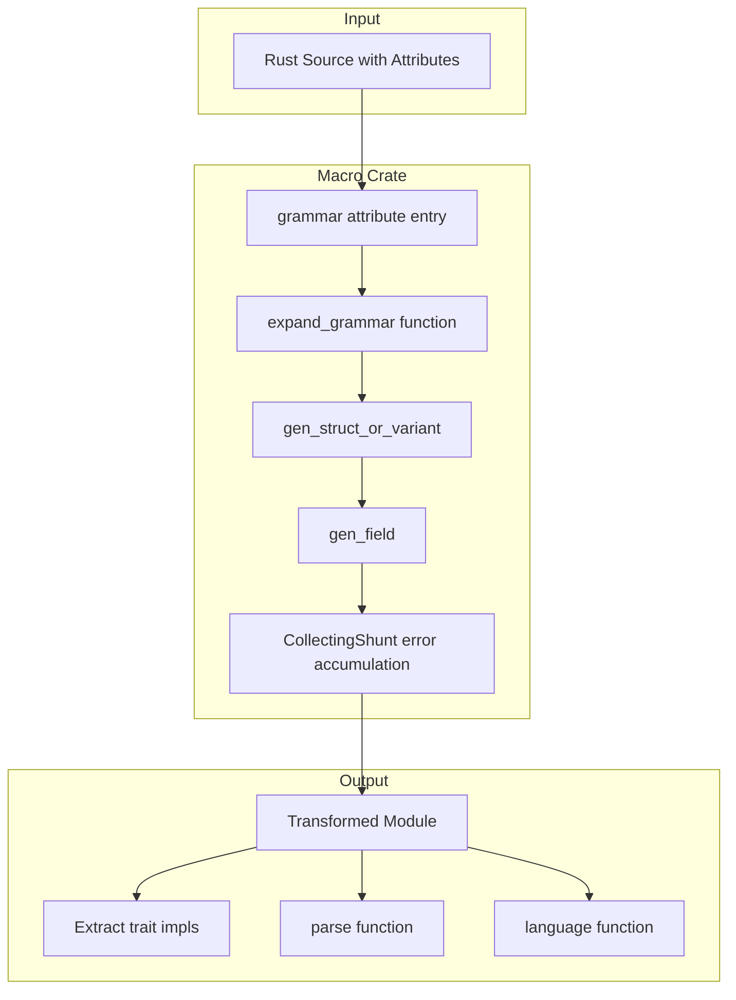

# ADR-026: Proc-Macro Attribute Design and Expansion

## Status

Accepted

## Context

Adze uses procedural macros to transform Rust type definitions into parser implementations. The design of these macros significantly impacts:

1. **Developer Experience**: Error messages, IDE support, compile times
2. **Maintainability**: How easy it is to extend and modify the macro system
3. **Correctness**: Ensuring grammar errors are caught at compile time

### Alternatives Considered

1. **Derive Macros Only**: Use `#[derive(Extract)]` pattern without additional attributes
   - Limited expressiveness for grammar metadata (precedence, leaf patterns)
   - Would require separate configuration mechanism

2. **Function-Based API**: Builder pattern for grammar definition
   - Loses type safety guarantees
   - No compile-time validation of grammar structure
   - Requires runtime grammar construction

3. **Attribute Macros with Early Failure**: Fail on first error during expansion
   - Developers would see only one error at a time
   - Slower iteration cycles

4. **Attribute Macros with Error Accumulation**: Collect all errors before reporting
   - Better developer experience with comprehensive error reporting
   - More complex implementation

## Decision

We chose **attribute macros with error accumulation** as the proc-macro design pattern.

### Attribute Inventory

The macro crate provides these attribute macros:

| Attribute | Scope | Purpose |
|-----------|-------|---------|
| `#[adze::grammar("name")]` | Module | Marks a module as containing grammar definitions |
| `#[adze::language]` | Struct/Enum | Marks the parse entry point type |
| `#[adze::leaf(pattern = r"...")]` | Field | Matches regex pattern, optional `transform` closure |
| `#[adze::leaf(text = "...")]` | Field | Matches exact literal text |
| `#[adze::extra]` | Struct | Marks type as skippable (whitespace, comments) |
| `#[adze::prec(n)]` | Variant | Non-associative precedence level |
| `#[adze::prec_left(n)]` | Variant | Left-associative precedence |
| `#[adze::prec_right(n)]` | Variant | Right-associative precedence |
| `#[adze::skip(value)]` | Field | Field not in grammar, uses `value` as default |
| `#[adze::delimited(...)]` | Field | Separator for `Vec<_>` elements |
| `#[adze::repeat(non_empty = bool)]` | Field | Configuration for repeated elements |
| `#[adze::external]` | Struct | External scanner token |
| `#[adze::word]` | Struct | Word token for keyword disambiguation |

### Expansion Architecture



### Error Accumulation Pattern

The [`CollectingShunt`](../../macro/src/errors.rs) iterator adapter enables comprehensive error reporting:

```rust
// From macro/src/errors.rs
struct CollectingShunt<'a, I, A> {
    iter: I,
    err: &'a mut Option<syn::Error>,
    _marker: PhantomData<fn() -> A>,
}

// Combines multiple syn::Error instances
impl<I, A> Iterator for CollectingShunt<'_, I, A>
where
    I: Iterator<Item = syn::Result<A>>,
{
    type Item = A;

    fn next(&mut self) -> Option<Self::Item> {
        match self.iter.next() {
            Some(Ok(x)) => Some(x),
            Some(Err(another)) => {
                match self.err {
                    Some(x) => x.combine(another),  // Accumulate errors
                    ref mut x => **x = Some(another),
                }
                None
            }
            _ => None,
        }
    }
}
```

Usage in expansion via the [`IteratorExt::sift()`](../../macro/src/errors.rs:45) trait:

```rust
// From macro/src/expansion.rs
let children_parsed = fields
    .iter()
    .enumerate()
    .map(|(i, field| { /* ... */ })
    .sift::<Vec<ParamOrField>>()?;  // Collects all errors before failing
```

### Pass-Through Design

Most attribute macros are **pass-through** - they preserve the input item unchanged:

```rust
// From macro/src/lib.rs
#[proc_macro_attribute]
pub fn leaf(
    _attr: proc_macro::TokenStream,
    item: proc_macro::TokenStream,
) -> proc_macro::TokenStream {
    item  // Pass through unchanged
}
```

Only [`#[adze::grammar]`](../../macro/src/lib.rs:299) performs actual expansion. Other attributes serve as markers that the expansion logic reads during processing.

### Dual Backend Support

The expansion generates different code based on feature flags:

```rust
// From macro/src/expansion.rs
let extract_impl: Item = if cfg!(feature = "pure-rust") {
    // Pure-Rust GLR backend
    syn::parse_quote! {
        impl ::adze::Extract<#enum_name> for #enum_name {
            fn extract(node: Option<&::adze::pure_parser::ParsedNode>, ...) -> Self
        }
    }
} else {
    // Tree-sitter FFI backend
    syn::parse_quote! {
        impl ::adze::Extract<#enum_name> for #enum_name {
            fn extract(node: Option<::adze::tree_sitter::Node>, ...) -> Self
        }
    }
};
```

## Consequences

### Positive

- **Comprehensive Error Reporting**: Developers see all grammar errors at once, not one at a time
- **IDE Compatibility**: Pass-through attributes work with rust-analyzer autocomplete and navigation
- **Type Safety**: Grammar definitions are type-checked by the Rust compiler
- **Compile-Time Validation**: Invalid grammars fail at compile time, not runtime
- **Dual Backend Support**: Same grammar works with both Tree-sitter and pure-Rust backends
- **Minimal Runtime Code**: Attributes are processed at compile time, no runtime overhead

### Negative

- **Complex Expansion Logic**: The [`expand_grammar()`](../../macro/src/expansion.rs:227) function is complex and hard to test in isolation
- **Cryptic Error Messages**: Proc-macro errors can be difficult to map back to source locations
- **Build Time Impact**: Proc-macro processing adds to compilation time
- **Debugging Difficulty**: Generated code is not easily inspectable without `cargo expand`
- **Attribute Proliferation**: Many attributes to learn for new users

### Neutral

- **Separate Crate Required**: Proc-macros must be in a separate crate from their use
- **Feature Flag Dependencies**: Backend selection requires consistent feature flag usage
- **Snapshot Testing**: Macro tests use insta snapshots for regression testing

## Related

- **Parent ADR**: [ADR-004: Grammar Definition via Macros](004-grammar-definition-via-macros.md) - Overall macro-based grammar approach
- **Related ADR**: [ADR-001: Pure-Rust GLR Implementation](001-pure-rust-glr-implementation.md) - Pure-Rust backend
- **Related ADR**: [ADR-003: Dual Runtime Strategy](003-dual-runtime-strategy.md) - Backend selection
- **Implementation**: [macro/src/lib.rs](../../macro/src/lib.rs) - Attribute definitions
- **Implementation**: [macro/src/expansion.rs](../../macro/src/expansion.rs) - Expansion logic
- **Implementation**: [macro/src/errors.rs](../../macro/src/errors.rs) - Error accumulation
