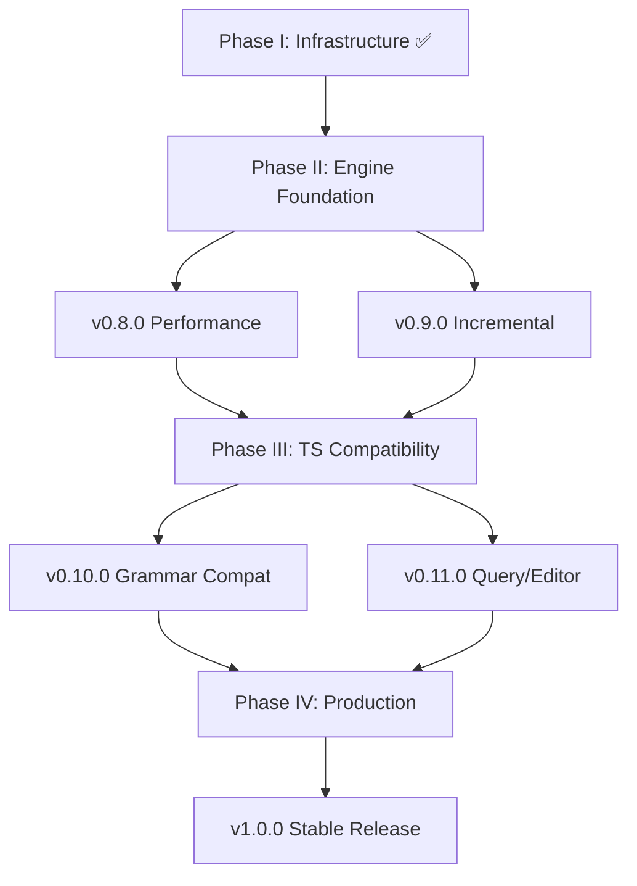

# Tree-sitter Parity and Beyond: Master Contract

**Version**: 1.0.0
**Date**: 2025-11-20
**Status**: ACTIVE
**Branch**: `claude/tree-sitter-parity-plan-01UEyfkWvbEbU7RiWVSxx4da`
**Target**: Full Tree-sitter feature parity + GLR capabilities

---

## Executive Summary

This contract defines the complete roadmap for achieving Tree-sitter feature parity while leveraging rust-sitter's unique GLR capabilities. It consolidates all planning documents into a single source of truth using contract-first, BDD, and Infrastructure-as-Code methodologies.

**Vision**: rust-sitter becomes the leading Rust-native parsing framework with:
1. **Tree-sitter Parity**: 100% compatibility for deterministic grammars
2. **GLR Advantage**: True ambiguity handling beyond Tree-sitter's capabilities
3. **Production Quality**: Performance, stability, and ecosystem on par with Tree-sitter
4. **Rust-Native Excellence**: Pure Rust tooling, WASM support, modern architecture

**Current State** (as of 2025-11-20):
- ✅ GLR v1 complete (100% test pass rate, 93 tests)
- ✅ Infrastructure Phase I complete (Nix, Policy-as-Code, CI)
- ✅ Performance baseline established (docs/PERFORMANCE_BASELINE.md)
- ✅ Benchmarks infrastructure in place
- 🚧 Week 3 Day 1 of v0.8.0 performance work complete
- ⏳ Incremental parsing partially implemented (feature-gated)
- ⏳ Query system partially implemented (predicates incomplete)

---

## I. Program Structure

This parity effort is organized into **four major phases**, each with concrete deliverables, contracts, and BDD scenarios:

### Phase Overview

```
Phase II  (Current) → v0.8.0 Performance + v0.9.0 Incremental (Q1 2026)
                      └─ Engine foundation with performance parity

Phase III           → v0.10.0 TS Grammar Compat + v0.11.0 Query/Editor (Q2-Q3 2026)
                      └─ Tree-sitter compatibility layer + ecosystem

Phase IV            → v1.0.0 GLR-Plus + Production Hardening (Q4 2026)
                      └─ GLR-first with TS compatibility as subset
```

### Phase Dependencies



---

## II. Success Criteria: "Leading in This Space"

### What "Leading" Means Concretely

**1. Tree-sitter Parity (Deterministic Grammars)**
- ✅ Use Tree-sitter grammars (via conversion tool)
- ✅ Parse the same documents
- ✅ Produce identical node types, fields, and ranges
- ✅ Support identical incremental edit semantics
- ✅ Run Tree-sitter queries with same results
- ✅ Performance: ≤2× Tree-sitter C on realistic editor workloads

**2. GLR Parity and Beyond (Ambiguous Grammars)**
- ✅ Full GLR support with efficient parse forests (SPPF)
- ✅ Configurable disambiguation (precedence, associativity, custom filters)
- ✅ Robust, configurable error recovery
- ✅ Performance overhead bounded and documented
- ✅ Capabilities Tree-sitter cannot provide (true ambiguity handling)

**3. Ecosystem & Operability**
- ✅ Batteries-included tooling (authoring, validation, conversion, debugging)
- ✅ Editor/LSP adapters for production use
- ✅ Versioned releases with upgrade path
- ✅ CI/perf gates preventing regressions
- ✅ Diagnostics, logging, and metrics for debugging

---

## III. Phase II: Engine Foundation (Current - Q1 2026)

**Objective**: Lock in performance parity and incremental parsing foundation

### v0.8.0 - Performance Optimization (Weeks 3-6)

**Goal**: Within **2× Tree-sitter C** on deterministic grammars

**Contract**: [`V0.8.0_PERFORMANCE_CONTRACT.md`](./V0.8.0_PERFORMANCE_CONTRACT.md)

**Key Deliverables**:
1. ✅ Benchmark infrastructure (Criterion, xtask commands) - **DONE**
2. ✅ Performance baseline documented - **DONE**
3. 🚧 Real GLR parsing in benchmarks - **IN PROGRESS**
4. ⏳ Real fixtures (Python, JS, Rust at small/medium/large scale)
5. ⏳ Arena allocator + stack pooling implementation
6. ⏳ CI performance regression gates (5% threshold)

**Success Metrics**:
- Parse time: ≤2× Tree-sitter C on 10k LOC Python/JS
- Memory: <10× input size for typical grammars
- CI gates: Auto-reject >5% performance regressions

**Timeline**: 3 weeks (Weeks 3-6 of roadmap)

---

### v0.9.0 - Incremental GLR Parsing (Weeks 7-15)

**Goal**: Editor-ready incremental parsing with GLR semantics

**Contract**: [`V0.9.0_INCREMENTAL_CONTRACT.md`](./V0.9.0_INCREMENTAL_CONTRACT.md)

**Key Deliverables**:
1. ⏳ Incremental API (`Tree::edit`, `Parser::parse_incremental`)
2. ⏳ Dirty region tracking + LCA-based reparse window
3. ⏳ GLR-aware incremental parsing (preserve ambiguity)
4. ⏳ Performance: ≤30% of full parse for 1-line change in 1k LOC
5. ⏳ Correctness: incremental == full parse (golden tests)

**Success Metrics**:
- Reuse %: ≥70% subtree reuse for local edits
- Latency: ≤30ms for typical keystroke edit (1k LOC file)
- Correctness: 100% pass rate on incremental == full test suite

**Timeline**: 9 weeks (Weeks 7-15 of roadmap, ending Q1 2026)

---

## IV. Phase III: Tree-sitter Compatibility (Q2-Q3 2026)

**Objective**: Become a drop-in or drop-in-adjacent replacement for Tree-sitter

### v0.10.0 - Tree-sitter Grammar & Runtime Compatibility (Q2 2026)

**Goal**: Consume Tree-sitter grammars and produce compatible trees

**Contract**: [`V0.10.0_GRAMMAR_COMPAT_CONTRACT.md`](./V0.10.0_GRAMMAR_COMPAT_CONTRACT.md)

**Key Deliverables**:
1. ⏳ Grammar IR (neutral representation supporting TS + GLR features)
2. ⏳ TS → IR converter (`grammar.js`/`grammar.json` → `.rsir`)
3. ⏳ IR → rust-sitter compiler (generate parser tables + code)
4. ⏳ Coverage: ≥95% of tree-sitter-python test suite passing
5. ⏳ TS-compat runtime API (`ts::Parser`, `ts::Tree`, `ts::Node`, `ts::TreeCursor`)
6. ⏳ CLI parity: `cargo xtask ts-parse` equivalent to `tree-sitter parse`

**Success Metrics**:
- Test coverage: ≥95% of TS grammar test suites pass
- API compatibility: All TS runtime concepts have rust-sitter equivalents
- Performance: Within 2× TS C on converted grammars

**Timeline**: 8 weeks (Q2 2026)

---

### v0.11.0 - Query Engine, Editor Integration, Migration Tooling (Q3 2026)

**Goal**: Complete ecosystem compatibility with editor tooling

**Contract**: [`V0.11.0_QUERY_EDITOR_CONTRACT.md`](./V0.11.0_QUERY_EDITOR_CONTRACT.md)

**Key Deliverables**:
1. ⏳ Query engine (S-expression `.scm` parser + evaluator)
2. ⏳ Query compatibility: Support TS query language (or documented subset)
3. ⏳ Performance: ≤2× TS C on typical editor queries
4. ⏳ LSP/daemon: Maintains trees, handles edits, serves highlighting/folding
5. ⏳ Editor adapters: Neovim and/or Helix integration (reference implementations)
6. ⏳ Migration tooling: `xtask ts-import-grammar`, `xtask ts-compare`

**Success Metrics**:
- Query compatibility: ≥90% of TS queries work unchanged
- Editor integration: At least 1 production-quality editor integration
- Migration guide: Clear docs for moving from TS to rust-sitter

**Timeline**: 8 weeks (Q3 2026)

---

## V. Phase IV: GLR-Plus & Production Hardening (Q4 2026)

**Objective**: Ship v1.0.0 as GLR-first production system with TS compatibility

### v1.0.0 - Stable Production Release (Q4 2026)

**Goal**: Production-grade 1.0 with semver guarantees

**Contract**: [`V1.0.0_PRODUCTION_CONTRACT.md`](./V1.0.0_PRODUCTION_CONTRACT.md)

**Key Deliverables**:
1. ⏳ Parse forest API (access all parses, ambiguity diagnostics)
2. ⏳ Disambiguation strategies (longest match, scoring, custom functions)
3. ⏳ Advanced error recovery (structural guarantees, configurable strategies)
4. ⏳ Multi-language composition (embedded languages, grammar combinators)
5. ⏳ Observability (metrics, tracing, timeouts, safe fallbacks)
6. ⏳ Stability guarantees (semver policy, LTS branch, migration guides)

**Success Metrics**:
- API frozen with semver guarantees
- Security audit complete
- ≥3 production deployment case studies
- ≥10 community grammars in registry
- Performance competitive (≤2× TS C)

**Timeline**: 12 weeks (Q4 2026)

---

## VI. Methodology & Infrastructure

### Contract-First Development

Every major feature follows this pattern:

1. **Contract Document** (`docs/contracts/<FEATURE>_CONTRACT.md`)
   - Acceptance criteria (AC-1, AC-2, ...)
   - Success metrics (quantitative & qualitative)
   - Risk assessment
   - Definition of Done

2. **BDD Scenarios** (`docs/plans/BDD_<FEATURE>.md`)
   - Gherkin-style scenarios
   - Given/When/Then structure
   - Concrete test cases

3. **Implementation Plan** (embedded in contract)
   - Week-by-week breakdown
   - Dependencies and blockers
   - Deliverables per week

4. **Test Implementation** (before code)
   - BDD scenario tests (e.g., `glr-core/tests/test_bdd_*.rs`)
   - Unit tests
   - Integration tests
   - E2E tests

5. **Code Implementation** (to pass tests)
   - Iterative development
   - Continuous CI validation
   - Performance monitoring

6. **Contract Verification** (automated + manual)
   - All ACs met
   - All tests passing
   - Performance within budget
   - Documentation complete

---

### Rust-Native Tooling

All project automation goes through **Rust binaries** (not shell scripts):

**xtask Commands** (all via `cargo xtask <command>`):

```bash
# Performance & profiling
cargo xtask bench                   # Run all benchmarks
cargo xtask bench --save-baseline   # Save new performance baseline
cargo xtask compare-baseline        # Compare current vs baseline
cargo xtask profile cpu             # CPU profiling with flamegraph
cargo xtask profile memory          # Memory profiling with heaptrack

# Grammar tooling
cargo xtask ts-import-grammar <repo>    # Import TS grammar
cargo xtask ts-parse <file>             # Parse with TS-compat mode
cargo xtask ts-compare <grammar> <file> # Compare TS vs rust-sitter

# Testing & validation
cargo xtask test-corpus                 # Test against TS corpus
cargo xtask test-grammars               # Test top 20 grammars
cargo xtask lint                        # Run all lint checks

# Documentation & reporting
cargo xtask dashboard-data              # Generate dashboard data
cargo xtask perf-report                 # Generate performance report
```

**New Commands to Implement** (v0.8.0):
- ✅ `bench` (wrapper around Criterion benchmarks)
- ⏳ `profile cpu|memory` (flamegraph + heaptrack integration)
- ⏳ `compare-baseline` (performance regression detection)

**New Commands to Implement** (v0.10.0):
- ⏳ `ts-import-grammar` (TS grammar converter)
- ⏳ `ts-parse` (TS-compatible parsing mode)
- ⏳ `ts-compare` (side-by-side comparison)

---

### Performance Gates & Monitoring

**CI Performance Gates**:
```yaml
# .github/workflows/performance.yml
- name: Performance Regression Check
  run: |
    cargo xtask bench
    cargo xtask compare-baseline --threshold 5%
    # Fails CI if any benchmark regresses >5%
```

**Performance Budget per Feature**:
- Incremental parsing: ≤30% of full parse overhead for local edits
- Query engine: ≤2× TS C for typical queries
- GLR overhead: ≤10% for deterministic grammars vs pure LR mode

**Monitoring**:
- Nightly benchmark runs with history tracking
- Performance dashboard (`docs/reports/perf_dashboard.html`)
- Regression alerts in CI

---

### Documentation Standards

**Required Documentation** (for each feature):

1. **Architecture Doc** (`docs/architecture/<FEATURE>.md`)
   - Design decisions
   - Component interactions
   - Performance characteristics

2. **User Guide** (`docs/guides/<FEATURE>_GUIDE.md`)
   - When/how to use
   - Examples and tutorials
   - Common pitfalls

3. **API Documentation** (inline rustdoc)
   - 100% coverage for public APIs
   - Examples for common use cases
   - Migration notes

4. **ADRs** (for key decisions)
   - Context and problem
   - Considered alternatives
   - Decision rationale

---

## VII. Risk Management

### High Risks

**1. Performance Targets Miss** (v0.8.0)
- **Risk**: Cannot achieve ≤2× TS C performance
- **Mitigation**: Early benchmarking, profiling, arena allocators
- **Fallback**: Document performance characteristics, target ≤5× instead

**2. TS Grammar Conversion Complexity** (v0.10.0)
- **Risk**: TS grammar features too complex to convert automatically
- **Mitigation**: Start with simple grammars, iterate to full coverage
- **Fallback**: Manual conversion guide + partial automation

**3. API Instability Pre-1.0**
- **Risk**: Breaking changes required late in development
- **Mitigation**: Freeze API early (v0.11.0), extensive dogfooding
- **Fallback**: Mark features as experimental if unstable

### Medium Risks

**1. Query Engine Compatibility**
- **Risk**: TS query language has undocumented edge cases
- **Mitigation**: Test against large corpus of real queries
- **Fallback**: Document known incompatibilities, provide workarounds

**2. Editor Integration Adoption**
- **Risk**: Editor maintainers don't adopt rust-sitter
- **Mitigation**: Reference implementations + migration tooling
- **Fallback**: Focus on Rust-first use cases (WASM, embedded)

---

## VIII. Success Metrics

### Quantitative Metrics

**Performance**:
- Parse speed: ≤2× Tree-sitter C
- Memory usage: <10× input size
- Incremental: ≥70% subtree reuse
- Query engine: ≤2× TS C

**Quality**:
- Test coverage: ≥80% for core crates
- CI pass rate: 100% (no ignored tests on critical path)
- Clippy: Zero warnings
- Documentation: 100% of public APIs

**Adoption**:
- Production deployments: ≥3 case studies
- Community grammars: ≥10 in registry
- Crates.io downloads: Track monthly growth

### Qualitative Metrics

**Usability**:
- External reviewer can migrate TS grammar in <1 day
- Editor integration setup in <1 hour
- Error messages are clear and actionable

**Ecosystem**:
- Active community contributions
- Responsive issue triage
- Regular releases (every 2-3 months)

---

## IX. Release Cadence

**Pre-1.0 (0.x)**:
- Minor releases: Every 2-3 months
- Breaking changes: Allowed in minor releases
- Feature flags: Experimental features behind flags

**Post-1.0 (1.x)**:
- Semver strictly enforced
- Breaking changes: Only in major versions
- LTS branch: Maintain for critical fixes
- Deprecation policy: 3 months minimum notice

---

## X. Definition of Done (Overall)

Tree-sitter Parity is **COMPLETE** when:

1. ✅ All phase contracts (v0.8.0 - v1.0.0) met
2. ✅ All acceptance criteria across all contracts satisfied
3. ✅ Test suite: 100% pass rate, no ignored critical tests
4. ✅ Performance: ≤2× TS C on benchmarks
5. ✅ Documentation: Complete and reviewed
6. ✅ API: Frozen with semver guarantees
7. ✅ Production: ≥3 case studies deployed
8. ✅ Security: Audit complete
9. ✅ Ecosystem: ≥10 community grammars
10. ✅ Release: v1.0.0 tagged and published

---

## XI. Current Status & Next Actions

### Current Status (2025-11-20)

**Phase I (Infrastructure)**: ✅ **COMPLETE**
- Nix flake, Policy-as-Code, CI workflows all operational

**Phase II (Engine Foundation)**: 🚧 **IN PROGRESS**
- v0.8.0 Performance: Week 3 Day 1 complete (benchmarks + baseline)
- v0.9.0 Incremental: Contract pending, implementation not started

**Phase III (TS Compatibility)**: ⏳ **NOT STARTED**

**Phase IV (Production)**: ⏳ **NOT STARTED**

### Immediate Next Actions (Priority Order)

1. **Complete v0.8.0 Performance Contract** (1-2 days)
   - Finalize BDD scenarios
   - Document AC-PERF1-5 in detail
   - Create week-by-week implementation plan

2. **Implement xtask Performance Commands** (2-3 days)
   - `cargo xtask profile cpu|memory`
   - `cargo xtask compare-baseline`
   - Wire into CI

3. **Create Real Fixtures for Benchmarks** (3-4 days)
   - Python: small/medium/large (100 / 2k / 10k LOC)
   - JavaScript: medium/large
   - Add fixture validation (LOC counts)

4. **Implement Arena Allocator + Stack Pooling** (1-2 weeks)
   - Arena for Tree construction
   - GLR stack pool for fork/merge
   - Benchmark improvements (target ≥30% speedup)

5. **Create v0.9.0 Incremental Contract** (1 week)
   - BDD scenarios (32 from planning doc)
   - AC-INCR1-5 detailed specification
   - Timeline and risk assessment

---

## XII. References

### Related Documents

**Contracts** (this directory):
- [`V0.8.0_PERFORMANCE_CONTRACT.md`](./V0.8.0_PERFORMANCE_CONTRACT.md) - Performance optimization
- [`V0.9.0_INCREMENTAL_CONTRACT.md`](./V0.9.0_INCREMENTAL_CONTRACT.md) - Incremental parsing
- [`V0.10.0_GRAMMAR_COMPAT_CONTRACT.md`](./V0.10.0_GRAMMAR_COMPAT_CONTRACT.md) - TS grammar compatibility
- [`V0.11.0_QUERY_EDITOR_CONTRACT.md`](./V0.11.0_QUERY_EDITOR_CONTRACT.md) - Query engine + editor integration
- [`V1.0.0_PRODUCTION_CONTRACT.md`](./V1.0.0_PRODUCTION_CONTRACT.md) - Production hardening

**Existing Specs**:
- [`../specs/GLR_V1_COMPLETION_CONTRACT.md`](../specs/GLR_V1_COMPLETION_CONTRACT.md) - GLR v1 foundation
- [`../specs/RUNTIME_MODES.md`](../specs/RUNTIME_MODES.md) - Dual runtime architecture
- [`../PERFORMANCE_BASELINE.md`](../PERFORMANCE_BASELINE.md) - Current performance baseline

**Planning**:
- [`../ROADMAP.md`](../ROADMAP.md) - Overall project roadmap
- [`../GAPS.md`](../GAPS.md) - Current implementation gaps
- [`../IMPLEMENTATION_PLAN.md`](../IMPLEMENTATION_PLAN.md) - Detailed implementation timeline

### External References

- [Tree-sitter Documentation](https://tree-sitter.github.io/tree-sitter/)
- [Tree-sitter Parser Interface](https://tree-sitter.github.io/tree-sitter/using-parsers)
- [Tree-sitter Query Syntax](https://tree-sitter.github.io/tree-sitter/using-parsers#pattern-matching-with-queries)
- [GLR Parsing Theory](https://en.wikipedia.org/wiki/GLR_parser)

---

**Contract Version**: 1.0.0
**Last Updated**: 2025-11-20
**Next Review**: After v0.8.0 completion
**Owner**: rust-sitter core team

---

**Signatures** (for contract acceptance):

- [ ] Technical Lead: _______________ Date: ___________
- [ ] Architecture Lead: _______________ Date: ___________
- [ ] Quality Assurance: _______________ Date: ___________

---

END OF CONTRACT
