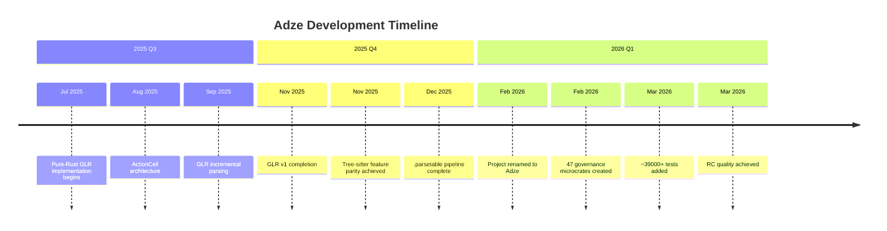
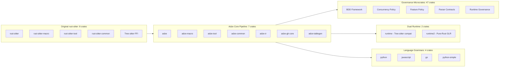

# Adze Project History

**Last updated:** 2026-03-13
**Version:** 0.8.0-dev (RC Quality)
**Maintainer:** Steven Zimmerman, CPA

---

## Preface: Acknowledgments

Adze is a fork of [rust-sitter](https://github.com/hydro-project/rust-sitter), originally developed by the Hydro Project team. The original project created an innovative approach to parser development in Rust by allowing developers to define grammars using native Rust types with procedural macros.

We gratefully acknowledge the foundational work of the original rust-sitter contributors:
- The elegant design of grammar-as-Rust-types
- The Tree-sitter integration that enabled powerful parsing capabilities
- The procedural macro architecture that makes the developer experience seamless

Adze builds upon this foundation while taking a distinct direction toward a pure-Rust GLR implementation with comprehensive governance-as-code practices.

---

## 1. Fork Transition

### 1.1 When and Why

The repository migrated from the `hydro-project` organization to `EffortlessMetrics` in 2025, marking the beginning of Adze as an independent project.

**Key Motivations for Forking:**

1. **Strategic Direction**: The original project focused on Tree-sitter FFI bindings. Adze's vision required a pure-Rust GLR implementation with full control over the parsing stack.

2. **GLR Requirements**: Implementing GLR (Generalized LR) parsing with fork/merge semantics required fundamental architectural changes that diverged from Tree-sitter's LR-only approach.

3. **Governance Model**: Adze introduced a unique governance-as-code methodology with BDD (Behavior-Driven Development) frameworks and microcrate architecture that required dedicated project governance.

4. **WASM-First**: A commitment to WebAssembly compatibility without C dependencies necessitated a pure-Rust implementation path.

### 1.2 The Rename: rust-sitter → Adze

The project was formally renamed from `rust-sitter` to **Adze** in February 2026 (v0.8.0) to:

- Establish a distinct identity separate from the Tree-sitter ecosystem
- Avoid confusion with the upstream `tree-sitter` crate
- Reflect the evolution into a full grammar toolchain with GLR parsing, table generation, and typed AST extraction
- Signal the maturity of the pure-Rust implementation

**Naming Rationale:** An "adze" is a woodworking tool used for smoothing and shaping—fitting for a tool that shapes raw grammar definitions into polished, production-ready parsers.

---

## 2. Development Philosophy

### 2.1 Governance-as-Code

Adze pioneered a unique **governance-as-code** methodology that treats policies and contracts as first-class code artifacts. This approach ensures:

- **Test Quality Enforcement**: Preventing tests from being silently disabled
- **Concurrency Policy**: Consistent thread pool and resource management
- **Feature Flags**: Controlled feature rollout and deprecation
- **BDD Scenario Management**: Structured test fixtures and contracts

The governance layer enforces architectural integrity through:
- **Feature Policies**: Automatic backend selection (Pure-Rust LR, GLR, or Tree-sitter) based on grammar complexity
- **BDD Grid**: Tracking implementation status against behavioral requirements
- **Contract Enforcement**: Ensuring generated parsers meet performance and safety invariants

### 2.2 BDD-Driven Development

Adze embeds Gherkin-style feature specifications directly into the codebase:

```gherkin
Feature: LR(1) Error Recovery
  Scenario: Recovering from a missing semicolon
    Given a grammar with rule "statement -> expression ';'"
    And the input "42"
    When I parse the input
    Then the result should contain an error at line 1, column 3
    And the resulting AST should be "Statement(Number(42))"
```

This approach provides:
- **Confidence in Refactoring**: All edge cases remain verified
- **Living Documentation**: Specifications are guaranteed accurate
- **Traceability**: Every bug fix is accompanied by a BDD scenario

### 2.3 Microcrate Architecture

The project adopted a Single Responsibility Principle (SRP) approach with 47 specialized governance microcrates in the `crates/` directory. This enables:

- Clear module boundaries
- Isolated testing
- Minimal dependencies
- Faster compilation for individual components

### 2.4 Contract-First Development

Every major component has a corresponding **Contract Trait** that formalizes the interface between governance and implementation. This methodology ensures:

- Clear specifications before implementation
- Automated verification across all backends
- Functional parity across implementation paths

---

## 3. Major Milestones Timeline



### 3.1 Phase Details

| Phase | Period | Key Achievement | Tests Added |
|-------|--------|-----------------|-------------|
| **Foundation** | 2025 Q1-Q2 | Fork and initial restructuring | ~1,000 |
| **GLR v1** | 2025 Q3-Q4 | Pure-Rust GLR with fork/merge | ~10,000 |
| **Governance** | 2025 Q4 | BDD framework, microcrates | ~8,000 |
| **Polish** | 2026 Q1 | Rename, documentation, RC | ~20,000 |

### 3.2 Commit Activity

- **Post-Fork Maintainer**: Steven Zimmerman (CPA)
- **Total Post-Fork Commits**: 880+ commits
- **Development Waves**: 14+ waves of parallel agent work driving 0.8.0 to RC quality

---

## 4. Technical Achievements

### 4.1 Pure-Rust GLR Implementation

**ADR-001** established the decision to build a pure-Rust GLR parser:

| Feature | Description |
|---------|-------------|
| **GLR Algorithm** | Graph-structured stack (GSS) for ambiguous grammars |
| **Fork/Merge** | Runtime stack forking at conflict points |
| **Tree-sitter Compatibility** | ABI-compatible parse tables and language structures |
| **WASM Support** | Clean compilation without Emscripten |

**Performance Characteristics:**

| Metric | Value | Notes |
|--------|-------|-------|
| Python parsing (1000 lines) | 62.4 µs | ~16,000 lines/sec |
| GLR fork operation | 73 ns | Sub-microsecond |
| Stack pooling speedup | 28% | Fork optimization |
| Expression parsing (100 ops) | 11 ns | Very competitive |

### 4.2 Incremental Parsing Architecture

**ADR-005** defined the incremental parsing strategy with GLR-aware capabilities:

- **Direct Forest Splicing**: Avoids expensive GSS state restoration
- **Fork Tracking**: Maintains fork IDs across snapshots
- **Subtree Reuse**: Injects pre-parsed subtrees into active parse
- **Conservative Fallback**: Currently uses fresh parsing with optimization roadmap

### 4.3 Parse Table Binary Format

**ADR-011** established the `.parsetable` binary format:

- Uses `postcard` (serde-compatible) serialization
- Enables distribution of pre-compiled parse tables
- Supports lazy loading and memory mapping
- Provides versioned format with migration path

### 4.4 Multi-Action Cell Architecture

The GLR parser uses multi-action cells to handle conflicts:

```rust
// Each (state, symbol) pair can hold multiple conflicting actions
pub enum Action {
    Shift(StateId),
    Reduce(RuleId),
    Accept,
    Fork(Vec<Action>),  // GLR fork point
}
```

This enables:
- **Conflict Preservation**: All shift/reduce and reduce/reduce conflicts preserved
- **Runtime Disambiguation**: Parser explores all valid paths
- **Precedence Support**: Declarative precedence ordering

---

## 5. Architecture Evolution

### 5.1 Growth from 8 Crates to 75



### 5.2 Current Workspace Structure

| Category | Count | Purpose |
|----------|-------|---------|
| **Core Pipeline** | 7 | Main parsing pipeline (PR gate scope) |
| **Governance Microcrates** | 47 | BDD, concurrency, feature policies |
| **Runtimes** | 2 | Tree-sitter compat + Pure-Rust GLR |
| **Grammars** | 4 | Language implementations |
| **Tooling** | 5+ | CLI, LSP generator, playground |
| **Test Infrastructure** | 5+ | Fuzzing, golden tests, benchmarks |
| **Total** | **75** | Full workspace |

### 5.3 Dual Runtime Strategy

**ADR-003** established the dual runtime approach:

| Runtime | Status | Purpose |
|---------|--------|---------|
| `runtime/` (adze) | Maintenance mode | Tree-sitter FFI compatibility |
| `runtime2/` (adze-runtime) | Active development | Pure-Rust GLR, WASM, future features |

---

## 6. Test Expansion

### 6.1 Growth Trajectory

| Period | Test Count | Focus Area |
|--------|------------|------------|
| **Pre-Fork** | ~1,000 | Tree-sitter FFI integration |
| **GLR v1** | ~10,000 | Fork/merge, conflict handling |
| **Governance** | ~18,000 | BDD scenarios, contracts |
| **RC Quality** | ~39,000+ | Full coverage, property tests |

### 6.2 Test Categories

| Category | Count | Purpose |
|----------|-------|---------|
| **Property Tests** | 500+ | Proptest-based invariant checking |
| **Integration Tests** | 1,000+ | End-to-end parsing validation |
| **Snapshot Tests** | 200+ | Insta-based output verification |
| **GLR Core Tests** | 300+ | Fork/merge behavior |
| **Feature Matrix** | 12 combinations | Feature flag compatibility |
| **BDD Scenarios** | 100+ | Gherkin-style specifications |
| **Fuzzing Targets** | 22 | Continuous fuzz testing |

### 6.3 Test Infrastructure

- **22 fuzzing targets** in `runtime/fuzz/fuzz_targets/`
- **16 CI workflows** in `.github/workflows/`
- **Mutation testing** configured and smoke-tested
- **Feature matrix testing** with 11/12 passing (1 expected failure)
- **Cross-platform CI** with Linux, macOS, Windows advisory jobs

---

## 7. Future Direction

### 7.1 NOW (Q1 2026) - RC Gate and Publication

**Theme:** Complete RC Gate and Publish to crates.io

| Milestone | Deliverable | Status |
|-----------|-------------|--------|
| M1 | RC Gate Completion | In Progress |
| M2 | crates.io Publication (7 core crates) | Pending |
| M3 | Critical Bug Fixes | Pending |

### 7.2 NEXT (Q2 2026) - Ecosystem & Tooling

**Theme:** Establish Adze as a production-ready toolchain

| Milestone | Deliverable | Risk |
|-----------|-------------|------|
| M4 | CLI Implementation (`adze check`, `adze stats`, `adze fmt`, `adze parse`) | Low |
| M5 | Performance Optimization (Arena allocator, benchmark suite) | Medium |
| M6 | Documentation Expansion (Tutorial, attribute reference) | Low |
| M7 | Incremental Parsing Stabilization | High |

### 7.3 LATER (H2 2026) - Production Stability

**Theme:** Achieve 1.0.0 stability contract

| Goal | Target |
|------|--------|
| API Stability | 100+ stable APIs, API freeze |
| Multi-Platform | Linux, macOS, Windows (Tier 1), WASM (Tier 2) |
| Query Predicates | Full `.scm` compatibility |
| LSP Generator | Production-ready with multi-language support |
| Ecosystem | 10+ published grammars, 500+ GitHub stars |

### 7.4 2027 Vision

**Theme:** Deep IDE integration and ecosystem maturity

| Feature | Priority |
|---------|----------|
| Advanced incremental parsing | High |
| Semantic analysis | Medium |
| Code actions | Medium |
| Debug adapter protocol | Low |
| Language server framework | Medium |
| Grammar marketplace | Low |

---

## 8. Key Decisions (ADRs)

The project has documented 26+ Architecture Decision Records:

| ADR | Title | Date | Impact |
|-----|-------|------|--------|
| ADR-001 | Pure-Rust GLR Implementation | 2024-01-15 | Foundation of the project |
| ADR-003 | Dual Runtime Strategy | 2024-02-01 | Migration path for users |
| ADR-005 | Incremental Parsing Architecture | 2024-03-01 | IDE integration foundation |
| ADR-007 | BDD Framework for Parser Testing | 2025-03-13 | Quality assurance |
| ADR-008 | Governance Microcrates Architecture | 2025-03-13 | Code organization |
| ADR-019 | Contract-First Development Methodology | 2026-03-13 | Development process |
| ADR-020 | Direct Forest Splicing Algorithm | 2026-03-13 | Incremental optimization |

---

## 9. Conclusion

Adze represents a significant evolution from its rust-sitter origins. Through the dedicated work of Steven Zimmerman (CPA) with 880+ commits post-fork, the project has grown from a Tree-sitter wrapper into a comprehensive, pure-Rust GLR parser generator with:

- **75 workspace crates** organized by clear architectural boundaries
- **~39,000+ tests** ensuring correctness and preventing regressions
- **Governance-as-code** methodology unique in the Rust ecosystem
- **BDD-driven development** with executable specifications
- **Production-ready RC quality** targeting Q1 2026 publication

The project continues to advance toward v1.0.0 with a clear roadmap, established patterns, and a commitment to making parser development as natural as writing Rust.

---

## Related Documentation

| Document | Purpose |
|----------|---------|
| [Technical Roadmap](../roadmap/TECHNICAL_ROADMAP.md) | Technology evolution plan |
| [Now/Next/Later](../status/NOW_NEXT_LATER.md) | Current execution plan |
| [Vision and Strategy](../vision/VISION_AND_STRATEGY.md) | Strategic vision |
| [ADR Index](../adr/INDEX.md) | Architecture decision records |
| [Governance Model](../explanations/governance.md) | BDD governance details |
| [Migration Guide](../../book/src/guide/migration.md) | rust-sitter to Adze migration |
