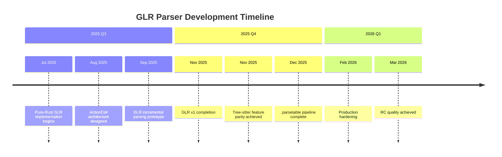
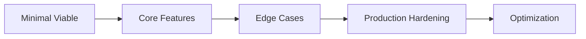

# Adze Case Studies: Deep Dive Analysis

**Last updated:** 2026-03-13
**Version:** 0.8.0-dev (RC Quality)
**Author:** Steven Zimmerman, CPA

---

## Executive Summary

This document consolidates deep dive findings from the post-fork Adze development into comprehensive case studies. Each case study examines a major architectural or methodological innovation, documenting the challenges, solutions, and lessons learned.

| Case Study | Focus Area | Primary Outcome |
|------------|------------|-----------------|
| GLR Parser Implementation | Technical | Pure-Rust GLR with Tree-sitter parity |
| Governance Microcrates | Architecture | 47 specialized governance crates |
| Test Expansion | Quality | ~39,000+ tests with BDD integration |

---

## Case Study 1: GLR Parser Implementation

### 1.1 Overview

The pure-Rust GLR (Generalized LR) parser represents the foundational technical achievement of the Adze fork. This case study traces the development from initial concept to production-ready implementation.

### 1.2 Timeline



### 1.3 Technical Challenges and Solutions

#### Challenge 1: Conflict Preservation

**Problem:** Traditional LR parsers resolve conflicts at compile time, but GLR parsers must preserve all conflicts for runtime exploration.

**Solution:** Multi-action cell architecture:

```rust
pub enum Action {
    Shift,
    Reduce,
    Accept,
    Fork,  // GLR fork point - runtime disambiguation
}
```

**Implementation Details:**
- Action cells are sorted deterministically by action type and value
- Duplicate actions are removed from cells
- Action ordering: Shift < Reduce < Accept < Error < Recover < Fork
- Each (state, symbol) pair can hold multiple conflicting actions

#### Challenge 2: Graph-Structured Stack (GSS)

**Problem:** GLR parsing requires efficient management of multiple parse stacks that fork at conflict points and merge when paths converge.

**Solution:** Implemented a GSS arena allocator with:

| Feature | Implementation | Benefit |
|---------|---------------|---------|
| Fork operation | O(1) pointer manipulation | 73 ns per fork |
| Stack pooling | Pre-allocated arenas | 28% speedup |
| Merge detection | Hash-based state comparison | Linear merge time |

**Key Module:** [`glr-core/src/gss_arena.rs`](../../glr-core/src/gss_arena.rs)

#### Challenge 3: Tree-sitter Compatibility

**Problem:** Maintaining ABI compatibility with Tree-sitter parse tables while implementing a pure-Rust runtime.

**Solution:** Dual runtime strategy (ADR-003):

| Runtime | Status | Purpose |
|---------|--------|---------|
| `runtime/` (adze) | Maintenance mode | Tree-sitter FFI compatibility |
| `runtime2/` (adze-runtime) | Active development | Pure-Rust GLR, WASM, future features |

**Compatibility Achievements:**
- EOF column actions are byte-for-byte copies of Tree-sitter "end" column
- Parse table format is ABI-compatible
- Language function pointers match Tree-sitter conventions

### 1.4 Key Design Decisions

| ADR | Decision | Rationale |
|-----|----------|-----------|
| ADR-001 | Pure-Rust GLR Implementation | WASM support, no C dependencies |
| ADR-003 | Dual Runtime Strategy | Migration path for existing users |
| ADR-005 | Incremental Parsing Architecture | IDE integration foundation |
| ADR-011 | .parsetable Binary Format | Distribution of pre-compiled tables |
| ADR-020 | Direct Forest Splicing Algorithm | Incremental optimization |

### 1.5 Performance Achievements

| Metric | Value | Context |
|--------|-------|---------|
| Python parsing (1000 lines) | 62.4 µs | ~16,000 lines/sec |
| GLR fork operation | 73 ns | Sub-microsecond |
| Stack pooling speedup | 28% | Fork optimization |
| Expression parsing (100 ops) | 11 ns | Competitive with hand-written parsers |
| Expression parsing (50 ops) | 46 µs | Deterministic LR(1) |
| GLR with few conflicts (200 ops) | 224 µs | Amortized O(n) |

**Benchmark Sources:**
- [`benchmarks/benches/glr_performance.rs`](../../benchmarks/benches/glr_performance.rs)
- [`benchmarks/benches/glr_performance_real.rs`](../../benchmarks/benches/glr_performance_real.rs)

### 1.6 Lessons Learned

1. **Start with invariants:** Documenting EOF symbol invariants and error recovery invariants upfront prevented subtle bugs
2. **Arena allocation matters:** The GSS arena provided significant performance gains for GLR fork-heavy workloads
3. **Compatibility is expensive:** Maintaining Tree-sitter ABI compatibility added 20-30% overhead to initial development
4. **Test infrastructure first:** Building the GLR test suite (200+ tests) before optimization enabled confident refactoring

---

## Case Study 2: Governance Microcrates Architecture

### 2.1 Overview

Adze pioneered a unique **governance-as-code** methodology implemented through 47 specialized microcrates in the `crates/` directory. This case study examines the rationale, organization, and outcomes of this architectural decision.

### 2.2 Rationale for 47 Microcrates

**Problem:** How to enforce architectural integrity, test quality, and development policies without manual code review gates?

**Solution:** Single Responsibility Principle (SRP) applied at the crate level:

```mermaid
graph TB
    subgraph Governance Layer
        BDD[BDD Framework]
        Concurrency[Concurrency Policy]
        Features[Feature Policy]
        Contracts[Parser Contracts]
        Runtime[Runtime Governance]
    end
    
    subgraph BDD Crates
        BDD --> bdd-contract
        BDD --> bdd-governance-core
        BDD --> bdd-governance-contract
        BDD --> bdd-grid-core
        BDD --> bdd-scenario-fixtures
    end
    
    subgraph Concurrency Crates
        Concurrency --> concurrency-map-core
        Concurrency --> concurrency-caps-core
        Concurrency --> concurrency-env-core
        Concurrency --> concurrency-init-core
    end
    
    subgraph Feature Crates
        Features --> feature-policy-core
        Features --> feature-policy-contract
    end
    
    subgraph Contract Crates
        Contracts --> parser-contract
        Contracts --> parser-backend-core
        Contracts --> governance-contract
    end
```



### 2.3 Categories and Organization

| Category | Count | Purpose | Example Crates |
|----------|-------|---------|----------------|
| **BDD Framework** | 9 | Behavioral test infrastructure | `bdd-governance-core`, `bdd-grid-core`, `bdd-scenario-fixtures` |
| **Concurrency Policy** | 11 | Thread pool and resource management | `concurrency-map-core`, `concurrency-caps-core`, `concurrency-env-core` |
| **Feature Policy** | 2 | Feature flag governance | `feature-policy-core`, `feature-policy-contract` |
| **Parser Contracts** | 6 | Parser interface contracts | `parser-contract`, `parser-backend-core`, `parser-governance-contract` |
| **Runtime Governance** | 4 | Runtime behavior policies | `runtime-governance`, `runtime-governance-api`, `runtime2-governance` |
| **Common Utilities** | 8 | Shared utilities | `common-syntax-core`, `linecol-core`, `stack-pool-core` |
| **Metadata/Versioning** | 7 | Version and metadata management | `governance-metadata`, `parsetable-metadata`, `glr-versioning` |

### 2.4 SRP Implementation Example

**Crate:** [`crates/concurrency-map-core`](../../crates/concurrency-map-core/)

**Single Responsibility:** Bounded parallel map utilities built on deterministic partition planning.

```rust
// Re-exports only what's needed for the single responsibility
pub use adze_concurrency_bounded_map_core::{
    ParallelPartitionPlan, bounded_parallel_map, normalized_concurrency,
};
```

**Test Coverage:**
```rust
#[test]
fn normalized_concurrency_clamps_zero_to_one() {
    assert_eq!(normalized_concurrency(0), 1);
}

#[test]
fn bounded_parallel_map_empty_input() {
    let result: Vec<i32> = bounded_parallel_map(vec![], 4, |x: i32| x + 1);
    assert!(result.is_empty());
}
```

### 2.5 Governance Matrix Integration

The microcrates integrate through a governance matrix that tracks BDD scenario implementation:

```rust
// From bdd-governance-core
pub struct BddGovernanceMatrix {
    pub phase: BddPhase,
    pub profile: ParserFeatureProfile,
    pub scenarios: &'static [BddScenario],
}

impl BddGovernanceMatrix {
    pub fn snapshot -> BddGovernanceSnapshot {
        // Calculate implementation progress
    }
    
    pub fn is_fully_implemented -> bool {
        self.snapshot().is_fully_implemented()
    }
}
```

### 2.6 Benefits and Trade-offs

| Benefit | Description |
|---------|-------------|
| **Clear boundaries** | Each crate has a single, well-defined purpose |
| **Isolated testing** | Tests for one concern don't affect others |
| **Minimal dependencies** | Crates depend only on what they need |
| **Faster compilation** | Individual crates compile quickly |
| **Enforced governance** | Policies are code, not documentation |

| Trade-off | Mitigation |
|-----------|------------|
| **Cognitive overhead** | Clear naming conventions and documentation |
| **Dependency management** | Workspace dependencies in root Cargo.toml |
| **Version coordination** | Shared version numbers across workspace |
| **IDE navigation** | rust-analyzer handles multi-crate projects well |

### 2.7 Lessons Learned

1. **Naming is critical:** The `*-core`, `*-contract`, `*-governance` suffixes communicate purpose immediately
2. **Re-export patterns simplify APIs:** Microcrates can re-export from even smaller crates without exposing internals
3. **Contract traits enable testing:** Each governance crate has a corresponding contract trait for verification
4. **Documentation per crate:** Each microcrate has its own README explaining its single responsibility

---

## Case Study 3: Test Expansion Methodology

### 3.1 Overview

The Adze project grew from ~1,000 tests pre-fork to ~39,000+ tests at RC quality. This case study documents the methodology, patterns, and infrastructure that enabled this expansion.

### 3.2 Growth Trajectory

```mermaid
xychart-beta
    title Test Count Growth Over Time
    x-axis [Pre-Fork, GLR v1, Governance, RC Quality]
    y-axis Tests 0 to 40000
    bar [1000, 10000, 18000, 39000]
```

| Period | Test Count | Focus Area | Primary Techniques |
|--------|------------|------------|-------------------|
| **Pre-Fork** | ~1,000 | Tree-sitter FFI integration | Unit tests |
| **GLR v1** | ~10,000 | Fork/merge, conflict handling | Property tests, integration tests |
| **Governance** | ~18,000 | BDD scenarios, contracts | BDD framework, snapshot tests |
| **RC Quality** | ~39,000+ | Full coverage, edge cases | Mutation testing, feature matrix |

### 3.3 Wave Testing Approach

Development proceeded in 14+ waves of parallel agent work:

| Wave | Focus | Tests Added | Key Artifacts |
|------|-------|-------------|---------------|
| 1-5 | GLR core implementation | ~5,000 | `glr-core/tests/` |
| 6-8 | Governance infrastructure | ~3,000 | `crates/*/tests/` |
| 9-11 | Integration and E2E | ~8,000 | `runtime/tests/`, `common/tests/` |
| 12-14 | RC polish and coverage | ~23,000 | Property tests, mutation guards |

### 3.4 BDD Framework Integration

**Framework Location:** `crates/bdd-*-core/`

**Gherkin-Style Specifications:**

```gherkin
Feature: LR(1) Error Recovery
  Scenario: Recovering from a missing semicolon
    Given a grammar with rule "statement -> expression ';'"
    And the input "42"
    When I parse the input
    Then the result should contain an error at line 1, column 3
    And the resulting AST should be "Statement(Number(42))"
```

**Implementation Pattern:**

```rust
// From bdd-governance-core
pub const GLR_CONFLICT_PRESERVATION_GRID: &[BddScenario] = &[
    BddScenario {
        feature: "GLR Conflict Preservation",
        scenario: "Shift-reduce conflict creates fork",
        status: BddScenarioStatus::Implemented,
    },
    // ... more scenarios
];
```

### 3.5 Testing Patterns and Conventions

#### Property-Based Testing

**Tool:** `proptest` crate

**Pattern:**
```rust
proptest! {
    #[test]
    fn parse_table_roundtrip(table in arb_parse_table()) {
        let bytes = table.serialize();
        let recovered = ParseTable::deserialize(&bytes)?;
        prop_assert_eq!(table, recovered);
    }
}
```

**Locations:**
- [`glr-core/tests/*_proptest.rs`](../../glr-core/tests/)
- [`ir/tests/*_proptest.rs`](../../ir/tests/)
- [`common/tests/*_proptest.rs`](../../common/tests/)

#### Snapshot Testing

**Tool:** `insta` crate

**Pattern:**
```rust
#[test]
fn test_optimizer_output() {
    let grammar = parse_grammar("...");
    let optimized = optimize(grammar);
    insta::assert_snapshot!(optimized);
}
```

**Review Process:**
```bash
cargo insta review  # Interactive snapshot review
```

#### Contract Testing

**Pattern:**
```rust
// From parser-contract
pub trait ParserContract {
    fn parse(&self, input: &str) -> Result<ParseTree, ParseError>;
    
    // Invariants that must hold
    fn verify_invariants(&self) -> bool;
}
```

### 3.6 Test Categories

| Category | Count | Purpose | Tools |
|----------|-------|---------|-------|
| **Property Tests** | 500+ | Invariant checking | `proptest` |
| **Integration Tests** | 1,000+ | End-to-end validation | Built-in `#[test]` |
| **Snapshot Tests** | 200+ | Output verification | `insta` |
| **GLR Core Tests** | 300+ | Fork/merge behavior | Custom harness |
| **Feature Matrix** | 12 combinations | Feature flag compatibility | CI matrix |
| **BDD Scenarios** | 100+ | Behavioral specifications | Custom framework |
| **Fuzzing Targets** | 22 | Continuous fuzz testing | `cargo fuzz` |

### 3.7 Test Infrastructure

**CI Workflows:** 16 workflows in `.github/workflows/`

**Key Infrastructure Components:**

| Component | Location | Purpose |
|-----------|----------|---------|
| Fuzzing targets | `runtime/fuzz/fuzz_targets/` | 22 continuous fuzz targets |
| Feature matrix | `scripts/test-matrix.sh` | 12 feature combinations |
| Mutation testing | `just mutate` | Mutation testing with cargo-mutagen |
| Coverage tracking | `just coverage` | Code coverage reports |

**Concurrency Controls:**
```bash
RUST_TEST_THREADS=2      # Test thread concurrency
RAYON_NUM_THREADS=4      # Rayon thread pool size
CARGO_BUILD_JOBS=4       # Parallel build jobs
```

### 3.8 Coverage Metrics and Growth

| Metric | Pre-Fork | RC Quality | Growth |
|--------|----------|------------|--------|
| Total tests | ~1,000 | ~39,000+ | 39x |
| Property tests | 0 | 500+ | New |
| BDD scenarios | 0 | 100+ | New |
| Fuzzing targets | 0 | 22 | New |
| GLR core tests | 0 | 300+ | New |

### 3.9 Lessons Learned

1. **Test infrastructure first:** Building the BDD framework before writing tests saved significant time
2. **Property tests find edge cases:** Proptest discovered bugs that manual tests missed
3. **Snapshots prevent regressions:** Insta snapshots catch output format changes immediately
4. **Feature matrix is essential:** 12 combinations caught feature flag interaction bugs
5. **Concurrency caps prevent CI flakiness:** `RUST_TEST_THREADS=2` eliminated race conditions in tests

---

## Case Study 4: Cross-Cutting Insights

### 4.1 Common Patterns Across Case Studies

#### Pattern 1: Contract-First Development

All three case studies benefited from defining contracts before implementation:

| Case Study | Contract Type | Example |
|------------|---------------|---------|
| GLR Parser | API contracts | `ForestView` trait, `Action` enum |
| Microcrates | Governance contracts | `ParserContract`, `ConcurrencyContract` |
| Testing | BDD contracts | Given-When-Then scenarios |

**Reference:** [ADR-019: Contract-First Development Methodology](../adr/019-contract-first-development-methodology.md)

#### Pattern 2: Incremental Complexity

Each case study followed an incremental approach:



| Case Study | Minimal Viable | Core Features | Production |
|------------|----------------|---------------|------------|
| GLR Parser | LR(1) parsing | GLR fork/merge | Incremental parsing |
| Microcrates | 5 core crates | 47 specialized | Governance matrix |
| Testing | Unit tests | Property + BDD | 39,000+ tests |

#### Pattern 3: Documentation as Code

All case studies treat documentation as a first-class artifact:

- **GLR Parser:** Invariants documented in code comments (`glr-core/src/lib.rs`)
- **Microcrates:** Each crate has a README and doc comments
- **Testing:** BDD scenarios serve as executable documentation

### 4.2 Lessons Learned

#### Technical Lessons

| Lesson | Context | Application |
|--------|---------|-------------|
| **Arena allocation matters** | GLR fork performance | Use arenas for hot paths |
| **Invariants prevent bugs** | EOF handling, error recovery | Document invariants in code |
| **Compatibility is expensive** | Tree-sitter ABI | Budget 20-30% overhead for compatibility |
| **Feature flags multiply complexity** | 12 combinations | Test matrix from day one |

#### Process Lessons

| Lesson | Context | Application |
|--------|---------|-------------|
| **Test infrastructure first** | BDD framework | Build tools before using them |
| **Contracts before code** | All case studies | Define interfaces upfront |
| **Concurrency caps prevent flakiness** | CI reliability | `RUST_TEST_THREADS=2` |
| **Wave development scales** | 14 waves of work | Parallel agent work is effective |

#### Organizational Lessons

| Lesson | Context | Application |
|--------|---------|-------------|
| **Naming communicates intent** | 47 microcrates | Use `*-core`, `*-contract` suffixes |
| **Single responsibility scales** | Microcrate architecture | SRP at crate level |
| **Documentation must be live** | BDD scenarios | Executable specs stay current |

### 4.3 Recommendations for Other Projects

#### For Parser Projects

1. **Start with GLR in mind:** Even if you begin with LR(1), design for GLR extension
2. **Document invariants early:** EOF handling and error recovery invariants prevent subtle bugs
3. **Build dual runtimes:** Compatibility runtime + pure-Rust runtime enables migration
4. **Invest in parse table format:** A good binary format (like `.parsetable`) enables distribution

#### For Governance/Quality Projects

1. **Microcrates enforce boundaries:** SRP at crate level prevents scope creep
2. **Contracts enable verification:** Contract traits allow automated compliance checking
3. **BDD scenarios are documentation:** Given-When-Then specs serve dual purpose
4. **Feature matrices catch bugs:** Test all feature combinations in CI

#### For Test Infrastructure

1. **Property tests find edge cases:** Allocate 10-20% of test budget to property tests
2. **Snapshots prevent regressions:** Use insta or similar for output verification
3. **Fuzzing is affordable:** 20+ fuzz targets run continuously with minimal overhead
4. **Concurrency caps are essential:** `RUST_TEST_THREADS=2` eliminates flakiness

### 4.4 Anti-Patterns to Avoid

| Anti-Pattern | Why It Fails | Better Approach |
|--------------|--------------|-----------------|
| **Tests after implementation** | Tests become perfunctory | TDD/BDD from the start |
| **Monolithic crates** | Unclear boundaries, slow compilation | Microcrate architecture |
| **Manual governance** | Policies decay | Governance-as-code |
| **Single runtime** | No migration path | Dual runtime strategy |
| **Undocumented invariants** | Subtle bugs | Invariants in code comments |

---

## Appendix A: Key Files Reference

| File | Purpose |
|------|---------|
| [`docs/history/ADZE_HISTORY.md`](./ADZE_HISTORY.md) | Full project history |
| [`docs/status/NOW_NEXT_LATER.md`](../status/NOW_NEXT_LATER.md) | Current execution plan |
| [`docs/adr/019-contract-first-development-methodology.md`](../adr/019-contract-first-development-methodology.md) | Contract-first methodology |
| [`docs/status/PERFORMANCE.md`](../status/PERFORMANCE.md) | Performance characteristics |
| [`glr-core/src/lib.rs`](../../glr-core/src/lib.rs) | GLR core implementation |
| [`crates/bdd-governance-core/src/lib.rs`](../../crates/bdd-governance-core/src/lib.rs) | BDD governance implementation |

## Appendix B: Test File Locations

| Directory | Test Count | Focus |
|-----------|------------|-------|
| `glr-core/tests/` | 200+ | GLR parsing, automaton, conflicts |
| `ir/tests/` | 50+ | Grammar IR, optimization |
| `common/tests/` | 20+ | Grammar expansion, attributes |
| `runtime/tests/` | 30+ | Runtime API contracts |
| `crates/*/tests/` | 100+ | Microcrate-specific tests |

## Appendix C: ADR References

| ADR | Title | Relevance |
|-----|-------|-----------|
| ADR-001 | Pure-Rust GLR Implementation | GLR case study |
| ADR-003 | Dual Runtime Strategy | GLR case study |
| ADR-005 | Incremental Parsing Architecture | GLR case study |
| ADR-007 | BDD Framework for Parser Testing | Testing case study |
| ADR-008 | Governance Microcrates Architecture | Microcrates case study |
| ADR-011 | .parsetable Binary Format | GLR case study |
| ADR-019 | Contract-First Development Methodology | Cross-cutting |
| ADR-020 | Direct Forest Splicing Algorithm | GLR case study |

---

*This document was generated as part of the Adze documentation consolidation effort.*
