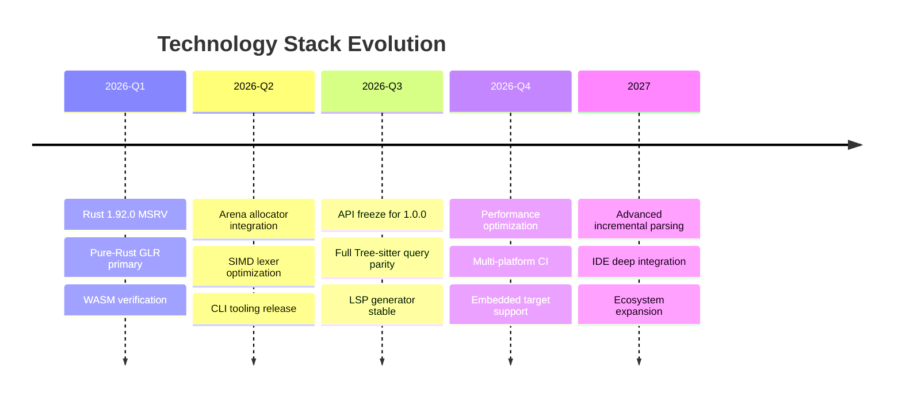
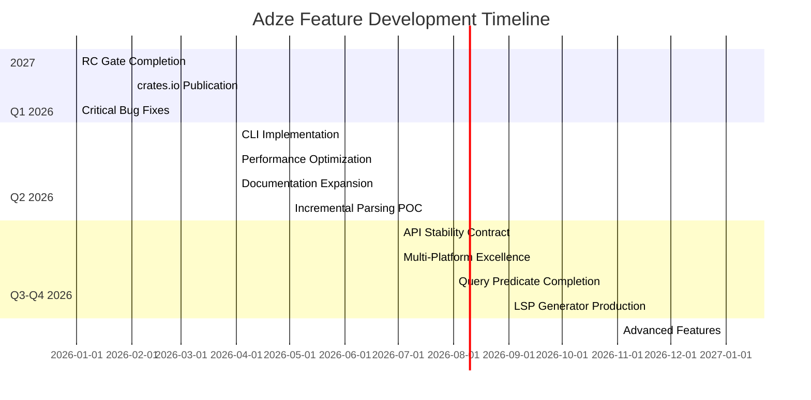
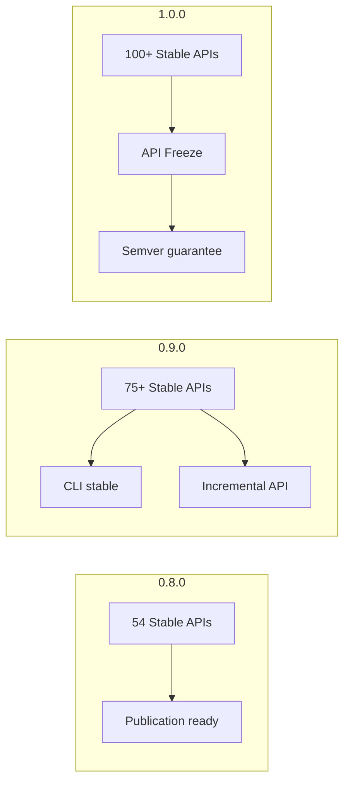
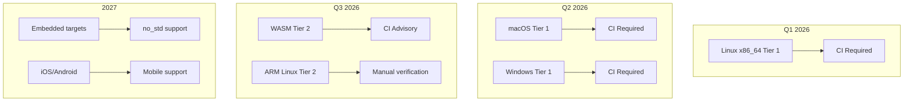
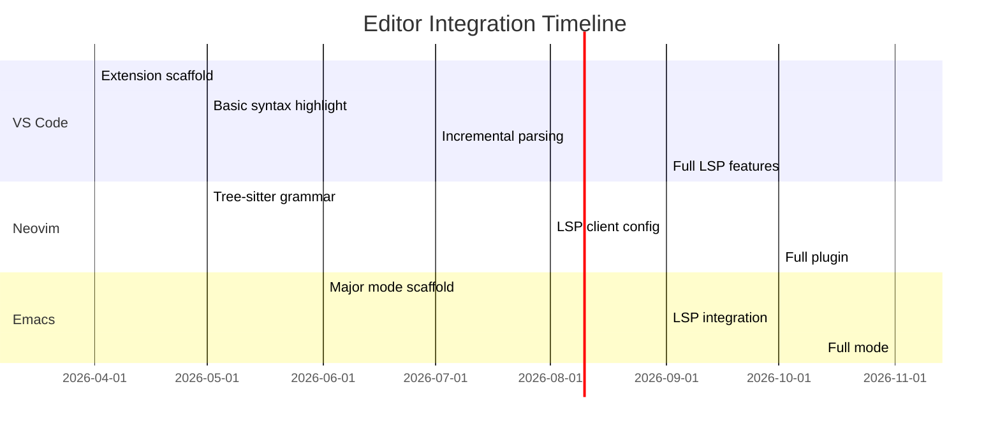

# Adze Technical Roadmap

**Last updated:** 2026-03-13
**Version:** 0.8.0-dev (RC Quality)
**Status:** Release Candidate

This document provides comprehensive technical planning for the Adze AST-first grammar toolchain, covering technology evolution, feature timelines, performance targets, API stability, platform support, and integration milestones.

---

## Executive Summary

Adze is an AST-first grammar toolchain for Rust that generates Tree-sitter-compatible parsers from Rust type annotations using a pure-Rust GLR implementation. The project is at **RC quality** for version 0.8.0 with **2,460+ tests** passing across the core pipeline.

### Current State

| Metric | Value | Target | Status |
|--------|-------|--------|--------|
| Version | 0.8.0-dev | 0.8.0 | 🟡 RC Quality |
| Test Count | 2,460+ | 2,500+ | 🟡 Near target |
| Feature Matrix | 11/12 pass | 12/12 pass | 🟡 1 expected failure |
| API Stability (Stable) | 54 APIs | 100+ APIs | 🟡 Expanding |
| MSRV | 1.92.0 | 1.92.0 | 🟢 Met |
| WASM Compatibility | ✅ | ✅ | 🟢 Pass |
| Security Audit | 0 vulns | 0 vulns | 🟢 Pass |

---

## 1. Technology Stack Evolution

### 1.1 Current Technology Stack

| Component | Version | Purpose |
|-----------|---------|---------|
| **Rust Edition** | 2024 | Language edition with latest features |
| **MSRV** | 1.92.0 | Minimum Supported Rust Version |
| **Workspace Size** | 75 crates | Monorepo structure |
| **Core Pipeline** | 7 crates | Main parsing pipeline |
| **Microcrates** | 47 crates | Governance-as-code, BDD, policy |

### 1.2 Core Dependencies

| Dependency | Version | Purpose |
|------------|---------|---------|
| `tree-sitter` | workspace | Tree-sitter compatibility |
| `serde` / `serde_json` | workspace | Serialization |
| `proptest` | workspace | Property-based testing |
| `insta` | workspace | Snapshot testing |
| `criterion` | workspace | Benchmarking |
| `thiserror` | workspace | Error types |
| `syn` / `quote` / `proc-macro2` | workspace | Proc-macro support |
| `anyhow` | workspace | Application errors |
| `indexmap` | workspace | Ordered maps |
| `rustc-hash` | workspace | Fast hashing |
| `smallvec` | workspace | Small vector optimization |
| `rayon` | workspace | Parallelism |
| `regex` | workspace | Pattern matching |
| `clap` | workspace | CLI argument parsing |
| `bincode` | workspace | Binary serialization |

### 1.3 Technology Evolution Plan

### 1.4 Toolchain Requirements

| Requirement | Current | Target | Timeline |
|-------------|---------|--------|----------|
| Rust Version | 1.92.0+ | 1.92.0+ | Maintained |
| `just` runner | Required | Required | Maintained |
| `cargo-insta` | Optional | Recommended | Q2 2026 |
| `cargo-audit` | CI only | CI + local | Q1 2026 |
| `cargo-mutagen` | Experimental | Optional | Q3 2026 |

### 1.5 Dual Runtime Strategy

Per [ADR-003](../adr/003-dual-runtime-strategy.md), Adze maintains two runtime implementations:

| Runtime | Status | Purpose |
|---------|--------|---------|
| `runtime/` (adze) | Maintenance mode | Tree-sitter FFI compatibility |
| `runtime2/` (adze-runtime) | Active development | Pure-Rust GLR, WASM, future features |

**Migration Path:**
- `runtime/` provides stable Tree-sitter integration for legacy users
- `runtime2/` is the primary development target for pure-Rust builds
- Feature flags control backend selection during transition

---

## 2. Feature Development Timeline

### 2.1 Phase Overview

### 2.2 Q1 2026: RC Gate and Publication

**Theme:** Complete RC Gate and Publish to crates.io

#### Milestone M1: RC Gate Completion

| Deliverable | Success Criteria | Status |
|-------------|------------------|--------|
| Package dry-run | `cargo package --dry-run` passes for all 7 core crates | 🔴 Not started |
| Feature-flag standardization | All feature flags follow naming convention | 🔴 Not started |
| Runtime test fixes | All `adze` runtime integration tests compile and pass | 🔴 Not started |
| Feature matrix fix | 12/12 feature combinations pass | 🔴 Not started |
| Doc drift cleanup | No references to legacy naming | 🔴 Not started |

#### Milestone M2: crates.io Publication

| Crate | Purpose | Status |
|-------|---------|--------|
| `adze-ir` | Grammar IR with GLR support | 🔴 Not published |
| `adze-glr-core` | GLR parser generation | 🔴 Not published |
| `adze-tablegen` | Table compression, FFI generation | 🔴 Not published |
| `adze-common` | Shared grammar expansion | 🔴 Not published |
| `adze-macro` | Proc-macro attributes | 🔴 Not published |
| `adze-tool` | Build-time code generation | 🔴 Not published |
| `adze` | Main runtime library | 🔴 Not published |

#### Milestone M3: Critical Bug Fixes

| Issue | Impact | Status |
|-------|--------|--------|
| FR-005: Transform closure capture | Type conversions fail silently | 🔴 Open |
| FR-014: Stale runtime test APIs | Test files fail to compile | 🔴 Open |
| FR-015: Feature matrix failure | 1 expected failure | 🔴 Open |

### 2.3 Q2 2026: Ecosystem and Tooling Expansion

**Theme:** Establish Adze as a production-ready toolchain

#### Milestone M4: CLI Implementation

| Command | Purpose | Risk Level |
|---------|---------|------------|
| `adze check` | Validates grammar without full build | 🟢 Low |
| `adze stats` | Reports parse table metrics | 🟢 Low |
| `adze fmt` | Formats grammar definitions | 🟡 Medium |
| `adze parse` | Parse files from command line | 🟢 Low |

#### Milestone M5: Performance Optimization

| Deliverable | Success Criteria | Risk Level |
|-------------|------------------|------------|
| Arena allocator | Parse forest nodes use arena allocation | 🟡 Medium |
| Benchmark suite | Criterion benchmarks with regression detection | 🟢 Low |
| Hot path optimization | 20% improvement on benchmark suite | 🟡 Medium |
| Memory profiling | Documented memory envelopes | 🟢 Low |

#### Milestone M6: Documentation Expansion

| Deliverable | Success Criteria |
|-------------|------------------|
| End-to-end tutorial | Complete walkthrough from install to production parser |
| Attribute reference | All 12 attributes documented with examples |
| Tree-sitter migration guide | Step-by-step guide for existing users |
| API cheat sheet | Single-page quick reference |

#### Milestone M7: Incremental Parsing Stabilization

| Deliverable | Success Criteria | Risk Level |
|-------------|------------------|------------|
| Forest-splicing POC | Working prototype of active incremental parsing | 🔴 High |
| Editor integration test | VS Code extension parses incrementally | 🔴 High |
| Performance validation | <10ms reparse for typical edits | 🟡 Medium |

### 2.4 Q3-Q4 2026: Production Stability

**Theme:** Achieve 1.0.0 stability contract

#### Goal 1: API Stability Contract (1.0.0)

| Objective | Success Criteria | Timeline |
|-----------|------------------|----------|
| API Freeze | No breaking changes without major version | Q3 2026 |
| Stable API count | 100+ stable public APIs | Q3 2026 |
| Deprecation cleanup | Remove all deprecated items from 0.x | Q3 2026 |
| Semver compliance | 100% adherence to semver guarantees | Q3 2026 |

#### Goal 2: Multi-Platform Excellence

| Platform | Target | Verification |
|----------|--------|--------------|
| Linux (x86_64) | Tier 1 | CI required |
| macOS (x86_64, ARM) | Tier 1 | CI required |
| Windows (x86_64) | Tier 1 | CI required |
| wasm32-unknown-unknown | Tier 2 | CI advisory |
| aarch64-unknown-linux-gnu | Tier 2 | Manual verification |

#### Goal 3: Query Predicate Completion

| Feature | Status | Priority |
|---------|--------|----------|
| `#eq?` | ✅ Done | - |
| `#match?` | ✅ Done | - |
| `#any-of?` | 🔴 Missing | High |
| `#not-any-of?` | 🔴 Missing | High |
| `#is?` / `#is-not?` | 🔴 Missing | Medium |
| Full `.scm` compatibility | 🔴 Missing | High |

#### Goal 4: LSP Generator Production-Readiness

| Deliverable | Success Criteria |
|-------------|------------------|
| Stable LSP API | Generated servers pass LSP compliance tests |
| Multi-language support | Python, JavaScript, Go grammars generate working LSPs |
| Documentation | LSP generation guide in book |
| Performance | <50ms response time for standard operations |

#### Goal 5: Ecosystem Growth

| Metric | Current | Target |
|--------|---------|--------|
| Published grammars | 4 | 10+ |
| Community contributions | 0 | 5+ PRs |
| GitHub stars | Unknown | 500+ |
| crates.io downloads | 0 | 1,000+ |

### 2.5 2027: Advanced Features

**Theme:** Deep IDE integration and ecosystem maturity

| Feature | Description | Priority |
|---------|-------------|----------|
| Advanced incremental parsing | Full forest-splicing with edge case handling | High |
| Semantic analysis | Type inference, scope resolution | Medium |
| Code actions | Automated refactoring suggestions | Medium |
| Debug adapter protocol | Debugger integration | Low |
| Language server framework | Reusable LSP framework | Medium |
| Grammar marketplace | Community grammar sharing | Low |

---

## 3. Performance Targets

### 3.1 Current Benchmark Suite

The benchmark suite in [`benchmarks/`](../../benchmarks/) includes:

| Benchmark | Purpose | File |
|-----------|---------|------|
| `parse_bench` | General parsing performance | `benches/parse_bench.rs` |
| `glr_performance` | GLR parser performance | `benches/glr_performance.rs` |
| `glr_hot` | GLR hot path optimization | `benches/glr_hot.rs` |
| `glr_performance_real` | Real-world GLR performance | `benches/glr_performance_real.rs` |
| `optimization_bench` | Optimization passes | `benches/optimization_bench.rs` |
| `incremental_bench` | Incremental parsing | `benches/incremental_bench.rs` |
| `stack_optimization` | Stack usage optimization | `benches/stack_optimization.rs` |
| `arena_vs_box_allocation` | Memory allocation comparison | `benches/arena_vs_box_allocation.rs` |
| `core_baselines` | IR normalization, FIRST/FOLLOW, table compression | `benches/core_baselines.rs` |

### 3.2 Performance Targets by Phase

| Phase | Metric | Current | Target | Improvement |
|-------|--------|---------|--------|-------------|
| **Q1 2026** | Baseline establishment | TBD | Documented | - |
| **Q2 2026** | Parse throughput | TBD | +20% | 20% |
| **Q2 2026** | Memory usage | TBD | -30% | 30% reduction |
| **Q3 2026** | Incremental reparse | N/A | <10ms | New capability |
| **Q4 2026** | LSP response time | N/A | <50ms | New capability |
| **2027** | Full file parse | TBD | <100ms/10KB | Production target |

### 3.3 Optimization Strategies

```mermaid
graph TD
    subgraph Memory Optimization
        A1[Arena Allocator] --> A2[Reduced allocations]
        A2 --> A3[Better cache locality]
    end
    
    subgraph Parse Optimization
        B1[Hot path analysis] --> B2[Inline critical functions]
        B2 --> B3[SIMD lexer]
        B3 --> B4[Parallel lexing]
    end
    
    subgraph Table Optimization
        C1[Table compression] --> C2[Smaller memory footprint]
        C2 --> C3[Faster state lookups]
    end
    
    subgraph Incremental Optimization
        D1[Forest splicing] --> D2[Chunk identification]
        D2 --> D3[Node reuse]
        D3 --> D4[Minimal reparsing]
    end
```

### 3.4 Memory Envelope Targets

| Scenario | Current | Target | Notes |
|----------|---------|--------|-------|
| Small file (<1KB) | TBD | <1MB | Typical source file |
| Medium file (10KB) | TBD | <10MB | Large source file |
| Large file (1MB) | TBD | <100MB | Generated/minified |
| Incremental edit | TBD | <2MB delta | Single edit operation |

### 3.5 Regression Prevention

| Mechanism | Implementation |
|-----------|----------------|
| CI benchmarks | Scheduled workflow runs |
| Performance gates | Criterion regression detection |
| Memory profiling | Valgrind/heaptrack integration |
| Profile-guided optimization | PGO builds for release |

---

## 4. API Evolution Plan

### 4.1 Current API Stability Status

Per [`API_STABILITY.md`](../status/API_STABILITY.md):

| Crate | Stable | Unstable | Experimental | Deprecated | Internal | Total |
|-------|--------|----------|-------------|------------|----------|-------|
| `adze` (runtime) | 8 | 18 | 11 | 5 | 5 | 47 |
| `adze-macro` | 10 | 1 | 0 | 0 | 0 | 11 |
| `adze-tool` | 3 | 5 | 2 | 0 | 0 | 10 |
| `adze-common` | 3 | 2 | 0 | 0 | 0 | 5 |
| `adze-ir` | 14 | 7 | 1 | 0 | 0 | 22 |
| `adze-glr-core` | 10 | 14 | 5 | 1 | 8 | 38 |
| `adze-tablegen` | 6 | 10 | 3 | 0 | 0 | 19 |
| **Total** | **54** | **57** | **22** | **6** | **13** | **152** |

### 4.2 Stability Levels

| Level | Meaning |
|-------|---------|
| **Stable** | Covered by semver. Will not break without a major version bump. |
| **Unstable** | Functional and tested, but signature or behavior may change in minor releases. |
| **Experimental** | Works in limited cases. May be removed or radically redesigned. |
| **Deprecated** | Scheduled for removal. Use the noted replacement instead. |
| **Internal** | Exposed for macro/codegen use only. Not part of the public contract. |

### 4.3 API Evolution Timeline

### 4.4 Breaking Change Policy

| Change Type | Policy | Example |
|-------------|--------|---------|
| **Stable API removal** | Major version required | Removing `Extract` trait |
| **Stable API signature change** | Major version required | Adding required parameter |
| **Behavioral change** | Minor version + docs | Error message format |
| **Unstable API change** | Minor version allowed | `ParserBackend` variants |
| **Experimental API removal** | Any version | `glr_query` module |

### 4.5 Deprecation Schedule

| API | Current Status | Deprecation Version | Removal Version | Replacement |
|-----|----------------|---------------------|-----------------|-------------|
| `incremental` module | Deprecated | 0.7.0 | 1.0.0 | `glr_incremental` |
| `incremental_v2` module | Deprecated | 0.7.0 | 1.0.0 | `glr_incremental` |
| `incremental_v3` module | Deprecated | 0.7.0 | 1.0.0 | `glr_incremental` |
| `glr` (legacy) module | Deprecated | 0.7.0 | 1.0.0 | `glr_parser` |
| `tree_sitter` re-export | Deprecated | 0.8.0 | 1.0.0 | Pure-Rust backend |

### 4.6 API Stabilization Process

1. **Proposal**: Document proposed stable API in ADR
2. **Review**: Core team review for completeness and correctness
3. **Testing**: Achieve 100% test coverage for API surface
4. **Documentation**: Complete doc comments with examples
5. **Stabilization**: Mark as stable in `API_STABILITY.md`
6. **Freeze**: API locked to semver guarantees

---

## 5. Platform Support Matrix

### 5.1 Platform Tier Definitions

| Tier | Definition | CI Requirement |
|------|------------|----------------|
| **Tier 1** | Guaranteed to work, tested every PR | Required |
| **Tier 2** | Guaranteed to build, tested periodically | Advisory |
| **Tier 3** | Best effort, community maintained | Manual |

### 5.2 Current Platform Support

| Platform | Tier | Status | Notes |
|----------|------|--------|-------|
| **Linux x86_64** | Tier 1 | ✅ Verified | Primary development platform |
| **macOS x86_64** | Tier 1 | 🟡 CI Advisory | CI runs, not blocking |
| **macOS ARM** | Tier 1 | 🟡 CI Advisory | Apple Silicon |
| **Windows x86_64** | Tier 1 | 🟡 CI Advisory | MSVC toolchain |
| **wasm32-unknown-unknown** | Tier 2 | ✅ Verified | Pure-Rust backend required |
| **aarch64-unknown-linux-gnu** | Tier 2 | 🔴 Unverified | ARM Linux |

### 5.3 Platform Support Timeline

### 5.4 WASM Support

| Feature | Status | Notes |
|---------|--------|-------|
| Core compilation | ✅ Working | `wasm32-unknown-unknown` |
| Pure-Rust backend | ✅ Required | No C dependencies |
| Playground demo | 🟡 Exists | `wasm-demo/` crate |
| NPM package | 🔴 Planned | 2026 Q3 |
| Browser testing | 🔴 Planned | 2026 Q3 |

### 5.5 Embedded Targets

| Target | Status | Timeline | Notes |
|--------|--------|----------|-------|
| `arm-none-eabi` | 🔴 Not supported | 2027 | no_std required |
| `riscv32/64` | 🔴 Not supported | 2027 | no_std required |
| `wasm32-wasi` | 🔴 Not supported | 2026 Q4 | WASI preview |

### 5.6 CI Platform Matrix

| Platform | CI Job | Trigger | Blocking |
|----------|--------|---------|----------|
| Linux x86_64 | `ci-supported` | Every PR | ✅ Yes |
| macOS x86_64 | `ci.yml` advisory | Every PR | ❌ No |
| macOS ARM | `ci.yml` advisory | Every PR | ❌ No |
| Windows x86_64 | `ci.yml` advisory | Every PR | ❌ No |
| WASM | `pure-rust-ci.yml` | Every PR | ❌ No |

---

## 6. Integration Milestones

### 6.1 Editor Integration Timeline

### 6.2 VS Code Integration

| Feature | Status | Timeline | Notes |
|---------|--------|----------|-------|
| Extension scaffold | 🔴 Not started | Q2 2026 | `adze-vscode` package |
| Syntax highlighting | 🔴 Not started | Q2 2026 | TextMate grammar |
| Incremental parsing | 🔴 Not started | Q3 2026 | Forest splicing |
| Diagnostics | 🔴 Not started | Q3 2026 | Error reporting |
| Code completion | 🔴 Not started | Q4 2026 | LSP integration |
| Go to definition | 🔴 Not started | Q4 2026 | LSP integration |
| Find references | 🔴 Not started | Q4 2026 | LSP integration |
| Rename | 🔴 Not started | 2027 | LSP integration |

### 6.3 Neovim Integration

| Feature | Status | Timeline | Notes |
|---------|--------|----------|-------|
| Tree-sitter grammar | 🔴 Not started | Q2 2026 | Native Neovim support |
| LSP client config | 🔴 Not started | Q3 2026 | nvim-lspconfig |
| Incremental updates | 🔴 Not started | Q3 2026 | Native incremental |
| Plugin documentation | 🔴 Not started | Q3 2026 | README and docs |

### 6.4 Emacs Integration

| Feature | Status | Timeline | Notes |
|---------|--------|----------|-------|
| Major mode scaffold | 🔴 Not started | Q2 2026 | `adze-mode` |
| LSP integration | 🔴 Not started | Q3 2026 | lsp-mode / eglot |
| Company backend | 🔴 Not started | Q4 2026 | Completion |

### 6.5 Language Server Protocol

#### LSP Generator Status

The [`lsp-generator/`](../../lsp-generator/) crate provides LSP server generation:

| Component | Status | Notes |
|-----------|--------|-------|
| Core generator | 🟡 Prototype | Basic functionality |
| Multi-language | 🔴 Planned | Python, JS, Go |
| Performance | 🔴 Untested | Target <50ms |
| Documentation | 🔴 Missing | Needs guide |

#### LSP Feature Support

| Feature | Status | Timeline | Notes |
|---------|--------|----------|-------|
| Text synchronization | 🟡 Partial | Q2 2026 | Full sync |
| Diagnostics | 🟡 Partial | Q2 2026 | Parse errors |
| Completion | 🔴 Not started | Q3 2026 | Basic support |
| Hover | 🔴 Not started | Q3 2026 | Type info |
| Go to definition | 🔴 Not started | Q4 2026 | Symbol resolution |
| Find references | 🔴 Not started | Q4 2026 | Symbol search |
| Document symbols | 🔴 Not started | Q3 2026 | Outline view |
| Semantic tokens | 🔴 Not started | 2027 | Advanced highlighting |

### 6.6 Build System Integration

| System | Status | Timeline | Notes |
|--------|--------|----------|-------|
| Cargo `build.rs` | ✅ Working | Current | Primary integration |
| Bazel | 🔴 Not started | 2027 | Rules_rust |
| Buck | 🔴 Not started | 2027 | Facebook build |
| Bloop | 🔴 Not started | 2027 | Scala build tool |
| Makefile | 🔴 Not started | 2026 Q4 | Simple projects |

### 6.7 CI/CD Integration

| Platform | Status | Timeline | Notes |
|----------|--------|----------|-------|
| GitHub Actions | ✅ Working | Current | 16 workflows |
| GitLab CI | 🔴 Not started | 2027 | Template |
| CircleCI | 🔴 Not started | 2027 | Orb |
| Jenkins | 🔴 Not started | 2027 | Pipeline shared library |

---

## 7. Risk Assessment

### 7.1 High Priority Risks

| Risk ID | Description | Probability | Impact | Mitigation |
|---------|-------------|-------------|--------|------------|
| R1 | Transform closure bug (FR-005) blocks production use | High | Critical | Prioritize fix in Q1 2026 |
| R2 | Incremental parsing complexity delays M7 | Medium | High | Start POC early, phased rollout |
| R3 | API changes required for arena allocator | Medium | High | Design for compatibility, feature flags |
| R4 | crates.io publication reveals packaging issues | Medium | Medium | Add `cargo package --dry-run` to CI |

### 7.2 Medium Priority Risks

| Risk ID | Description | Probability | Impact | Mitigation |
|---------|-------------|-------------|--------|------------|
| R5 | Documentation drift continues | Medium | Medium | Add doc validation to CI |
| R6 | Feature flag naming inconsistency | Medium | Medium | Standardize in Q1 2026 |
| R7 | Performance regressions in edge cases | Low | Medium | Expand benchmark coverage |
| R8 | LSP generator scope creep | Medium | Medium | Define MVP clearly |

### 7.3 Low Priority Risks

| Risk ID | Description | Probability | Impact | Mitigation |
|---------|-------------|-------------|--------|------------|
| R9 | Community adopts different grammar tool | Low | Low | Focus on Rust-native value prop |
| R10 | Tree-sitter API changes break compatibility | Low | Medium | Monitor upstream changes |

---

## 8. Success Metrics

### 8.1 Q1 2026 Success Metrics

| KPI | Current | Target | Measurement |
|-----|---------|--------|-------------|
| Core crates on crates.io | 0 | 7 | `cargo search adze` |
| Feature matrix pass rate | 11/12 | 12/12 | CI job result |
| Runtime test compilation | ~80% | 100% | `cargo test -p adze` |
| Doc drift issues | 5+ files | 0 files | grep for legacy naming |
| Open P0 friction items | 3 | 0 | FRICTION_LOG.md |

### 8.2 Q2 2026 Success Metrics

| KPI | Current | Target | Measurement |
|-----|---------|--------|-------------|
| CLI commands available | 0 | 4 | `adze --help` |
| Benchmark coverage | 0% | 80% of hot paths | Criterion reports |
| Book chapters | 6 | 12 | book/ directory |
| Parse performance baseline | Unknown | Documented | benchmarks/README.md |
| Incremental reparse time | N/A | <10ms | Criterion benchmark |

### 8.3 Q3-Q4 2026 Success Metrics

| KPI | Current | Target | Measurement |
|-----|---------|--------|-------------|
| Stable API count | 54 | 100+ | API_STABILITY.md |
| Platform support | 1 (Linux) | 4 | CI matrix |
| Query predicate coverage | 60% | 100% | Feature parity tests |
| LSP compliance | 0% | 100% | LSP test suite |
| Published grammars | 4 | 10+ | grammars/ directory |
| Community PRs | 0 | 5+ | GitHub metrics |

### 8.4 2027 Success Metrics

| KPI | Target | Measurement |
|-----|--------|-------------|
| crates.io downloads | 10,000+ | crates.io stats |
| GitHub stars | 1,000+ | GitHub metrics |
| Published grammars | 20+ | Community contributions |
| Editor extensions | 3 | VS Code, Neovim, Emacs |
| Corporate adopters | 3+ | Public usage |

---

## 9. Related Documentation

| Document | Purpose |
|----------|---------|
| [`INDEX.md`](../INDEX.md) | Master documentation index |
| [`NAVIGATION.md`](../NAVIGATION.md) | Reading paths and cross-references |
| [`QUICK_REFERENCE.md`](../QUICK_REFERENCE.md) | One-page cheat sheet |
| [`NOW_NEXT_LATER.md`](../status/NOW_NEXT_LATER.md) | Detailed milestones and KPIs |
| [`API_STABILITY.md`](../status/API_STABILITY.md) | API stability matrix |
| [`KNOWN_RED.md`](../status/KNOWN_RED.md) | Intentional CI exclusions |
| [`FRICTION_LOG.md`](../status/FRICTION_LOG.md) | Pain points and issues |
| [`AGENTS.md`](../../AGENTS.md) | Development guidelines |
| [`docs/adr/`](../adr/) | Architecture Decision Records |

---

## Changelog

| Date | Change |
|------|--------|
| 2026-03-13 | Initial technical roadmap creation |
