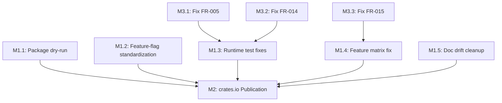
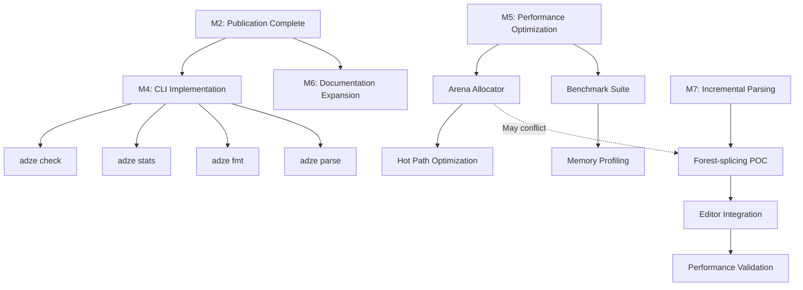
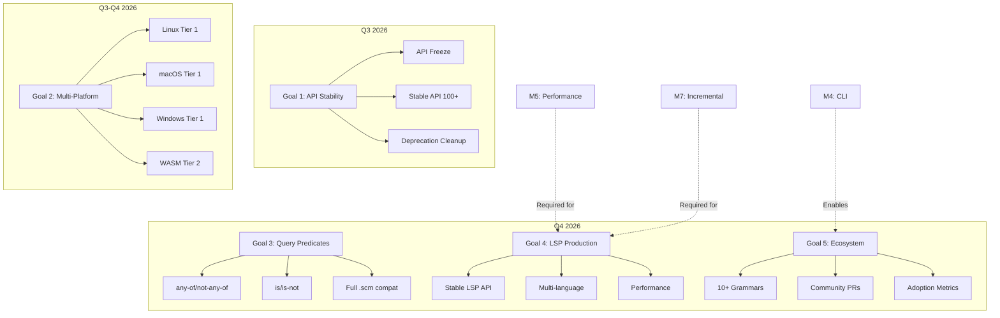
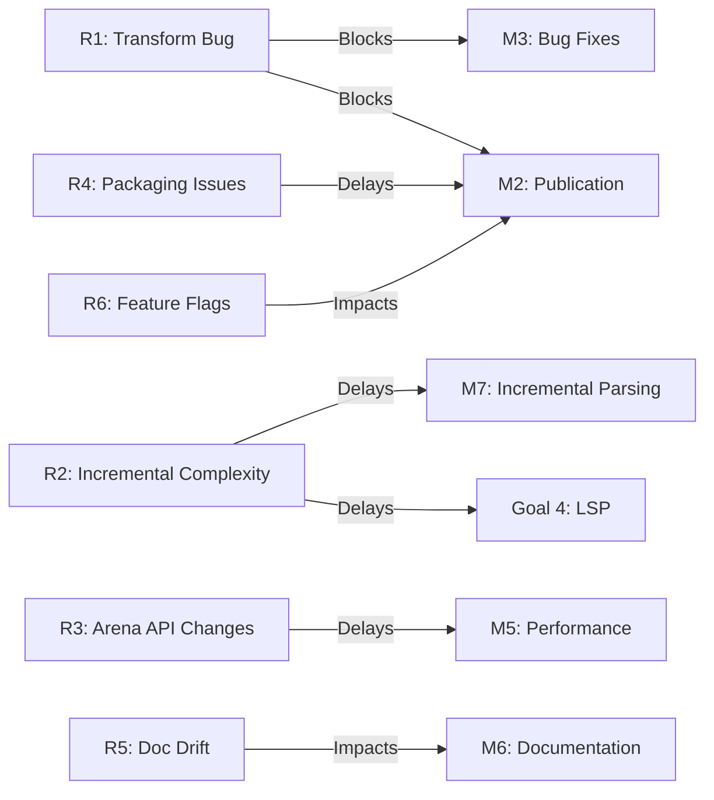

# Now / Next / Later

**Last updated:** 2026-03-13
**Status:** **Release Candidate** — 0.8.0-rc quality
**Version:** 0.8.0-dev
**MSRV:** 1.92.0 (Rust 2024 edition)

Adze status and rolling execution plan. For paper cuts and pain points, see [`FRICTION_LOG.md`](./FRICTION_LOG.md). For API stability guarantees per crate, see [`API_STABILITY.md`](./API_STABILITY.md). For intentional CI exclusions, see [`KNOWN_RED.md`](./KNOWN_RED.md).

---

## Executive Summary

Adze is an AST-first grammar toolchain for Rust that generates Tree-sitter-compatible parsers from Rust type annotations using a pure-Rust GLR implementation. The project is at **RC quality** for version 0.8.0, with **2,460+ tests** passing across the core pipeline. The immediate focus is completing the release candidate gate and publishing to crates.io.

### Current Health Metrics

| Metric | Value | Target | Status |
|--------|-------|--------|--------|
| Test Count | 2,460+ | 2,500+ | 🟡 Near target |
| Feature Matrix | 11/12 pass | 12/12 pass | 🟡 1 expected failure |
| API Stability (Stable) | 54 APIs | 60+ APIs | 🟡 Expanding |
| Clippy Clean | ✅ | ✅ | 🟢 Pass |
| Fmt Clean | ✅ | ✅ | 🟢 Pass |
| Security Audit | 0 vulns | 0 vulns | 🟢 Pass |
| WASM Compatibility | ✅ | ✅ | 🟢 Pass |
| Doc Warnings | 0 | 0 | 🟢 Pass |
| Open Friction Items | 7 | <5 | 🟡 Needs work |

---

## Done (Waves 1–14)

> 14 waves of parallel agent work, 85+ commits driving the 0.8.0 release to RC quality.

### ✅ CI Gate Green
- [x] All supported crates compile: `adze`, `adze-ir`, `adze-glr-core`, `adze-tablegen`, `adze-common`, `adze-macro`, `adze-tool`.
- [x] `cargo check --workspace` passes (full workspace compiles).
- [x] `cargo fmt --all -- --check` passes — **fmt clean** across all supported crates.
- [x] `cargo clippy` clean on supported crates — **clippy clean**.
- [x] `cargo test` passes — **2,460+ tests across feature combinations, 0 failures in supported lane**.
- [x] `cargo doc` builds for supported crates — **0 rustdoc warnings** across supported crates.

### ✅ Safety Audit
- [x] SAFETY comments on all `unsafe` blocks in `runtime/src/lex/`, `runtime/src/parser.rs`, `runtime/src/ffi.rs`, `runtime/src/decoder.rs`.
- [x] SAFETY comments on all `unsafe` blocks in `glr-core` and `tablegen`.

### ✅ Testing Buildout
- [x] **2,460+ tests** across the workspace and feature combinations (property, integration, snapshot, GLR-core, fuzzing, mutation guards, ABI matrix).
- [x] Property-based tests in `tablegen/tests/property_tests.rs`.
- [x] Integration tests in `runtime/tests/` (30+ test files covering API contracts, end-to-end, edge cases, concurrency).
- [x] Integration tests in `common/tests/` (`expansion_tests.rs`, `parsing_tests.rs`).
- [x] Snapshot tests in `ir/tests/` (10+ snapshots via `insta` for optimizer, normalizer, validator, JSON roundtrip).
- [x] Snapshot tests in `example/src/` — **10 example grammars** (arithmetic, optionals, repetitions, words, boolean, json, csv, lambda, regex, ini).
- [x] GLR-core integration tests (20+ test files: conflict preservation, driver correctness, stack invariants, etc).
- [x] Feature-combination matrix: 11/12 pass (1 expected failure).
- [x] Mutation testing configured and smoke-tested.
- [x] Driver integration, cursor, pipeline, and serialization tests (Wave 13).
- [x] Error display, builder, forest property, and ABI matrix tests (Wave 14).
- [x] Cross-crate integration and architecture validation tests.
- [x] Microcrate coverage for 5 low-coverage crates (Wave 12).

### ✅ Error Message Quality
- [x] Actionable error messages across parser, IR, and tablegen.
- [x] Compile-time diagnostics for grammar issues.
- [x] Error display formatting tests (Wave 14).

### ✅ WASM Compatibility Verification
- [x] All core crates compile for `wasm32-unknown-unknown`.
- [x] Pure-Rust runtime enables browser-based parsing without C dependencies.
- [x] WASM CI verification job added (Wave 12).

### ✅ Security Audit
- [x] `cargo-audit` clean — 0 known vulnerabilities.
- [x] No unsafe code without SAFETY comments.

### ✅ API Documentation
- [x] Crate-level `//!` doc comments on all supported crates.
- [x] `cargo doc` builds cleanly — 0 warnings across supported crates.
- [x] Doctests pass for `glr-core` (serialization) and `ir` (builder).
- [x] Book: **6+ chapters** covering grammar design, GLR parsing, external scanners, and more.
- [x] Missing doc comments added to core pipeline crates (Wave 14).
- [x] User guide architecture chapter added (Wave 13).

### ✅ Infrastructure
- [x] Fuzzing targets set up (22 targets in `fuzz/fuzz_targets/`).
- [x] CI workflow with feature matrix job for crate × feature-flag combinations.
- [x] CI with cross-platform advisory jobs (macOS/Windows).
- [x] Cargo.toml metadata fixed for publish readiness across workspace.
- [x] Publish order documented for crates.io release.
- [x] READMEs added to `crates/` microcrates.
- [x] Concurrency caps in CI (RUST_TEST_THREADS=2, RAYON_NUM_THREADS=4).
- [x] Cross-platform: Linux verified, macOS/Windows CI advisory jobs in place.
- [x] `scripts/check-publish-ready.sh` for crates.io readiness checks (Wave 14).

### ✅ Workspace Polish
- [x] Cargo.toml metadata polish across workspace crates.
- [x] Core pure-Rust pipeline compiles cleanly: `adze-ir`, `adze-glr-core`, `adze-tablegen`.
- [x] 47 microcrates in `crates/` with stable structure.
- [x] Benchmarks, fuzzing, golden-tests, and book scaffolding in place.

### ✅ Documentation Sync
- [x] Rework [`ARCHITECTURE.md`](../explanations/architecture.md) with Mermaid and Governance details.
- [x] Update [`GETTING_STARTED.md`](../tutorials/getting-started.md) and [`GRAMMAR_EXAMPLES.md`](../reference/grammar-examples.md) for 0.8.0.
- [x] Sync [`DEVELOPER_GUIDE.md`](../DEVELOPER_GUIDE.md) with `just` and `xtask` workflows.
- [x] Update [`ROADMAP.md`](../../ROADMAP.md) and [`KNOWN_LIMITATIONS.md`](../reference/known-limitations.md).
- [ ] Close remaining release blockers in doc history/version drift (`FR-001`): version strings and legacy naming in advanced how-to guides.

---

## NOW (Q1 2026)

**Theme:** Complete RC Gate and Publish to crates.io

### Primary Objective
Ship version 0.8.0 to crates.io with a stable, well-documented core pipeline.

### Milestone M1: RC Gate Completion

| Deliverable | Success Criteria | Owner | Status |
|-------------|------------------|-------|--------|
| Package dry-run | `cargo package --dry-run` passes for all 7 core crates | Release | 🔴 Not started |
| Feature-flag standardization | All feature flags follow naming convention (`glr`, `simd`, `serialization`) | Runtime | 🔴 Not started |
| Runtime test fixes | All `adze` runtime integration tests compile and pass | Runtime | 🔴 Not started |
| Feature matrix fix | 12/12 feature combinations pass | Testing | 🔴 Not started |
| Doc drift cleanup | No references to `rust-sitter` or legacy naming | Docs | 🔴 Not started |

### Milestone M2: crates.io Publication

| Deliverable | Success Criteria | Owner | Status |
|-------------|------------------|-------|--------|
| Publish `adze-ir` | Live on crates.io with complete metadata | Release | 🔴 Not started |
| Publish `adze-glr-core` | Live on crates.io with complete metadata | Release | 🔴 Not started |
| Publish `adze-tablegen` | Live on crates.io with complete metadata | Release | 🔴 Not started |
| Publish `adze-common` | Live on crates.io with complete metadata | Release | 🔴 Not started |
| Publish `adze-macro` | Live on crates.io with complete metadata | Release | 🔴 Not started |
| Publish `adze-tool` | Live on crates.io with complete metadata | Release | 🔴 Not started |
| Publish `adze` | Live on crates.io with complete metadata | Release | 🔴 Not started |

### Milestone M3: Critical Bug Fixes

| Issue | Impact | Success Criteria | Status |
|-------|--------|------------------|--------|
| FR-005: Transform closure capture | Type conversions fail silently | Closures execute during extract phase | 🔴 Open |
| FR-014: Stale runtime test APIs | Test files fail to compile | All test files compile | 🔴 Open |
| FR-015: Feature matrix failure | 1 expected failure | 12/12 pass | 🔴 Open |

### NOW Dependency Map

### NOW Success Metrics

| KPI | Current | Target | Measurement |
|-----|---------|--------|-------------|
| Core crates on crates.io | 0 | 7 | `cargo search adze` |
| Feature matrix pass rate | 11/12 | 12/12 | CI job result |
| Runtime test compilation | ~80% | 100% | `cargo test -p adze` |
| Doc drift issues | 5+ files | 0 files | grep for legacy naming |
| Open P0 friction items | 3 | 0 | FRICTION_LOG.md |

---

## NEXT (Q2 2026)

**Theme:** Ecosystem & Tooling Expansion

### Primary Objective
Establish Adze as a production-ready toolchain with CLI, improved performance, and comprehensive documentation.

### Milestone M4: CLI Implementation

| Deliverable | Success Criteria | Dependencies | Risk Level |
|-------------|------------------|--------------|------------|
| `adze check` | Validates grammar without full build | M2 complete | 🟢 Low |
| `adze stats` | Reports parse table metrics | M2 complete | 🟢 Low |
| `adze fmt` | Formats grammar definitions | M2 complete | 🟡 Medium |
| `adze parse` | Parse files from command line | M2 complete | 🟢 Low |

**Risk Factors:**
- CLI API design requires careful consideration for future compatibility
- Error messaging must be user-friendly

### Milestone M5: Performance Optimization

| Deliverable | Success Criteria | Dependencies | Risk Level |
|-------------|------------------|--------------|------------|
| Arena allocator | Parse forest nodes use arena allocation | None | 🟡 Medium |
| Benchmark suite | Criterion benchmarks with regression detection | None | 🟢 Low |
| Hot path optimization | 20% improvement on benchmark suite | Arena allocator | 🟡 Medium |
| Memory profiling | Documented memory envelopes | Benchmark suite | 🟢 Low |

**Risk Factors:**
- Arena allocator may require significant API changes
- Performance regressions in edge cases

### Milestone M6: Documentation Expansion

| Deliverable | Success Criteria | Dependencies | Risk Level |
|-------------|------------------|--------------|------------|
| End-to-end tutorial | Complete walkthrough from install to production parser | M2 complete | 🟢 Low |
| Attribute reference | All 12 attributes documented with examples | None | 🟢 Low |
| Tree-sitter migration guide | Step-by-step guide for existing users | None | 🟡 Medium |
| API cheat sheet | Single-page quick reference | None | 🟢 Low |

### Milestone M7: Incremental Parsing Stabilization

| Deliverable | Success Criteria | Dependencies | Risk Level |
|-------------|------------------|--------------|------------|
| Forest-splicing POC | Working prototype of active incremental parsing | None | 🔴 High |
| Editor integration test | VS Code extension parses incrementally | Forest-splicing | 🔴 High |
| Performance validation | <10ms reparse for typical edits | Editor integration | 🟡 Medium |

**Risk Factors:**
- Incremental parsing is architecturally complex
- May require GLR forest representation changes

### NEXT Dependency Map

### NEXT Success Metrics

| KPI | Current | Target | Measurement |
|-----|---------|--------|-------------|
| CLI commands available | 0 | 4 | `adze --help` |
| Benchmark coverage | 0% | 80% of hot paths | Criterion reports |
| Book chapters | 6 | 12 | book/ directory |
| Parse performance baseline | Unknown | Documented | benchmarks/README.md |
| Incremental reparse time | N/A | <10ms | Criterion benchmark |

---

## LATER (H2 2026)

**Theme:** Production Stability and Ecosystem Growth

### Primary Objective
Achieve 1.0.0 stability contract with multi-platform support and a thriving ecosystem.

### Strategic Goals

#### Goal 1: API Stability Contract (1.0.0)

| Objective | Success Criteria | Timeline |
|-----------|------------------|----------|
| API Freeze | No breaking changes without major version | Q3 2026 |
| Stable API count | 100+ stable public APIs | Q3 2026 |
| Deprecation cleanup | Remove all deprecated items from 0.x | Q3 2026 |
| Semver compliance | 100% adherence to semver guarantees | Q3 2026 |

#### Goal 2: Multi-Platform Excellence

| Platform | Target | Verification |
|----------|--------|--------------|
| Linux (x86_64) | Tier 1 | CI required |
| macOS (x86_64, ARM) | Tier 1 | CI required |
| Windows (x86_64) | Tier 1 | CI required |
| wasm32-unknown-unknown | Tier 2 | CI advisory |
| aarch64-unknown-linux-gnu | Tier 2 | Manual verification |

#### Goal 3: Query Predicate Completion

| Feature | Status | Priority |
|---------|--------|----------|
| `#eq?` | ✅ Done | - |
| `#match?` | ✅ Done | - |
| `#any-of?` | 🔴 Missing | High |
| `#not-any-of?` | 🔴 Missing | High |
| `#is?` / `#is-not?` | 🔴 Missing | Medium |
| Full `.scm` compatibility | 🔴 Missing | High |

#### Goal 4: LSP Generator Production-Readiness

| Deliverable | Success Criteria |
|-------------|------------------|
| Stable LSP API | Generated servers pass LSP compliance tests |
| Multi-language support | Python, JavaScript, Go grammars generate working LSPs |
| Documentation | LSP generation guide in book |
| Performance | <50ms response time for standard operations |

#### Goal 5: Ecosystem Growth

| Metric | Current | Target |
|--------|---------|--------|
| Published grammars | 4 (python, javascript, go, python-simple) | 10+ |
| Community contributions | 0 | 5+ PRs |
| GitHub stars | Unknown | 500+ |
| crates.io downloads | 0 | 1,000+ |

### LATER Dependency Map

### LATER Success Metrics

| KPI | Current | Target | Measurement |
|-----|---------|--------|-------------|
| Stable API count | 54 | 100+ | API_STABILITY.md |
| Platform support | 1 (Linux) | 4 | CI matrix |
| Query predicate coverage | 60% | 100% | Feature parity tests |
| LSP compliance | 0% | 100% | LSP test suite |
| Published grammars | 4 | 10+ | grammars/ directory |
| Community PRs | 0 | 5+ | GitHub metrics |

---

## Risk Assessment Matrix

### High Priority Risks

| Risk ID | Description | Probability | Impact | Mitigation |
|---------|-------------|-------------|--------|------------|
| R1 | Transform closure bug (FR-005) blocks production use | High | Critical | Prioritize fix in NOW phase |
| R2 | Incremental parsing complexity delays M7 | Medium | High | Start POC early, consider phased rollout |
| R3 | API changes required for arena allocator | Medium | High | Design for compatibility, use feature flags |
| R4 | crates.io publication reveals packaging issues | Medium | Medium | Add `cargo package --dry-run` to CI |

### Medium Priority Risks

| Risk ID | Description | Probability | Impact | Mitigation |
|---------|-------------|-------------|--------|------------|
| R5 | Documentation drift continues | Medium | Medium | Add doc validation to CI |
| R6 | Feature flag naming inconsistency confuses users | Medium | Medium | Standardize in NOW phase |
| R7 | Performance regressions in edge cases | Low | Medium | Expand benchmark coverage |
| R8 | LSP generator scope creep | Medium | Medium | Define MVP clearly |

### Low Priority Risks

| Risk ID | Description | Probability | Impact | Mitigation |
|---------|-------------|-------------|--------|------------|
| R9 | Community adopts different grammar tool | Low | Low | Focus on Rust-native value prop |
| R10 | Tree-sitter API changes break compatibility | Low | Medium | Monitor upstream changes |

### Risk Dependency Graph

---

## Appendix A: Friction Item Status

| ID | Area | Status | NOW/NEXT/LATER |
|----|------|--------|----------------|
| FR-001 | Docs | Open | NOW (M1.5) |
| FR-002 | CI | Mitigated | - |
| FR-003 | Dev loop | Mitigated | - |
| FR-004 | Status | Mitigated | - |
| FR-005 | Macro | Open | NOW (M3.1) |
| FR-006 | Macro | Resolved | - |
| FR-007 | Runtime | Resolved | - |
| FR-008 | Tooling | Mitigated | - |
| FR-009 | Dev loop | Open | LATER (workspace partitioning) |
| FR-010 | Runtime | Resolved | - |
| FR-011 | Docs | Resolved | - |
| FR-012 | Publishing | Open | NOW (M1.1) |
| FR-013 | Tooling | Open | NEXT (M4) |
| FR-014 | Runtime | Open | NOW (M3.2) |
| FR-015 | Testing | Open | NOW (M3.3) |

---

## Appendix B: API Stability Summary

| Crate | Stable | Unstable | Experimental | Deprecated | Internal | Total |
|-------|--------|----------|-------------|------------|----------|-------|
| `adze` (runtime) | 8 | 18 | 11 | 5 | 5 | 47 |
| `adze-macro` | 10 | 1 | 0 | 0 | 0 | 11 |
| `adze-tool` | 3 | 5 | 2 | 0 | 0 | 10 |
| `adze-common` | 3 | 2 | 0 | 0 | 0 | 5 |
| `adze-ir` | 14 | 7 | 1 | 0 | 0 | 22 |
| `adze-glr-core` | 10 | 14 | 5 | 1 | 8 | 38 |
| `adze-tablegen` | 6 | 10 | 3 | 0 | 0 | 19 |
| **Total** | **54** | **57** | **22** | **6** | **13** | **152** |

---

## Appendix C: Workspace Structure

The workspace contains **75 crates** organized as follows:

| Layer | Crates | Purpose |
|-------|--------|---------|
| Core Pipeline | 7 | Main parsing pipeline (adze, adze-macro, adze-tool, adze-common, adze-ir, adze-glr-core, adze-tablegen) |
| Runtime2 | 1 | Alternative runtime path (converging) |
| Grammars | 5 | Language implementations (python, javascript, go, python-simple, test-vec-wrapper) |
| Microcrates | 47 | Governance-as-code, BDD, policy, parser contracts |
| Tooling | 4 | CLI, LSP generator, playground, WASM demo |
| Infrastructure | 6 | Benchmarks, golden-tests, testing support, xtask |
| Samples | 1 | Downstream demo |
| Tests | 1 | Governance tests |

---

## Appendix D: CI Workflow Summary

| Workflow | Purpose | Required |
|----------|---------|----------|
| `ci.yml` | Main CI with `ci-supported` job | ✅ PR gate |
| `pure-rust-ci.yml` | Pure-Rust implementation | Advisory |
| `core-tests.yml` | Core crate testing | Advisory |
| `golden-tests.yml` | Tree-sitter parity | Advisory |
| `microcrate-ci.yml` | Governance micro-crates | Advisory |
| `fuzz.yml` | Fuzz testing | Scheduled |
| `benchmarks.yml` | Performance benchmarks | Scheduled |

See [`KNOWN_RED.md`](./KNOWN_RED.md) for intentional exclusions.

---

## Changelog

| Date | Change |
|------|--------|
| 2026-03-13 | Enhanced document with milestones, KPIs, risk matrix, and dependency maps |
| 2026-03-07 | Updated test count to 2,460+, added Wave 14 completions |
| 2026-03-04 | Fixed adze runtime compile errors, added Wave 12-13 completions |

---

## Related Documentation

| Document | Purpose |
|----------|---------|
| [Documentation Index](../INDEX.md) | Master documentation index |
| [Navigation Guide](../NAVIGATION.md) | Reading paths and cross-references |
| [Quick Reference](../QUICK_REFERENCE.md) | One-page cheat sheet |
| [Technical Roadmap](../roadmap/TECHNICAL_ROADMAP.md) | Technology evolution plan |
| [Vision and Strategy](../vision/VISION_AND_STRATEGY.md) | Strategic vision |
