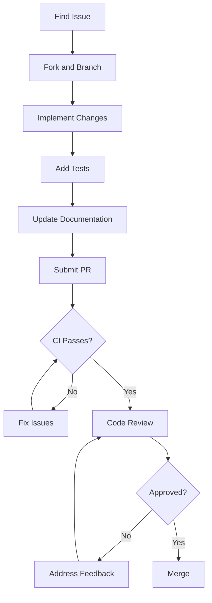
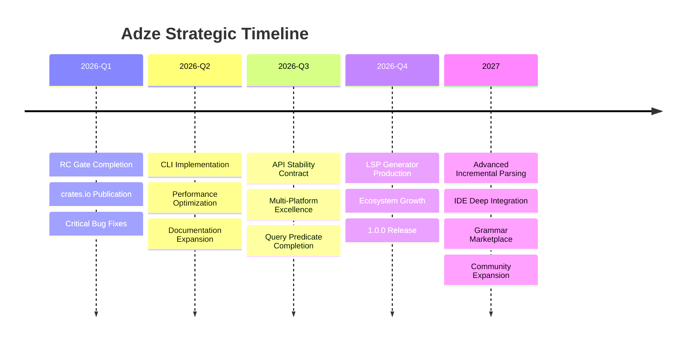

# Adze Vision and Strategy

**Last updated:** 2026-03-13
**Version:** 0.8.0-dev (RC Quality)
**Status:** Strategic Planning Document

---

## Executive Summary

Adze is an AST-first grammar toolchain for Rust that transforms how developers create parsers. By defining grammars as native Rust types with procedural macros, users get typed ASTs directly—eliminating the boilerplate of manual tree traversal and the complexity of external grammar files.

This document outlines the strategic vision, market positioning, and sustainability model for Adze as it evolves from a release candidate to a production-ready 1.0 release and beyond.

---

## 1. Executive Vision

### 1.1 Mission Statement

**Make parser development as natural as writing Rust.**

Adze's mission is to eliminate the friction between language design and parser implementation. Developers should express their grammar using familiar Rust constructs—enums, structs, and attributes—and receive a fully-typed, production-ready parser without leaving their IDE or learning a new syntax.

### 1.2 Long-Term Vision (3-5 Years)

By 2029, Adze aims to be:

1. **The default choice for Rust parser development** — When a Rust developer needs to parse anything from configuration files to full programming languages, Adze is their first consideration.

2. **The foundation for next-generation developer tools** — IDEs, linters, formatters, and language servers built on Adze's incremental parsing and rich AST capabilities.

3. **A bridge between ecosystems** — Seamless interoperability with Tree-sitter grammars while providing a pure-Rust alternative for WASM, embedded, and security-sensitive environments.

4. **A thriving open-source community** — Dozens of community-maintained grammars, active contribution from multiple organizations, and a sustainable governance model.

### 1.3 Value Proposition

| For Language Designers | For Tool Developers | For Platform Engineers |
|------------------------|---------------------|------------------------|
| Define grammars in idiomatic Rust | Get typed ASTs without boilerplate | Pure-Rust with no C dependencies |
| GLR parsing handles ambiguity | Incremental parsing for IDEs | WASM compilation out of the box |
| Operator precedence made simple | LSP generation built-in | Cross-platform by default |
| Rich error recovery | Query system for pattern matching | Tree-sitter compatibility layer |

**The Adze Advantage:**

```
Traditional Approach:
  Grammar file → External tool → Generated code → Manual AST mapping → Runtime

Adze Approach:
  Rust types + #[adze] → build.rs → Typed parser → Your types returned directly
```

---

## 2. Strategic Pillars

### 2.1 Core Principles

#### P1: Type Safety First

The grammar *is* the AST. Every parse result is a properly typed Rust value, with parse errors captured at the type level. No runtime casting, no optional fields that should always exist.

```rust
// The grammar definition IS your type system
#[adze::grammar("calc")]
pub mod calc {
    #[adze::language]
    pub enum Expr {
        Number(i32),
        Add(Box<Expr>, Box<Expr>),
    }
}
// parse() returns Result<Expr, Vec<ParseError>> — fully typed
```

#### P2: Pure Rust by Default

No C toolchain required. No external dependencies beyond Cargo. This enables:
- Cross-compilation without complexity
- WASM targets without Emscripten
- Reproducible builds
- Easier security audits

#### P3: GLR Power, LR Simplicity

GLR parsing handles ambiguous grammars (C++, JavaScript, Ruby) that break traditional LR parsers, while the attribute system keeps simple grammars simple:

```rust
#[adze::prec_left(1)]  // Declarative precedence
Add(Box<Expr>, #[adze::leaf(text = "+")] (), Box<Expr>),
```

#### P4: Incremental by Design

Built for IDE integration from day one. The parse forest representation supports incremental reparsing, enabling sub-10ms response times for typical edits.

#### P5: Ecosystem Compatibility

Tree-sitter compatibility is not an afterthought—it's a core feature. Import existing grammars via `ts-bridge`, generate compatible parse tables, and integrate with the existing Tree-sitter ecosystem.

### 2.2 Strategic Differentiators

| Differentiator | Adze | Tree-sitter | LALRPOP | nom |
|----------------|------|-------------|---------|-----|
| **Typed extraction** | ✅ Native | ❌ Manual mapping | ⚠️ Partial | ❌ Manual |
| **Pure Rust** | ✅ Default | ❌ C required | ✅ Yes | ✅ Yes |
| **GLR parsing** | ✅ Yes | ❌ LR only | ❌ LR only | ❌ PEG |
| **Incremental** | ✅ Designed | ✅ Core feature | ❌ No | ❌ No |
| **WASM support** | ✅ Native | ⚠️ Complex | ✅ Yes | ✅ Yes |
| **IDE integration** | ✅ LSP gen | ✅ Mature | ❌ Limited | ❌ Limited |
| **Grammar syntax** | Rust types | External JSON | External file | Rust macros |

### 2.3 Market Positioning

```
                    Complexity of Target Language
                           Low ─────────────── High
                    ┌────────────────────────────────┐
                    │                                │
   Pure Rust     ▲  │    nom              Adze       │
   Requirement   │  │    (simple)      (sweet spot)  │
                 │  │                                │
                 ▼  │    LALRPOP         Tree-sitter │
                    │   (moderate)       (mature)    │
                    │                                │
                    └────────────────────────────────┘
```

**Adze's Position:** The only pure-Rust solution that handles complex, ambiguous grammars while providing typed extraction and IDE-ready incremental parsing.

---

## 3. Target Audience & Use Cases

### 3.1 Primary User Personas

#### Persona 1: The Language Hacker

**Profile:** Developer creating a domain-specific language (DSL) or experimental programming language.

**Needs:**
- Rapid iteration on grammar design
- Clear error messages for debugging
- Type-safe AST without boilerplate
- Easy testing of grammar changes

**Adze Fit:** Perfect match. Define grammar as Rust types, get immediate feedback on changes, and receive typed results.

```rust
// Language Hacker's dream: iterate on grammar in the same file as tests
#[adze::grammar("my-lang")]
pub mod my_lang {
    #[adze::language]
    pub enum Stmt {
        Let(String, Expr),
        Return(Expr),
        // Add new variants instantly
    }
}

#[test]
fn test_let_statement() {
    assert!(my_lang::parse("let x = 42").is_ok());
}
```

#### Persona 2: The Tool Builder

**Profile:** Developer building linters, formatters, or IDE extensions.

**Needs:**
- Incremental parsing for responsiveness
- Rich AST with source positions
- Query capabilities for pattern matching
- LSP integration

**Adze Fit:** Strong. Incremental parsing designed for IDE use, query system for pattern matching, LSP generator for quick tooling.

#### Persona 3: The Platform Engineer

**Profile:** Developer integrating parsing into constrained environments (WASM, embedded, secure systems).

**Needs:**
- No C dependencies
- Small binary footprint
- WASM compatibility
- Reproducible builds

**Adze Fit:** Excellent. Pure-Rust by default, WASM verified, no external toolchain requirements.

#### Persona 4: The Legacy Migrator

**Profile:** Developer with existing Tree-sitter grammars wanting Rust integration.

**Needs:**
- Import existing grammars
- Tree-sitter compatibility
- Gradual migration path
- Feature parity

**Adze Fit:** Good. `ts-bridge` for importing grammars, compatible parse tables, and parallel runtime support.

### 3.2 Key Use Cases

#### UC1: Configuration Language Parsing

**Scenario:** A Rust application needs to parse a custom configuration format with nested structures, optional fields, and inline comments.

**Adze Solution:**
```rust
#[adze::grammar("config")]
pub mod config {
    #[adze::language]
    pub struct Config {
        pub sections: Vec<Section>,
    }
    
    pub struct Section {
        #[adze::leaf(pattern = r"[a-z]+")]
        pub name: String,
        pub entries: Vec<Entry>,
    }
    
    #[adze::extra]
    struct Comment {
        #[adze::leaf(pattern = r"#[^\n]*")]
        _comment: (),
    }
}
```

#### UC2: IDE Extension Development

**Scenario:** Building a VS Code extension for a custom language with syntax highlighting, error reporting, and go-to-definition.

**Adze Solution:**
1. Define grammar with `#[adze::grammar]`
2. Generate LSP server with `adze-lsp-gen`
3. Configure VS Code extension to use the LSP
4. Incremental parsing provides <10ms response times

#### UC3: WASM-Based Playground

**Scenario:** Creating an online playground for a custom language that runs entirely in the browser.

**Adze Solution:**
```toml
[dependencies]
adze = { version = "0.8", features = ["wasm"] }
```

Compile with `wasm-pack` for immediate browser deployment—no Emscripten, no C toolchain.

#### UC4: Code Transformation Tool

**Scenario:** Building a refactoring tool that needs to parse, analyze, modify, and regenerate code.

**Adze Solution:**
- Parse into typed AST with source positions
- Query system to find transformation targets
- Modify AST nodes
- Regenerate source with formatting preserved

### 3.3 Integration Opportunities

| Integration | Status | Timeline | Value |
|-------------|--------|----------|-------|
| **Cargo build.rs** | ✅ Working | Current | Primary integration point |
| **VS Code** | 🔴 Planned | Q2 2026 | IDE support |
| **Neovim** | 🔴 Planned | Q3 2026 | Editor support |
| **Emacs** | 🔴 Planned | Q3 2026 | Editor support |
| **Bazel** | 🔴 Planned | 2027 | Build system |
| **GitHub Actions** | ✅ Working | Current | CI/CD |

---

## 4. Competitive Landscape

### 4.1 Competitor Analysis

#### Tree-sitter

**Strengths:**
- Mature ecosystem with 100+ grammars
- Excellent incremental parsing
- Wide IDE support (GitHub, Atom, Neovim)
- Battle-tested in production

**Weaknesses:**
- Requires C toolchain
- Grammar defined in external JSON
- No typed extraction (manual tree walking)
- WASM compilation is complex
- LR parser cannot handle ambiguous grammars

**Adze Advantage:** Pure Rust, typed extraction, GLR for ambiguity, native WASM.

#### LALRPOP

**Strengths:**
- Pure Rust
- Familiar LR grammar syntax
- Good error messages
- Well-documented

**Weaknesses:**
- External grammar file format
- No incremental parsing
- No GLR support
- Limited IDE integration
- No WASM focus

**Adze Advantage:** Grammar as Rust types, incremental parsing, GLR, IDE-ready.

#### nom

**Strengths:**
- Pure Rust
- Parser combinator approach
- Very flexible
- Zero dependencies option
- Excellent for simple formats

**Weaknesses:**
- No grammar extraction—write parsers manually
- No incremental parsing
- PEG limitations (left recursion)
- No IDE integration story

**Adze Advantage:** Declarative grammar, typed extraction, incremental, GLR.

#### chumsky

**Strengths:**
- Pure Rust
- Composable parsers
- Good error recovery
- Active development

**Weaknesses:**
- No typed extraction
- No incremental parsing
- No Tree-sitter compatibility
- Smaller ecosystem

**Adze Advantage:** Typed extraction, incremental, ecosystem compatibility.

#### pest

**Strengths:**
- Pure Rust
- PEG grammar syntax
- Good documentation
- Easy to learn

**Weaknesses:**
- PEG limitations
- No incremental parsing
- External grammar file
- No GLR for ambiguity

**Adze Advantage:** GLR, incremental, typed extraction, Rust-native syntax.

### 4.2 Feature Comparison Matrix

| Feature | Adze | Tree-sitter | LALRPOP | nom | chumsky | pest |
|---------|------|-------------|---------|-----|---------|------|
| Pure Rust | ✅ | ❌ | ✅ | ✅ | ✅ | ✅ |
| Typed extraction | ✅ | ❌ | ⚠️ | ❌ | ❌ | ❌ |
| GLR parsing | ✅ | ❌ | ❌ | ❌ | ⚠️ | ❌ |
| Incremental | ✅ | ✅ | ❌ | ❌ | ❌ | ❌ |
| WASM native | ✅ | ⚠️ | ✅ | ✅ | ✅ | ✅ |
| LSP generation | ✅ | ⚠️ | ❌ | ❌ | ❌ | ❌ |
| Query system | ⚠️ | ✅ | ❌ | ❌ | ❌ | ❌ |
| Grammar marketplace | ❌ | ✅ | ❌ | ❌ | ❌ | ❌ |
| Rust-native syntax | ✅ | ❌ | ❌ | ✅ | ✅ | ❌ |

Legend: ✅ Full support | ⚠️ Partial/complex | ❌ Not supported

### 4.3 Unique Advantages

1. **Grammar as Types** — The only solution where your grammar definition is your AST definition.

2. **Pure Rust GLR** — The only pure-Rust parser generator with GLR capabilities.

3. **Typed Extraction** — Automatic transformation from parse tree to your types.

4. **Dual Compatibility** — Tree-sitter interop while providing pure-Rust alternative.

5. **LSP Generation** — Built-in language server generation from grammar.

### 4.4 Areas for Improvement

| Area | Current State | Target State | Timeline |
|------|---------------|--------------|----------|
| Grammar ecosystem | 4 grammars | 20+ grammars | 2027 |
| Query predicates | 60% parity | 100% parity | Q4 2026 |
| Incremental parsing | Experimental | Production | Q3 2026 |
| Documentation | 6 chapters | Comprehensive | Q2 2026 |
| Community size | Small | Active | Ongoing |

---

## 5. Success Criteria

### 5.1 Definition of Success

Adze succeeds when:

1. **Developers choose it first** — When starting a new parsing project in Rust, Adze is the default consideration.

2. **It powers production systems** — Real-world IDEs, linters, and language tools depend on Adze.

3. **The community is self-sustaining** — New grammars, bug fixes, and features come from community contributions.

4. **It advances the state of the art** — Ideas from Adze influence other parser generators.

### 5.2 Key Performance Indicators

#### Technical KPIs

| Metric | Current (0.8.0) | Target (1.0.0) | Target (2027) |
|--------|-----------------|----------------|---------------|
| Test count | 2,460+ | 3,000+ | 5,000+ |
| Stable APIs | 54 | 100+ | 150+ |
| Feature matrix | 11/12 | 12/12 | 12/12 |
| Parse performance | Baseline | +20% | +50% |
| Incremental reparse | N/A | <10ms | <5ms |
| LSP response time | N/A | <50ms | <20ms |

#### Adoption KPIs

| Metric | Current | Target (Q2 2026) | Target (1.0.0) | Target (2027) |
|--------|---------|------------------|----------------|---------------|
| crates.io downloads | 0 | 1,000+ | 10,000+ | 100,000+ |
| GitHub stars | Unknown | 200+ | 500+ | 2,000+ |
| Published grammars | 4 | 6 | 10+ | 20+ |
| Community PRs | 0 | 5+ | 20+ | 100+ |
| Corporate adopters | 0 | 1+ | 3+ | 10+ |

#### Quality KPIs

| Metric | Current | Target | Measurement |
|--------|---------|--------|-------------|
| Security vulnerabilities | 0 | 0 | cargo-audit |
| Clippy warnings | 0 | 0 | CI gate |
| Doc coverage | ~80% | 100% | rustdoc |
| Open P0 bugs | 3 | 0 | Issue tracker |
| Time to first PR merge | N/A | <7 days | Contribution metrics |

### 5.3 Community and Adoption Goals

#### Short-term (Q1-Q2 2026)

- [ ] Publish 7 core crates to crates.io
- [ ] Achieve first external contributor PR
- [ ] Document 3 success stories/case studies
- [ ] Present at 1 Rust meetup or conference

#### Medium-term (Q3-Q4 2026)

- [ ] 5+ community-maintained grammars
- [ ] Active Discord/Reddit community
- [ ] VS Code extension in marketplace
- [ ] 3+ blog posts from users

#### Long-term (2027+)

- [ ] 20+ community grammars
- [ ] Corporate sponsorship or funding
- [ ] Integration into major Rust projects
- [ ] Annual Adze community event

### 5.4 Success Metrics Dashboard

```
┌─────────────────────────────────────────────────────────────────┐
│                    ADOPTION METRICS                              │
├─────────────────────────────────────────────────────────────────┤
│ crates.io downloads                                              │
│ ▓▓▓▓▓▓▓▓░░░░░░░░░░░░ 10,000+ ─────────────────────── Target    │
│ ▓▓▓░░░░░░░░░░░░░░░░░░ 1,000+  ─────────────────────── Q2 2026   │
│ ░░░░░░░░░░░░░░░░░░░░░ 0       ─────────────────────── Current   │
├─────────────────────────────────────────────────────────────────┤
│ published grammars                                               │
│ ▓▓▓▓▓▓▓▓▓▓▓▓▓▓▓▓▓▓░░ 20+     ─────────────────────── 2027      │
│ ▓▓▓▓▓░░░░░░░░░░░░░░░░ 10+     ─────────────────────── 1.0.0     │
│ ▓▓░░░░░░░░░░░░░░░░░░░ 4       ─────────────────────── Current   │
├─────────────────────────────────────────────────────────────────┤
│ stable APIs                                                      │
│ ▓▓▓▓▓▓▓▓▓▓▓▓▓▓▓▓▓▓▓░ 150+    ─────────────────────── 2027      │
│ ▓▓▓▓▓▓▓▓▓▓▓░░░░░░░░░░ 100+    ─────────────────────── 1.0.0     │
│ ▓▓▓▓▓░░░░░░░░░░░░░░░░ 54      ─────────────────────── Current   │
└─────────────────────────────────────────────────────────────────┘
```

---

## 6. Sustainability Model

### 6.1 Maintenance Strategy

#### Core Team Responsibilities

| Role | Responsibilities | Time Commitment |
|------|------------------|-----------------|
| **BDFL** (Benevolent Dictator For Life) | Final decisions, roadmap, releases | Ongoing |
| **Core Maintainers** (2-3) | PR reviews, bug fixes, CI management | 5-10 hrs/week |
| **Grammar Maintainers** | Language-specific grammar maintenance | 2-5 hrs/week |
| **Documentation Maintainers** | Docs, tutorials, examples | 2-5 hrs/week |

#### Maintenance Tiers

| Tier | Response Time | Example |
|------|---------------|---------|
| **Critical** (security, data loss) | <24 hours | Parse corruption, memory safety |
| **High** (blocking issues) | <1 week | Build failures, incorrect parses |
| **Medium** (feature requests) | Next release | New attributes, minor features |
| **Low** (nice-to-have) | Backlog | Optimizations, refactors |

#### Release Cadence

| Release Type | Frequency | Contents |
|--------------|-----------|----------|
| **Patch** (0.8.x) | As needed | Bug fixes, documentation |
| **Minor** (0.x.0) | Monthly | New features, API additions |
| **Major** (x.0.0) | Yearly | Breaking changes, milestones |

### 6.2 Contribution Guidelines

#### Getting Started

1. **Good First Issues** — Labeled in GitHub for newcomers
2. **Documentation** — Improvements always welcome
3. **Grammar Contributions** — New language grammars
4. **Bug Reports** — Clear reproduction steps

#### Contribution Process



#### Code Standards

| Standard | Tool | Enforcement |
|----------|------|-------------|
| Formatting | `cargo fmt` | CI required |
| Linting | `cargo clippy` | CI required |
| Tests | `cargo test` | CI required |
| Documentation | `cargo doc` | CI required |
| Security | `cargo audit` | CI scheduled |

#### Recognition

- **Contributors** — Listed in CONTRIBUTORS.md
- **Grammar Authors** — Listed in GRAMMARS.md with links
- **Major Contributors** — Invited to core team

### 6.3 Governance Model

#### Decision Making

| Decision Type | Authority | Process |
|---------------|-----------|---------|
| **Bug fixes** | Any maintainer | PR approval |
| **Minor features** | Core maintainers | PR + 1 approval |
| **Major features** | BDFL + core team | RFC process |
| **Breaking changes** | BDFL | RFC + community input |
| **Governance changes** | BDFL | Community discussion |

#### RFC Process

For major changes:

1. **Proposal** — Write RFC in `docs/rfcs/`
2. **Discussion** — Community feedback period (2 weeks)
3. **Decision** — BDFL decision with core team input
4. **Implementation** — Assigned to contributor
5. **Review** — Standard PR process

#### Conflict Resolution

1. **Discussion** — Attempt to reach consensus
2. **Core team vote** — If consensus fails
3. **BDFL decision** — Final authority

### 6.4 Financial Sustainability

#### Current Model

- **Open source** — MIT/Apache-2.0 dual license
- **Volunteer maintained** — No paid contributors currently

#### Future Options

| Model | Pros | Cons | Timeline |
|-------|------|------|----------|
| **GitHub Sponsors** | Easy setup, direct support | Unpredictable income | Q2 2026 |
| **Corporate sponsorship** | Stable funding, credibility | May influence direction | 2027 |
| **Paid support** | Leverages expertise | Time commitment | 2027 |
| **Foundation** | Community ownership | Administrative overhead | 2028+ |

#### Funding Priorities

If funding becomes available:

1. **Core maintainer stipend** — Ensure sustainable maintenance
2. **CI/CD infrastructure** — Faster builds, more platforms
3. **Documentation bounty** — Comprehensive guides
4. **Grammar bounties** — Expand language support

### 6.5 Long-Term Viability

#### Risk Mitigation

| Risk | Mitigation |
|------|------------|
| **Bus factor** | Multiple core maintainers, comprehensive documentation |
| **Burnout** | Sustainable pace, clear boundaries, shared load |
| **Funding** | Multiple income streams, low operational costs |
| **Competition** | Focus on unique value proposition, community engagement |
| **Technical debt** | Regular refactoring sprints, code quality standards |

#### Community Building

- **Monthly updates** — Blog posts on progress
- **Office hours** — Regular community calls
- **Conference presence** — RustConf, Rust Belt Rust
- **Mentorship** — Help new contributors grow

---

## 7. Strategic Roadmap Summary

### 7.1 Phase Timeline



### 7.2 Key Milestones

| Milestone | Target | Key Deliverables |
|-----------|--------|------------------|
| **0.8.0** | Q1 2026 | crates.io publication, RC quality |
| **0.9.0** | Q2 2026 | CLI tools, performance baseline |
| **1.0.0** | Q4 2026 | API stability, multi-platform |
| **1.1.0** | Q1 2027 | Full incremental parsing |
| **2.0.0** | 2027+ | Advanced features, ecosystem |

### 7.3 Investment Priorities

```
┌─────────────────────────────────────────────────────────────────┐
│                    INVESTMENT PRIORITIES                         │
├─────────────────────────────────────────────────────────────────┤
│                                                                  │
│  HIGH PRIORITY (2026)                                           │
│  ├── Core pipeline stability                                    │
│  ├── Documentation and onboarding                               │
│  ├── CLI tooling                                                │
│  └── Performance optimization                                   │
│                                                                  │
│  MEDIUM PRIORITY (2026-2027)                                    │
│  ├── Incremental parsing production                             │
│  ├── LSP generator                                              │
│  ├── Query predicate completion                                 │
│  └── Community building                                         │
│                                                                  │
│  LONG-TERM (2027+)                                              │
│  ├── Grammar marketplace                                        │
│  ├── Advanced IDE features                                      │
│  ├── Embedded targets                                           │
│  └── Foundation/governance                                      │
│                                                                  │
└─────────────────────────────────────────────────────────────────┘
```

---

## 8. Related Documentation

| Document | Purpose |
|----------|---------|
| [`INDEX.md`](../INDEX.md) | Master documentation index |
| [`NAVIGATION.md`](../NAVIGATION.md) | Reading paths and cross-references |
| [`QUICK_REFERENCE.md`](../QUICK_REFERENCE.md) | One-page cheat sheet |
| [`NOW_NEXT_LATER.md`](../status/NOW_NEXT_LATER.md) | Detailed milestones and KPIs |
| [`TECHNICAL_ROADMAP.md`](../roadmap/TECHNICAL_ROADMAP.md) | Technical planning |
| [`API_STABILITY.md`](../status/API_STABILITY.md) | API stability matrix |
| [`AGENTS.md`](../../AGENTS.md) | Development guidelines |
| [`README.md`](../../README.md) | Project introduction |
| [`docs/adr/`](../adr/) | Architecture Decision Records |

---

## Changelog

| Date | Change |
|------|--------|
| 2026-03-13 | Initial vision and strategy document creation |
