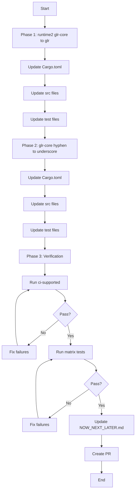

# PR #2: Feature-Flag Standardization - Implementation Plan

**Status:** ✅ Complete
**Created:** 2026-03-27
**Release Blocker:** Yes (prerequisite for crates.io publication per `docs/status/NOW_NEXT_LATER.md`)
**Target Version:** 0.8.0-dev → 0.8.0 (crates.io publication)
**Depends On:** PR #1 (Documentation Sync - FR-001)

---

## Executive Summary

This plan addresses feature-flag standardization across the workspace. Documentation was updated in PR #1 to use `glr` and `incremental_glr` feature names; this PR ensures the actual code matches these standardized names.

### Goals
1. Standardize feature flag naming across all crates
2. Maintain backward compatibility where possible via deprecated aliases
3. Ensure documentation and code are consistent

### Non-Goals
- Changing crate names (e.g., `adze-glr-core` is correct)
- Removing deprecated aliases that are already in place
- Changing features that don't affect the public API

---

## Current Feature Flag Inventory

### Core Pipeline Crates (7 crates - PR gate scope)

| Crate | File | Features |
|-------|------|----------|
| `adze` (runtime) | [`runtime/Cargo.toml:17-40`](runtime/Cargo.toml:17) | `pure-rust`, `tree-sitter-c2rust`, `tree-sitter-standard`, `wasm`, `simd`, `serialization`, `legacy-parsers`, `incremental_glr`, `debug_glr`, `ts-compat`, `debug_incremental`, `experimental_examples`, `json_example`, `external_scanners`, `query`, `runtime-e2e`, `strict_docs`, `strict_api`, `unstable-benches`, `glr_telemetry`, `glr`, `with-grammars` |
| `adze-runtime` (runtime2) | [`runtime2/Cargo.toml:44-72`](runtime2/Cargo.toml:44) | `glr-core`, `pure-rust`, `pure-rust-glr` (deprecated), `serialization`, `arenas`, `incremental_glr`, `incremental` (deprecated), `external_scanners`, `external-scanners` (deprecated), `query`, `queries` (deprecated), `test-utils` |
| `adze-glr-core` | [`glr-core/Cargo.toml:32-48`](glr-core/Cargo.toml:32) | `parallel`, `strict_docs`, `strict_api`, `glr-trace`, `test-helpers`, `strict-invariants`, `memory-tests`, `json-parity`, `perf-counters`, `test-api`, `debug_glr`, `serialization`, `glr_telemetry` |
| `adze-ir` | [`ir/Cargo.toml:25-28`](ir/Cargo.toml:25) | `optimize`, `strict_docs` |
| `adze-macro` | [`macro/Cargo.toml:17-19`](macro/Cargo.toml:17) | `pure-rust`, `strict_docs` |
| `adze-tool` | [`tool/Cargo.toml:13-24`](tool/Cargo.toml:13) | `build_parsers`, `no_opt`, `optimize`, `strict_docs`, `serialization` |
| `adze-tablegen` | [`tablegen/Cargo.toml:54-64`](tablegen/Cargo.toml:54) | `tree-sitter-standard`, `tree-sitter-c2rust`, `compression`, `strict_docs`, `strict_api`, `serialization`, `small-table` |
| `adze-common` | [`common/Cargo.toml:16-17`](common/Cargo.toml:16) | `strict_docs` |

### Governance Crates (consistent pattern)

| Crate | Features |
|-------|----------|
| `adze-runtime-governance-api` | `pure-rust`, `tree-sitter-standard`, `tree-sitter-c2rust`, `glr`, `strict_api`, `strict_docs` |
| `adze-runtime-governance` | `pure-rust`, `tree-sitter-standard`, `tree-sitter-c2rust`, `glr`, `strict_api`, `strict_docs` |
| `adze-parser-backend-core` | `pure-rust`, `tree-sitter-c2rust`, `tree-sitter-standard`, `glr`, `strict_api`, `strict_docs` |
| `adze-parsetable-metadata` | `strict_api`, `strict_docs` |

---

## Identified Inconsistencies

### 1. Critical: `glr-core` vs `glr` Feature Flag

| Crate | Current | Standard | Impact |
|-------|---------|----------|--------|
| `adze-runtime` (runtime2) | `glr-core` | `glr` | **Breaking** - users must update Cargo.toml |

**Evidence:**
- [`runtime2/Cargo.toml:47`](runtime2/Cargo.toml:47): `glr-core = ["dep:adze-glr-core", "dep:adze-ir"]`
- [`runtime/Cargo.toml:39`](runtime/Cargo.toml:39): `glr = ["adze-runtime-governance-api/glr"]`
- Documentation (PR#1) standardized on `glr`

**Code Usage (300+ occurrences):**
- `#[cfg(feature = "glr-core")]` in runtime2 tests and src
- `#[cfg(feature = "glr")]` in runtime and governance crates

### 2. Hyphen vs Underscore Inconsistency in glr-core

| Current (Hyphen) | Should Be (Underscore) | Rationale |
|------------------|------------------------|-----------|
| `glr-trace` | `glr_trace` | Match `glr_telemetry`, `debug_glr` |
| `test-helpers` | `test_helpers` | Match `test-utils` pattern |
| `strict-invariants` | `strict_invariants` | Match `strict_docs`, `strict_api` |
| `memory-tests` | `memory_tests` | Consistent underscore convention |
| `json-parity` | `json_parity` | Consistent underscore convention |
| `perf-counters` | `perf_counters` | Consistent underscore convention |
| `test-api` | `test_api` | Match `strict_api` pattern |

**Note:** These are internal features with minimal external usage, so breaking changes are acceptable.

### 3. Already Correct: Deprecated Aliases in runtime2

These are already properly handled with deprecated aliases:

| Deprecated | Canonical | Status |
|------------|-----------|--------|
| `pure-rust-glr` | `pure-rust` | ✓ Alias exists |
| `incremental` | `incremental_glr` | ✓ Alias exists |
| `external-scanners` | `external_scanners` | ✓ Alias exists |
| `queries` | `query` | ✓ Alias exists |

### 4. Crate Name vs Feature Flag Distinction

**Important:** Do NOT change these:
- Crate name: `adze-glr-core` (correct - this is the package name)
- Feature flag: `glr` (correct - this is the feature name)

---

## Standardization Plan

### Naming Convention

1. **Use underscores** for multi-word feature flags (e.g., `incremental_glr`, `strict_docs`)
2. **Use hyphens** only for external ecosystem names (e.g., `tree-sitter-c2rust`, `pure-rust`)
3. **Keep deprecated aliases** for features that may have external users

### Proposed Changes

#### Phase 1: Critical - `glr-core` → `glr` in runtime2

**Files to modify:**
- [`runtime2/Cargo.toml`](runtime2/Cargo.toml) - rename feature, add deprecated alias
- [`runtime2/src/lib.rs`](runtime2/src/lib.rs) - update cfg gates
- [`runtime2/src/parser.rs`](runtime2/src/parser.rs) - update cfg gates
- [`runtime2/src/language.rs`](runtime2/src/language.rs) - update cfg gates
- [`runtime2/src/engine.rs`](runtime2/src/engine.rs) - update cfg gates
- [`runtime2/src/builder.rs`](runtime2/src/builder.rs) - update cfg gates
- [`runtime2/src/test_helpers.rs`](runtime2/src/test_helpers.rs) - update cfg gates
- [`runtime2/tests/*.rs`](runtime2/tests/) - update cfg gates (50+ files)

**Change pattern:**
```toml
# Before
[features]
glr-core = ["dep:adze-glr-core", "dep:adze-ir"]

# After
[features]
glr = ["dep:adze-glr-core", "dep:adze-ir"]
glr-core = ["glr"]  # Deprecated alias for backward compatibility
```

```rust
// Before
#[cfg(feature = "glr-core")]

// After
#[cfg(feature = "glr")]
```

#### Phase 2: Internal Features in glr-core (Underscore Standardization)

**Files to modify:**
- [`glr-core/Cargo.toml`](glr-core/Cargo.toml) - rename features
- [`glr-core/src/lib.rs`](glr-core/src/lib.rs) - update cfg gates
- [`glr-core/src/driver.rs`](glr-core/src/driver.rs) - update cfg gates
- [`glr-core/tests/*.rs`](glr-core/tests/) - update cfg gates (30+ files)
- [`glr-core/benches/*.rs`](glr-core/benches/) - update cfg gates

**Change pattern:**
```toml
# Before
[features]
glr-trace = []
test-helpers = []
strict-invariants = []
memory-tests = []
json-parity = []
perf-counters = []
test-api = []

# After
[features]
glr_trace = []
test_helpers = []
strict_invariants = []
memory_tests = []
json_parity = []
perf_counters = []
test_api = []

# Deprecated aliases (optional, for internal features may skip)
glr-trace = ["glr_trace"]
test-helpers = ["test_helpers"]
# ... etc
```

**Note:** Since these are internal/test features, we may skip deprecated aliases to keep the feature surface clean.

#### Phase 3: Update Documentation References

**Files to verify:**
- [`book/src/getting-started/quickstart.md`](book/src/getting-started/quickstart.md) - already updated in PR#1
- [`docs/tutorials/glr-quickstart.md`](docs/tutorials/glr-quickstart.md) - verify feature flags
- Any other docs referencing `glr-core` as a feature flag

---

## Risk Assessment

### Breaking Changes

| Change | Risk Level | Mitigation |
|--------|------------|------------|
| `glr-core` → `glr` in runtime2 | **Medium** | Add deprecated alias `glr-core = ["glr"]` |
| Hyphen → underscore in glr-core | **Low** | Internal features, minimal external usage |

### Non-Breaking Changes

| Change | Risk Level | Notes |
|--------|------------|-------|
| Documentation updates | **None** | Already done in PR#1 |
| Adding deprecated aliases | **None** | Purely additive |

### Test Impact

- **300+ cfg gates** reference `glr-core` in runtime2
- **50+ cfg gates** reference hyphenated features in glr-core
- All tests must pass after changes
- Feature matrix testing (`just matrix`) must pass

---

## Implementation Checklist

### Pre-Implementation
- [ ] Verify PR #1 documentation changes are merged
- [ ] Create feature branch from main

### Phase 1: Critical - runtime2 `glr-core` → `glr`
- [ ] Update [`runtime2/Cargo.toml`](runtime2/Cargo.toml) - rename feature, add alias
- [ ] Update [`runtime2/src/lib.rs`](runtime2/src/lib.rs) - cfg gates
- [ ] Update [`runtime2/src/parser.rs`](runtime2/src/parser.rs) - cfg gates
- [ ] Update [`runtime2/src/language.rs`](runtime2/src/language.rs) - cfg gates
- [ ] Update [`runtime2/src/engine.rs`](runtime2/src/engine.rs) - cfg gates
- [ ] Update [`runtime2/src/builder.rs`](runtime2/src/builder.rs) - cfg gates
- [ ] Update [`runtime2/src/test_helpers.rs`](runtime2/src/test_helpers.rs) - cfg gates
- [ ] Update [`runtime2/src/error.rs`](runtime2/src/error.rs) - cfg gates
- [ ] Update [`runtime2/src/external_scanner.rs`](runtime2/src/external_scanner.rs) - cfg gates
- [ ] Update [`runtime2/src/tree.rs`](runtime2/src/tree.rs) - cfg gates
- [ ] Update all runtime2 test files (50+ files)
- [ ] Update runtime2 example files

### Phase 2: glr-core Hyphen → Underscore
- [ ] Update [`glr-core/Cargo.toml`](glr-core/Cargo.toml) - rename features
- [ ] Update [`glr-core/src/lib.rs`](glr-core/src/lib.rs) - cfg gates
- [ ] Update [`glr-core/src/driver.rs`](glr-core/src/driver.rs) - cfg gates
- [ ] Update [`glr-core/src/telemetry.rs`](glr-core/src/telemetry.rs) - cfg gates
- [ ] Update all glr-core test files (30+ files)
- [ ] Update glr-core benchmark files

### Phase 3: Verification
- [ ] Run `just ci-supported` - must pass
- [ ] Run `just matrix` - feature matrix must pass
- [ ] Run `cargo test -p adze-runtime --all-features` - must pass
- [ ] Run `cargo test -p adze-glr-core --all-features` - must pass
- [ ] Verify deprecated alias works: `cargo build -p adze-runtime --features glr-core`
- [ ] Update [`docs/status/NOW_NEXT_LATER.md`](docs/status/NOW_NEXT_LATER.md) - mark item complete

### Post-Implementation
- [ ] Create PR with this plan as description
- [ ] Request review
- [ ] Merge after approval

---

## Execution Order



---

## Files Affected Summary

### Cargo.toml Files (2)
- [`runtime2/Cargo.toml`](runtime2/Cargo.toml)
- [`glr-core/Cargo.toml`](glr-core/Cargo.toml)

### Source Files (12)
- [`runtime2/src/lib.rs`](runtime2/src/lib.rs)
- [`runtime2/src/parser.rs`](runtime2/src/parser.rs)
- [`runtime2/src/language.rs`](runtime2/src/language.rs)
- [`runtime2/src/engine.rs`](runtime2/src/engine.rs)
- [`runtime2/src/builder.rs`](runtime2/src/builder.rs)
- [`runtime2/src/test_helpers.rs`](runtime2/src/test_helpers.rs)
- [`runtime2/src/error.rs`](runtime2/src/error.rs)
- [`runtime2/src/external_scanner.rs`](runtime2/src/external_scanner.rs)
- [`runtime2/src/tree.rs`](runtime2/src/tree.rs)
- [`glr-core/src/lib.rs`](glr-core/src/lib.rs)
- [`glr-core/src/driver.rs`](glr-core/src/driver.rs)
- [`glr-core/src/telemetry.rs`](glr-core/src/telemetry.rs)

### Test Files (80+)
- [`runtime2/tests/*.rs`](runtime2/tests/) - ~50 files
- [`glr-core/tests/*.rs`](glr-core/tests/) - ~30 files

### Benchmark Files (3)
- [`glr-core/benches/perf_snapshot.rs`](glr-core/benches/perf_snapshot.rs)
- [`runtime/benches/*.rs`](runtime/benches/) - already use correct features

### Documentation (1)
- [`docs/status/NOW_NEXT_LATER.md`](docs/status/NOW_NEXT_LATER.md) - mark item complete

---

## Success Criteria

1. ✅ All feature flags use underscore convention (except ecosystem names)
2. ✅ `glr-core` feature in runtime2 renamed to `glr` with backward-compatible alias
3. ✅ `just ci-supported` passes
4. ✅ Feature matrix tests pass
5. ✅ Documentation matches code
6. ✅ No breaking changes for users using deprecated aliases

---

## Appendix: Feature Flag Reference

### Standardized Feature Flags

| Feature | Purpose | Crates |
|---------|---------|--------|
| `glr` | Enable GLR parser mode | runtime, runtime2, governance |
| `incremental_glr` | Enable GLR incremental parsing | runtime, runtime2 |
| `pure-rust` | Enable pure-Rust backend | runtime, macro, governance |
| `tree-sitter-c2rust` | Enable c2rust Tree-sitter backend | runtime, tablegen |
| `tree-sitter-standard` | Enable standard Tree-sitter backend | runtime, tablegen |
| `serialization` | Enable serialization support | runtime, runtime2, tablegen, glr-core |
| `external_scanners` | Enable external scanner support | runtime, runtime2 |
| `strict_docs` | Enable strict documentation | all crates |
| `strict_api` | Enable strict API surface | most crates |
| `debug_glr` | Enable GLR debug output | runtime, glr-core |
| `glr_telemetry` | Enable GLR telemetry | runtime, glr-core |

### Internal/Test Features (glr-core only)

| Feature | Purpose |
|---------|---------|
| `test_api` | Enable test API |
| `test_helpers` | Enable test helpers |
| `perf_counters` | Enable performance counters |
| `parallel` | Enable parallel processing |
| `glr_trace` | Enable GLR trace |
| `strict_invariants` | Enable strict invariants |
| `memory_tests` | Enable memory tests |
| `json_parity` | Enable JSON parity tests |

---

## Completion Summary

**Status:** ✅ Complete
**Verified:** 2026-03-27

### Phase 1: runtime2 `glr-core` → `glr` Renaming

- Renamed feature flag `glr-core` to `glr` in [`runtime2/Cargo.toml`](runtime2/Cargo.toml)
- Added deprecated alias `glr-core` pointing to `glr` for backward compatibility
- Updated 24 files in runtime2/ with 106+ cfg gates changed from `#[cfg(feature = "glr-core")]` to `#[cfg(feature = "glr")]`

### Phase 2: glr-core Hyphenated → Underscore Standardization

- Standardized 7 feature flags in [`glr-core/Cargo.toml`](glr-core/Cargo.toml):
  - `glr-trace` → `glr_trace`
  - `test-helpers` → `test_helpers`
  - `strict-invariants` → `strict_invariants`
  - `memory-tests` → `memory_tests`
  - `json-parity` → `json_parity`
  - `perf-counters` → `perf_counters`
  - `test-api` → `test_api`
- Added deprecated aliases for all renamed features
- Updated 11 files in glr-core/ with 32 cfg gates

### Verification Results

1. **CI Pipeline:** ✅ PASS
   - `cargo fmt --all -- --check` - passed
   - `cargo clippy` (7 core crates) - passed
   - `cargo test` (7 core crates) - all tests passed
   - `cargo test -p adze-glr-core --features serialization --doc` - passed

2. **Deprecated Aliases:** ✅ WORKING
   - `cargo check -p adze-runtime --features glr-core` - success
   - `cargo check -p adze-glr-core --features glr-trace,test-helpers,perf-counters` - success

3. **Git Diff Summary:** 82 files changed
   - runtime2/: 24 files (feature renaming)
   - glr-core/: 11 files (underscore standardization)
   - Plus documentation and Cargo.lock updates

### Files Modified

**runtime2/ (24 files):**
- `Cargo.toml`, `lib.rs`, `builder.rs`, `engine.rs`, `error.rs`, `language.rs`, `parser.rs`, `test_helpers.rs`
- 16 test files updated with new feature flag names

**glr-core/ (11 files):**
- `Cargo.toml`, `lib.rs`, `driver.rs`, `forest_view.rs`, `parse_forest.rs`
- 6 test/benchmark files updated
